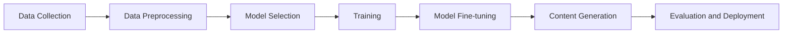

# SOTA Generative AI Models for Visual Tasks - Notes

## Table of Contents (ToC)

  - [Introduction](#introduction)
    - [What's SOTA Generative AI for Visual Tasks?](#whats-sota-generative-ai-for-visual-tasks)
    - [Key Concepts and Terminology](#key-concepts-and-terminology)
    - [Applications](#applications)
  - [Fundamentals](#fundamentals)
    - [SOTA Generative AI Architecture Pipeline](#sota-generative-ai-architecture-pipeline)
    - [How SOTA Generative AI works?](#how-sota-generative-ai-works)
    - [Types of SOTA Generative AI Models](#types-of-sota-generative-ai-models)
    - [Some hands-on examples](#some-hands-on-examples)
  - [Tools \& Frameworks](#tools--frameworks)
  - [Hello World!](#hello-world)
  - [Lab: Zero to Hero Projects](#lab-zero-to-hero-projects)
  - [References](#references)

## Introduction
SOTA (State-of-the-Art) generative AI models for visual tasks represent the latest advancements in generating high-quality visual content such as images and videos.

### What's SOTA Generative AI for Visual Tasks?
- Advanced models designed to create realistic and high-quality visual content.
- Utilize cutting-edge techniques in deep learning and neural networks.
- Aim to push the boundaries of what is achievable in visual content generation.

### Key Concepts and Terminology
- **GANs (Generative Adversarial Networks):** Pioneering models for generating realistic images.
- **Diffusion Models:** Recent advancements offering high-fidelity image synthesis.
- **Transformers:** Applied in visual tasks for image generation and enhancement.
- **Neural Rendering:** Techniques to synthesize photorealistic images from 3D models.

### Applications
- **Art and Design:** Creating original artwork and designs.
- **Film and Entertainment:** Generating visual effects and CGI for movies.
- **Advertising:** Producing high-quality images for marketing campaigns.
- **Gaming:** Creating realistic game environments and characters.

## Fundamentals

### SOTA Generative AI Architecture Pipeline



### How SOTA Generative AI works?
- **Data Collection:** Gather large and diverse datasets relevant to the visual task.
- **Data Preprocessing:** Clean, augment, and prepare data for training.
- **Model Selection:** Choose the most appropriate state-of-the-art model for the task.
- **Training:** Train the model on the preprocessed data using powerful GPUs.
- **Model Fine-tuning:** Adjust the model for specific tasks or improve performance.
- **Content Generation:** Use the trained model to create new visual content.
- **Evaluation and Deployment:** Assess the quality of generated content and deploy the model for use.

### Types of SOTA Generative AI Models
| Name | Techniques | Description | Application examples/interests |
|------|------------|-------------|--------------------------------|
| GANs (Generative Adversarial Networks) | Generator and discriminator networks | Create realistic images by having two networks contesting with each other | Image generation, video synthesis, data augmentation |
| StyleGAN | Advanced version of GANs with style control | Generates high-resolution images with control over style and features | Photorealistic image generation, facial synthesis |
| Diffusion Models | Gradual denoising process | Produces high-fidelity images through iterative denoising | High-quality image synthesis, super-resolution |
| VQ-VAE-2 (Vector Quantized Variational Autoencoders) | Quantization and autoencoding | Learns discrete latent representations for high-quality image generation | Image reconstruction, generative art |
| BigGAN | Large-scale GANs | Scales up GAN training for higher quality and diversity | High-resolution image synthesis, diverse content creation |
| DALL-E | Transformer-based model | Generates images from textual descriptions | Text-to-image generation, creative content creation |
| NeRF (Neural Radiance Fields) | 3D scene representation | Synthesizes novel views of complex 3D scenes | 3D rendering, virtual reality, augmented reality |

### Some hands-on examples
- **Image Generation with StyleGAN:** Create photorealistic images with controllable styles.
- **Super-resolution with Diffusion Models:** Enhance the resolution of low-quality images.
- **Text-to-Image with DALL-E:** Generate images from descriptive text prompts.
- **3D Rendering with NeRF:** Create realistic 3D renderings from 2D images.

## Tools & Frameworks
- **TensorFlow:** Provides support for training and deploying SOTA models.
- **PyTorch:** Widely used for implementing and fine-tuning advanced generative models.
- **Hugging Face Transformers:** Includes models like DALL-E for text-to-image generation.
- **NVIDIA StyleGAN2:** Implementation of StyleGAN for high-resolution image synthesis.

## Hello World!
```python
import torch
from transformers import DALL_E, DALL_EProcessor

# Load pre-trained model and processor
model = DALL_E.from_pretrained('dalle-mini')
processor = DALL_EProcessor.from_pretrained('dalle-mini')

# Encode input text
input_text = "An astronaut riding a horse in space"
inputs = processor([input_text], return_tensors="pt")

# Generate image
outputs = model.generate(**inputs)
image = outputs[0]

# Convert tensor to image and display
from PIL import Image
import numpy as np

image = Image.fromarray((image.numpy() * 255).astype(np.uint8))
image.show()
```

## Lab: Zero to Hero Projects
- **Create Custom Art with StyleGAN:** Generate unique artwork by fine-tuning StyleGAN on a custom dataset.
- **Enhance Images with Diffusion Models:** Build a super-resolution tool to enhance low-quality images.
- **Text-to-Image Generator with DALL-E:** Develop an application that generates images from text descriptions.
- **3D Scene Generation with NeRF:** Create a tool to generate 3D scenes from 2D images.

## References
- Karras, T., Laine, S., & Aila, T. (2019). A Style-Based Generator Architecture for Generative Adversarial Networks. IEEE/CVF Conference on Computer Vision and Pattern Recognition (CVPR).
- Dhariwal, P., & Nichol, A. (2021). Diffusion Models Beat GANs on Image Synthesis. arXiv preprint arXiv:2105.05233.
- Ramesh, A., Pavlov, M., Goh, G., Gray, S., Voss, C., Radford, A., ... & Sutskever, I. (2021). Zero-Shot Text-to-Image Generation. arXiv preprint arXiv:2102.12092.
- Mildenhall, B., Srinivasan, P. P., Tancik, M., Barron, J. T., Ramamoorthi, R., & Ng, R. (2020). NeRF: Representing Scenes as Neural Radiance Fields for View Synthesis. European Conference on Computer Vision (ECCV).