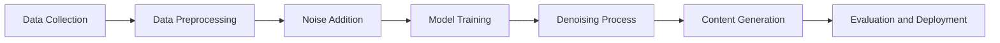

# Diffusion Models - Notes

## Table of Contents (ToC)

- [Introduction](#introduction)
  - [What's Diffusion Models?](#whats-diffusion-models)
  - [Key Concepts and Terminology](#key-concepts-and-terminology)
  - [Applications](#applications)
- [Fundamentals](#fundamentals)
  - [Diffusion Models Architecture Pipeline](#diffusion-models-architecture-pipeline)
  - [How Diffusion Models work?](#how-diffusion-models-work)
  - [Types of Diffusion Models](#types-of-diffusion-models)
  - [Some hands-on examples](#some-hands-on-examples)
- [Tools \& Frameworks](#tools--frameworks)
- [Hello World!](#hello-world)
- [Lab: Zero to Hero Projects](#lab-zero-to-hero-projects)
- [References](#references)

## Introduction
Diffusion models are a class of generative models that generate data by reversing a diffusion process.

### What's Diffusion Models?
- Generative models that create data through a gradual denoising process.
- They start with noise and iteratively refine it to produce realistic data.
- Recently shown to achieve state-of-the-art performance in image generation.

### Key Concepts and Terminology
- **Diffusion Process:** A process where data is gradually corrupted with noise.
- **Denoising:** The process of reversing noise to reconstruct the original data.
- **Latent Space:** The abstract space where the model represents data during the diffusion process.
- **Markov Chain:** A mathematical system that undergoes transitions from one state to another.

### Applications
- **Image Synthesis:** Generating high-quality images from noise.
- **Super-resolution:** Enhancing the resolution of low-quality images.
- **Inpainting:** Filling in missing parts of images.
- **Video Generation:** Creating realistic video sequences from noise.

## Fundamentals

### Diffusion Models Architecture Pipeline



### How Diffusion Models work?
- **Data Collection:** Gather a large dataset of high-quality images or relevant data.
- **Data Preprocessing:** Clean and prepare data, and add noise at various levels.
- **Noise Addition:** Gradually add noise to the data in a controlled manner.
- **Model Training:** Train the model to reverse the noise addition process.
- **Denoising Process:** Apply the trained model to denoise the data iteratively.
- **Content Generation:** Generate new data by starting from noise and applying the denoising process.
- **Evaluation and Deployment:** Assess the quality of generated data and deploy the model for use.

### Types of Diffusion Models
| Name | Techniques | Description | Application examples/interests |
|------|------------|-------------|--------------------------------|
| Denoising Diffusion Probabilistic Models (DDPM) | Gradual denoising using a Markov chain | Iteratively denoises data starting from pure noise | High-quality image synthesis, super-resolution |
| Score-Based Generative Models | Score matching and Langevin dynamics | Uses a score function to guide the denoising process | Image generation, inpainting, text-to-image synthesis |
| Latent Diffusion Models | Denoising in latent space | Performs denoising in a lower-dimensional latent space | Efficient high-quality image synthesis, compression |
| Continuous Diffusion Models | Continuous noise process | Models the diffusion process as a continuous-time stochastic process | Video generation, long sequence modeling |

### Some hands-on examples
- **Image Generation with DDPM:** Generate high-resolution images from noise.
- **Super-resolution with Latent Diffusion Models:** Enhance image resolution using latent space denoising.
- **Inpainting with Score-Based Models:** Fill in missing parts of images realistically.
- **Video Generation with Continuous Diffusion Models:** Create realistic video sequences from noise.

## Tools & Frameworks
- **TensorFlow:** Framework for implementing and training diffusion models.
- **PyTorch:** Widely used for its flexibility and support for advanced generative models.
- **DiffWave:** A PyTorch library specifically for training and deploying diffusion models.
- **OpenAI Guided Diffusion:** Implements advanced diffusion models for high-quality image generation.

## Hello World!
```python
import torch
from diffusers import DDPMPipeline

# Load pre-trained diffusion model pipeline
model_name = "google/ddpm-celebahq-256"
pipeline = DDPMPipeline.from_pretrained(model_name)

# Generate image from noise
generated_images = pipeline(num_inference_steps=1000, batch_size=1)

# Convert tensor to image and display
from PIL import Image
import numpy as np

image_array = generated_images[0].cpu().numpy().transpose(1, 2, 0)
image = Image.fromarray((image_array * 255).astype(np.uint8))
image.show()
```

## Lab: Zero to Hero Projects
- **Create Photorealistic Images:** Use DDPM to generate high-quality images from noise.
- **Enhance Image Resolution:** Develop a super-resolution tool with Latent Diffusion Models.
- **Image Inpainting:** Build an application to fill in missing parts of images using Score-Based Models.
- **Generate Video Sequences:** Create realistic videos from noise using Continuous Diffusion Models.

## References

- [Denoising Diffusion Probabilistic Models - Ho, J., Jain, A., & Abbeel, P. (2020)](https://arxiv.org/abs/2006.11239)
- [Score-Based Generative Modeling through Stochastic Differential Equations - Song, Y., & Ermon, S. (2020)](https://arxiv.org/abs/2011.13456)
- [Zero-Shot Text-to-Image Generation - Ramesh, A., Pavlov, M., Goh, G., Gray, S., Voss, C., Radford, A., ... & Sutskever, I. (2021)](https://arxiv.org/pdf/2102.12092).
- [Dhariwal, P., & Nichol, A. (2021). Diffusion Models Beat GANs on Image Synthesis. arXiv preprint arXiv:2105.05233](https://arxiv.org/pdf/2105.05233).

Lectures and online courses
- [How Stable Diffusion Works (AI Image Generation) - Gonkee (Must Watch)](https://www.youtube.com/watch?v=sFztPP9qPRc)
- [WORLD OF DIFFUSION: theory, shortcuts & future - Martin Andrews@reddragon.ai]( https://www.youtube.com/watch?v=hVk7Py1c24Q&t=0s)
- [Practical Deep Learning - @fastai](https://www.youtube.com/playlist?list=PLfYUBJiXbdtRUvTUYpLdfHHp9a58nWVXP)
- [An introduction to Diffusion Probabilistic Models](https://ayandas.me/blogs/2021-12-04-diffusion-prob-models.html)
- [Week 7 Diffusion processes - Jonathan Goodman](https://math.nyu.edu/~goodman/teaching/StochCalc2013/notes/Week7.pdf)
- [What are Diffusion Models? - @https://github.com/lilianweng](https://lilianweng.github.io/posts/2021-07-11-diffusion-models/)
- [Understanding Diffusion Probabilistic Models (DPMs)](https://towardsdatascience.com/understanding-diffusion-probabilistic-models-dpms-1940329d6048)
- [Understanding Diffusion Models: A Unified Perspective - Calvin Luo](https://calvinyluo.com/2022/08/26/diffusion-tutorial.html)


Papers: 
- [Diffusion Models in Vision: A Survey - 1 Apr 2023](https://arxiv.org/pdf/2209.04747)
  ```text
  - 3 Diffusion Models Sub-categories:
    - DDPMs: Denoising dDiffusion Probabilistic Models
    - NCSNs: Noise Conditioned Score Networks 
    - SDEs: Stochastic Differential Equations
  ```
