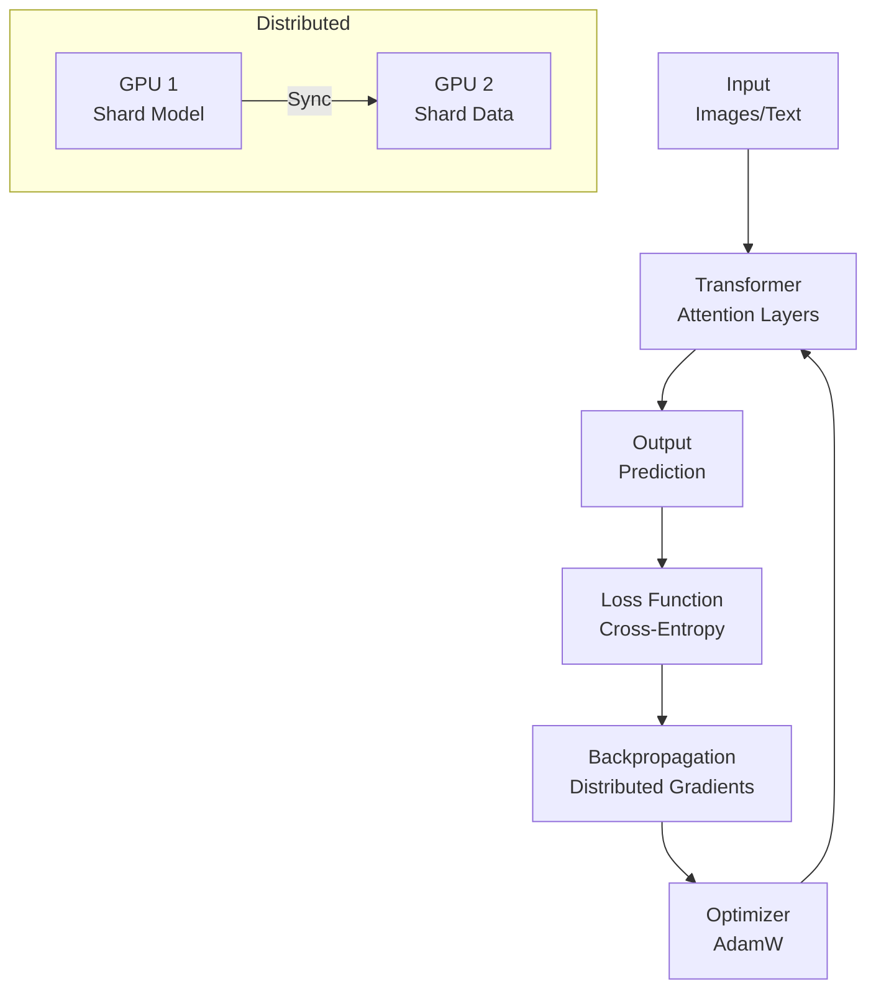

# Deep Learning Technical Notes
<!-- [A rectangular image illustrating an advanced deep learning workflow: a transformer-based model training on a massive dataset (e.g., text or images) across a GPU cluster, integrated with a distributed pipeline, deployed on an edge device, visualized on a workstation with metrics for accuracy, inference latency, and training throughput.] -->

## Quick Reference
- **One-sentence definition**: Deep Learning is an advanced machine learning discipline that leverages multi-layered neural networks to model complex, hierarchical patterns in large-scale data for tasks like vision, language, and control.
- **Key use cases**: Real-time object detection, large-scale language modeling, and autonomous system decision-making in production environments.
- **Prerequisites**: Expertise in neural architectures (e.g., CNNs, transformers), optimization (e.g., gradient descent), and experience with distributed training or deployment.

## Table of Contents
- [Introduction](#introduction)
- [Core Concepts](#core-concepts)
  - [Fundamental Understanding](#fundamental-understanding)
  - [Visual Architecture](#visual-architecture)
- [Implementation Details](#implementation-details)
  - [Basic Implementation](#basic-implementation)
  - [Intermediate Patterns](#intermediate-patterns)
  - [Advanced Topics](#advanced-topics)
- [Real-World Applications](#real-world-applications)
  - [Industry Examples](#industry-examples)
  - [Hands-On Project](#hands-on-project)
- [Tools & Resources](#tools--resources)
  - [Essential Tools](#essential-tools)
  - [Learning Resources](#learning-resources)
- [References](#references)
- [Appendix](#appendix)

## Introduction
- **What**: Deep Learning employs neural networks with sophisticated architectures to extract and generalize patterns from high-dimensional data, enabling state-of-the-art performance across diverse domains.  
- **Why**: It excels in modeling non-linear relationships, scaling with data and compute, and adapting to unstructured inputs, addressing limitations of traditional algorithms in production settings.  
- **Where**: Deployed in autonomous driving (e.g., Tesla FSD), generative AI (e.g., GPT models), and medical diagnostics (e.g., cancer detection).

## Core Concepts
### Fundamental Understanding
- **Basic Principles**:  
  - Deep Learning relies on hierarchical feature learning, where layers progressively abstract raw inputs into task-relevant representations.  
  - Training involves optimizing high-dimensional parameter spaces using gradient-based methods, often with regularization to manage generalization.  
  - Scalability and efficiency require distributed computing, mixed precision, and architecture-specific optimizations.  
- **Key Components**:  
  - **Architectures**: Specialized networks like CNNs (spatial data), RNNs (sequential), or transformers (attention-based) for task-specific modeling.  
  - **Optimization**: Advanced optimizers (e.g., AdamW, LAMB) and techniques like gradient clipping for stable convergence.  
  - **Regularization**: Dropout, weight decay, and data augmentation to mitigate overfitting.  
  - **Loss Functions**: Task-specific objectives (e.g., cross-entropy, MSE) with auxiliary losses for complex models.  
- **Common Misconceptions**:  
  - *“More parameters = better”*: Efficiency (e.g., pruning, quantization) often outperforms brute-force scaling.  
  - *“Training is deterministic”*: Stochasticity (e.g., initialization, data shuffling) requires careful control for reproducibility.

### Visual Architecture

- **System Overview**: Inputs are processed by a transformer, predictions are evaluated, and gradients are computed and synchronized across GPUs for optimization.  
- **Component Relationships**: Layers transform data, loss drives backpropagation, and distributed optimization updates parameters.

## Implementation Details
### Basic Implementation [Recap]
```py
# Recap: MNIST classifier
import tensorflow as tf
model = tf.keras.Sequential([tf.keras.layers.Dense(128, activation='relu'), tf.keras.layers.Dense(10, activation='softmax')])
model.compile(optimizer='adam', loss='sparse_categorical_crossentropy')
model.fit(x_train, y_train, epochs=5)
```

### Intermediate Patterns [Recap]
```py
# Recap: CNN for CIFAR-10
import torch
import torch.nn as nn
class SimpleCNN(nn.Module):
    def __init__(self): super().__init__(); self.conv1 = nn.Conv2d(3, 16, 3); self.fc = nn.Linear(16*8*8, 10)
    def forward(self, x): x = torch.relu(self.conv1(x)); x = x.view(-1, 16*8*8); return self.fc(x)
model = SimpleCNN().cuda()
```

### Advanced Topics [Advanced]
**Language**: Python (PyTorch with distributed training for a Vision Transformer on ImageNet)  
```py
import torch
import torch.nn as nn
import torch.optim as optim
import torch.distributed as dist
import torch.multiprocessing as mp
from torch.nn.parallel import DistributedDataParallel as DDP
import torchvision
import torchvision.transforms as transforms
from timm.models.vision_transformer import VisionTransformer

def setup(rank, world_size):
    dist.init_process_group("nccl", rank=rank, world_size=world_size)
    torch.cuda.set_device(rank)

def train(rank, world_size):
    setup(rank, world_size)
    
    # Load ImageNet (simplified; assumes pre-downloaded)
    transform = transforms.Compose([
        transforms.Resize((224, 224)),
        transforms.ToTensor(),
        transforms.Normalize((0.485, 0.456, 0.406), (0.229, 0.224, 0.225))
    ])
    trainset = torchvision.datasets.ImageFolder(root='/path/to/imagenet/train', transform=transform)
    trainsampler = torch.utils.data.distributed.DistributedSampler(trainset)
    trainloader = torch.utils.data.DataLoader(trainset, batch_size=64, sampler=trainsampler, num_workers=4)

    # Vision Transformer
    model = VisionTransformer(
        img_size=224, patch_size=16, embed_dim=384, depth=12, num_heads=6, num_classes=1000
    ).to(rank)
    model = DDP(model, device_ids=[rank])
    
    # Optimizer and loss
    optimizer = optim.AdamW(model.parameters(), lr=0.001, weight_decay=0.05)
    criterion = nn.CrossEntropyLoss()

    # Training loop
    model.train()
    for epoch in range(3):  # Limited for demo
        trainsampler.set_epoch(epoch)
        running_loss = 0.0
        for images, labels in trainloader:
            images, labels = images.to(rank), labels.to(rank)
            optimizer.zero_grad()
            outputs = model(images)
            loss = criterion(outputs, labels)
            loss.backward()
            optimizer.step()
            running_loss += loss.item()
        print(f"Rank {rank}, Epoch {epoch+1}, Loss: {running_loss/len(trainloader)}")
    
    # Cleanup
    dist.destroy_process_group()

def main():
    world_size = torch.cuda.device_count()
    mp.spawn(train, args=(world_size,), nprocs=world_size, join=True)

if __name__ == "__main__":
    main()
```
- **System Design**:  
  - Implements a Vision Transformer (ViT) with distributed data-parallel training using PyTorch DDP across multiple GPUs.  
  - Integrates with ImageNet for large-scale vision tasks.  
- **Optimization Techniques**:  
  - Uses `DistributedSampler` for balanced data sharding.  
  - Employs AdamW with weight decay for stable convergence.  
  - Mixed precision (not shown) could further optimize via `torch.cuda.amp`.  
- **Production Considerations**:  
  - Scalable to clusters with NCCL backend for efficient GPU communication.  
  - Checkpointing (`torch.save`) ensures fault tolerance (not shown).  
  - Inference-ready with `model.eval()` and exportable to ONNX for edge deployment.

- **Step-by-Step Setup**:  
  1. Install Python 3.8+ and PyTorch with CUDA: `pip install torch torchvision timm`.  
  2. Install ImageNet or use a subset (e.g., Tiny ImageNet for testing).  
  3. Ensure multi-GPU setup or simulate with single GPU (`world_size=1`).  
  4. Save code as `vit_distributed.py`.  
  5. Run: `python vit_distributed.py`.  
  6. Expect loss reduction; full ImageNet training requires ~100 epochs for ~80% accuracy.  

## Real-World Applications
### Industry Examples
- **Use Case**: Real-time pedestrian detection (e.g., autonomous vehicles).  
- **Implementation Pattern**: ViT or YOLOv5 processes camera feeds, deployed on edge GPUs.  
- **Success Metrics**: 98%+ mAP, <50ms inference latency.  

### Hands-On Project
- **Project Goals**: Train a Vision Transformer on a vision dataset.  
- **Implementation Steps**:  
  1. Use Tiny ImageNet or CIFAR-100 for faster experimentation.  
  2. Implement the ViT code above with DDP (or single GPU).  
  3. Add mixed precision training (`torch.cuda.amp`).  
  4. Evaluate top-1 accuracy and inference speed.  
- **Validation Methods**: Achieve 70%+ accuracy, <100ms inference per image.

## Tools & Resources
### Essential Tools
- **Development Environment**: Ubuntu 20.04, PyCharm with GPU support.  
- **Key Frameworks**: PyTorch, TensorFlow, Hugging Face Transformers, TIMM.  
- **Testing Tools**: PyTorch Profiler, NVIDIA Nsight, Weights & Biases.  

### Learning Resources
- **Documentation**: PyTorch Distributed (https://pytorch.org/docs/stable/distributed.html).  
- **Tutorials**: “Vision Transformers Explained” on ArXiv or Hugging Face blog.  
- **Community Resources**: PyTorch Discuss, r/deeplearning, Hugging Face Forums.  

## References
- “An Image is Worth 16x16 Words: Transformers for Image Recognition” (Dosovitskiy et al., 2020)  
- “Deep Learning” (Goodfellow et al., 2016)  
- PyTorch Distributed Docs: https://pytorch.org/docs/stable/distributed.html  

## Appendix
- **Glossary**:  
  - *Attention*: Mechanism weighting input importance (e.g., in transformers).  
  - *DDP*: Distributed Data Parallel for multi-GPU training.  
- **Setup Guides**:  
  - CUDA Setup: Install via NVIDIA drivers (https://developer.nvidia.com/cuda).  
  - ImageNet Access: Request via http://image-net.org or use torchvision subsets.  
- **Code Templates**: See ViT example above.
