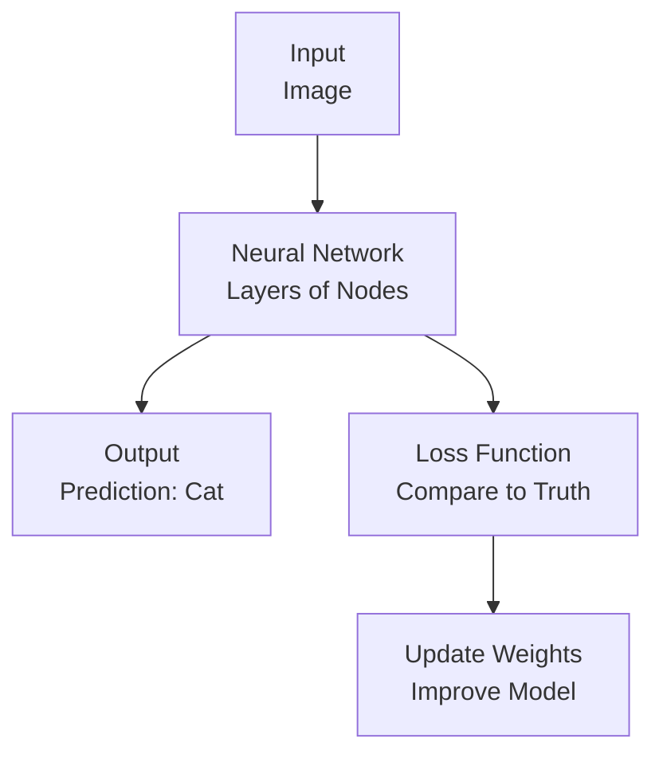

# Deep Learning Technical Notes
<!-- [A rectangular image showing a simplified deep learning workflow: a beginner-friendly diagram with a cartoon brain-like neural network (nodes and arrows), a dataset (e.g., images of cats and dogs), and a laptop displaying predictions (e.g., “Cat!”), with icons for accuracy and simplicity.] -->

## Quick Reference
- **One-sentence definition**: Deep Learning is a subset of machine learning that uses neural networks with many layers to learn patterns from data for tasks like image recognition or language processing.
- **Key use cases**: Classifying images, translating languages, generating text, or powering self-driving cars.
- **Prerequisites**: Basic Python (e.g., running scripts), high school-level math (e.g., algebra), and curiosity about AI.

## Table of Contents
- [Introduction](#introduction)
- [Core Concepts](#core-concepts)
    - [Fundamental Understanding](#fundamental-understanding)
    - [Visual Architecture](#visual-architecture)
- [Implementation Details](#implementation-details)
    - [Basic Implementation](#basic-implementation)
- [Real-World Applications](#real-world-applications)
    - [Industry Examples](#industry-examples)
    - [Hands-On Project](#hands-on-project)
- [Tools & Resources](#tools--resources)
    - [Essential Tools](#essential-tools)
    - [Learning Resources](#learning-resources)
- [References](#references)
- [Appendix](#appendix)

## Introduction
- **What**: Deep Learning involves training artificial neural networks, inspired by the human brain, to recognize patterns in data like images, text, or sounds.  
- **Why**: It solves complex problems that traditional programming struggles with, like identifying objects in photos, by learning directly from examples.  
- **Where**: Used in apps (e.g., photo filters), healthcare (e.g., diagnosing diseases), entertainment (e.g., movie recommendations), and more.

## Core Concepts
### Fundamental Understanding
- **Basic Principles**:  
  - Deep Learning models learn by adjusting connections in a network based on data, like tuning a guitar to play the right notes.  
  - They need lots of data (e.g., thousands of images) and computing power to train effectively.  
  - The “deep” part comes from using many layers of interconnected nodes to process data.  
- **Key Components**:  
  - **Neural Network**: A structure of nodes (neurons) organized in layers that process input (e.g., image pixels) to produce output (e.g., “cat” or “dog”).  
  - **Training**: Adjusting the network’s connections using math to reduce errors in predictions.  
  - **Loss Function**: A measure of how wrong the model’s predictions are, guiding the training process.  
- **Common Misconceptions**:  
  - *“It’s like a real brain”*: Neural networks are simplified math models, not actual brains.  
  - *“It’s too hard for beginners”*: Simple tools like Python libraries make it accessible.

### Visual Architecture

- **System Overview**: Data enters a neural network, produces a prediction, and improves through loss-guided updates.  
- **Component Relationships**: The network processes input, the loss measures errors, and updates refine the model.

## Implementation Details
### Basic Implementation [Beginner]
**Language**: Python (using TensorFlow/Keras)  
```py
# Simple neural network to classify handwritten digits
import tensorflow as tf
from tensorflow.keras import layers, models

# Load dataset (MNIST: handwritten digits 0-9)
(x_train, y_train), (x_test, y_test) = tf.keras.datasets.mnist.load_data()

# Preprocess data
x_train = x_train / 255.0  # Normalize pixel values to 0-1
x_test = x_test / 255.0

# Build model
model = models.Sequential([
    layers.Flatten(input_shape=(28, 28)),  # Flatten 28x28 images
    layers.Dense(128, activation='relu'),  # Hidden layer with 128 nodes
    layers.Dense(10, activation='softmax') # Output layer for 10 digits
])

# Compile model
model.compile(optimizer='adam',
              loss='sparse_categorical_crossentropy',
              metrics=['accuracy'])

# Train model
model.fit(x_train, y_train, epochs=5)

# Test model
test_loss, test_accuracy = model.evaluate(x_test, y_test)
print(f"Test accuracy: {test_accuracy}")
```
- **Step-by-Step Setup**:  
  1. Install Python 3.8+ (python.org).  
  2. Install TensorFlow: `pip install tensorflow`.  
  3. Save code as `mnist_classifier.py`.  
  4. Run: `python mnist_classifier.py`.  
  5. Expect output showing training progress and final test accuracy (~95%+).  
- **Code Walkthrough**:  
  - `mnist.load_data()` provides 60,000 training and 10,000 test images of digits.  
  - `Sequential` builds a neural network with a hidden layer (128 nodes) and output layer (10 classes).  
  - `fit()` trains the model for 5 epochs (passes through data); `evaluate()` checks accuracy.  
- **Common Pitfalls**:  
  - Missing TensorFlow: Ensure `pip install tensorflow` completes without errors.  
  - Wrong data shape: Images must be 28x28 pixels, normalized to 0-1.  
  - Slow training: Use a CPU/GPU; reduce epochs if testing.

## Real-World Applications
### Industry Examples
- **Use Case**: Facial recognition in phones.  
- **Implementation Pattern**: A neural network trained on face images unlocks the device.  
- **Success Metrics**: 99%+ accuracy in identifying users.  

### Hands-On Project
- **Project Goals**: Train a neural network to recognize digits (0-9).  
- **Implementation Steps**:  
  1. Run the example code above to train on MNIST.  
  2. Test on a few test images by printing predictions (`model.predict(x_test[:5])`).  
  3. Visualize an image to understand the data (`plt.imshow(x_test[0], cmap='gray')` with `matplotlib`).  
- **Validation Methods**: Achieve 90%+ test accuracy after 5 epochs.

## Tools & Resources
### Essential Tools
- **Development Environment**: Jupyter Notebook, VS Code.  
- **Key Frameworks**: TensorFlow/Keras, PyTorch (alternative).  
- **Testing Tools**: Matplotlib for visualizing data/predictions.  

### Learning Resources
- **Documentation**: TensorFlow Tutorials (https://www.tensorflow.org/tutorials).  
- **Tutorials**: “Deep Learning for Beginners” on YouTube or Coursera (e.g., Andrew Ng’s courses).  
- **Community Resources**: r/learnmachinelearning, Stack Overflow (tensorflow tag).  

## References
- TensorFlow Documentation: https://www.tensorflow.org  
- “Deep Learning with Python” (Chollet, 2017)  
- “Neural Networks and Deep Learning” (online book by Michael Nielsen)  

## Appendix
- **Glossary**:  
  - *Neuron*: A node in a network that processes data.  
  - *Epoch*: One full pass through the training data.  
- **Setup Guides**:  
  - Install Python: Use python.org or Anaconda.  
  - TensorFlow GPU (optional): Follow https://www.tensorflow.org/install/gpu.  
- **Code Templates**: See MNIST example above.
