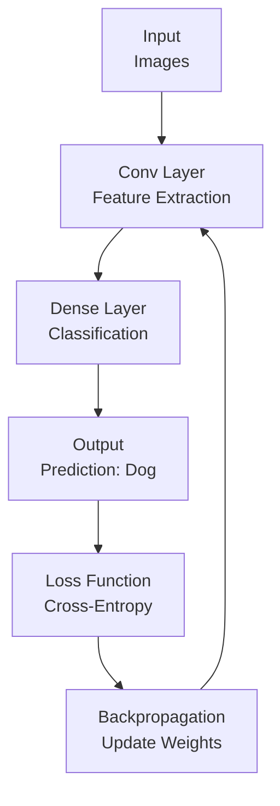

# Deep Learning Technical Notes
<!-- [A rectangular image depicting an intermediate deep learning workflow: a convolutional neural network (CNN) processing a dataset (e.g., color images of animals), running on a GPU, with a programmer tweaking settings on a laptop, displayed with metrics for accuracy, training time, and model size.] -->

## Quick Reference
- **One-sentence definition**: Deep Learning is a machine learning paradigm that leverages multi-layered neural networks to extract complex patterns from large datasets for tasks like image classification or natural language processing.
- **Key use cases**: Enhancing computer vision (e.g., object detection), natural language processing (e.g., chatbots), and predictive analytics.
- **Prerequisites**: Familiarity with neural networks (e.g., layers, activation functions), Python proficiency, and basic ML concepts (e.g., overfitting, loss).

## Table of Contents
1. [Introduction](#introduction)  
2. [Core Concepts](#core-concepts)  
  - [Fundamental Understanding](#fundamental-understanding)  
  - [Visual Architecture](#visual-architecture)  
3. [Implementation Details](#implementation-details)  
  - [Intermediate Patterns](#intermediate-patterns-intermediate)  
4. [Real-World Applications](#real-world-applications)  
  - [Industry Examples](#industry-examples)  
  - [Hands-On Project](#hands-on-project)  
5. [Tools & Resources](#tools--resources)  
  - [Essential Tools](#essential-tools)  
  - [Learning Resources](#learning-resources)  
6. [References](#references)  
7. [Appendix](#appendix)  

## Introduction
- **What**: Deep Learning uses neural networks with multiple layers to model intricate relationships in data, enabling tasks like recognizing objects or generating text.  
- **Why**: It excels at handling unstructured data (e.g., images, audio) and scales with large datasets, addressing limitations of traditional ML algorithms.  
- **Where**: Applied in autonomous vehicles (e.g., lane detection), healthcare (e.g., MRI analysis), and consumer tech (e.g., voice assistants).

## Core Concepts
### Fundamental Understanding
- **Basic Principles**:  
  - Neural networks learn hierarchical features (e.g., edges to objects in images) through layered transformations.  
  - Training involves optimizing weights using backpropagation and gradient descent to minimize a loss function.  
  - Overfitting and computational cost are managed through regularization and efficient architectures.  
- **Key Components**:  
  - **Layers**: Input, hidden (e.g., dense, convolutional), and output layers process data sequentially.  
  - **Activation Functions**: Non-linear functions (e.g., ReLU, softmax) enable complex modeling.  
  - **Optimizer**: Algorithms (e.g., Adam, SGD) that adjust weights to reduce loss.  
  - **Loss Function**: Measures prediction error (e.g., cross-entropy for classification).  
- **Common Misconceptions**:  
  - *“Deeper is always better”*: More layers can lead to overfitting or inefficiency without proper design.  
  - *“Training is straightforward”*: Hyperparameter tuning and data quality are critical for success.

### Visual Architecture

- **System Overview**: Input data flows through layers, produces predictions, and updates weights via loss and backpropagation.  
- **Component Relationships**: Layers transform data, loss guides optimization, and backpropagation refines the model.

## Implementation Details
### Intermediate Patterns [Intermediate]
**Language**: Python (using PyTorch for a CNN on CIFAR-10)  
```py
import torch
import torch.nn as nn
import torch.optim as optim
import torchvision
import torchvision.transforms as transforms

# Define CNN
class SimpleCNN(nn.Module):
    def __init__(self):
        super(SimpleCNN, self).__init__()
        self.conv1 = nn.Conv2d(3, 16, 3, padding=1)  # 3 input channels (RGB), 16 filters
        self.conv2 = nn.Conv2d(16, 32, 3, padding=1)
        self.pool = nn.MaxPool2d(2, 2)  # 2x2 pooling
        self.fc1 = nn.Linear(32 * 8 * 8, 128)  # After pooling: 32x8x8
        self.fc2 = nn.Linear(128, 10)  # 10 classes
        self.relu = nn.ReLU()
    
    def forward(self, x):
        x = self.pool(self.relu(self.conv1(x)))
        x = self.pool(self.relu(self.conv2(x)))
        x = x.view(-1, 32 * 8 * 8)  # Flatten
        x = self.relu(self.fc1(x))
        x = self.fc2(x)
        return x

# Load CIFAR-10 dataset
transform = transforms.Compose([transforms.ToTensor(), transforms.Normalize((0.5, 0.5, 0.5), (0.5, 0.5, 0.5))])
trainset = torchvision.datasets.CIFAR10(root='./data', train=True, download=True, transform=transform)
trainloader = torch.utils.data.DataLoader(trainset, batch_size=32, shuffle=True)
testset = torchvision.datasets.CIFAR10(root='./data', train=False, download=True, transform=transform)
testloader = torch.utils.data.DataLoader(testset, batch_size=32, shuffle=False)

# Setup model, loss, optimizer
device = torch.device("cuda" if torch.cuda.is_available() else "cpu")
model = SimpleCNN().to(device)
criterion = nn.CrossEntropyLoss()
optimizer = optim.Adam(model.parameters(), lr=0.001)

# Training loop
for epoch in range(5):
    model.train()
    running_loss = 0.0
    for images, labels in trainloader:
        images, labels = images.to(device), labels.to(device)
        optimizer.zero_grad()
        outputs = model(images)
        loss = criterion(outputs, labels)
        loss.backward()
        optimizer.step()
        running_loss += loss.item()
    print(f"Epoch {epoch+1}, Loss: {running_loss/len(trainloader)}")

# Evaluation
model.eval()
correct, total = 0, 0
with torch.no_grad():
    for images, labels in testloader:
        images, labels = images.to(device), labels.to(device)
        outputs = model(images)
        _, predicted = torch.max(outputs, 1)
        total += labels.size(0)
        correct += (predicted == labels).sum().item()
print(f"Test accuracy: {100 * correct / total}%")
```
- **Design Patterns**:  
  - **Convolutional Layers**: Extract spatial features (e.g., edges, textures) for image tasks.  
  - **Data Loading**: Uses `DataLoader` for efficient batch processing and shuffling.  
- **Best Practices**:  
  - Normalize inputs (e.g., `transforms.Normalize`) to stabilize training.  
  - Use GPU (`cuda`) for faster computation if available.  
  - Save model checkpoints (`torch.save`) to resume training.  
- **Performance Considerations**:  
  - Batch size (32) balances memory and speed; adjust based on hardware.  
  - Limit epochs (5) for quick testing; increase for better accuracy.  

- **Step-by-Step Setup**:  
  1. Install Python 3.8+ (python.org).  
  2. Install PyTorch and torchvision: `pip install torch torchvision`.  
  3. Save code as `cifar_cnn.py`.  
  4. Run: `python cifar_cnn.py`.  
  5. Expect ~60-70% test accuracy after 5 epochs (more epochs improve results).  

## Real-World Applications
### Industry Examples
- **Use Case**: Object detection in security cameras.  
- **Implementation Pattern**: CNNs identify objects (e.g., people, vehicles) in real-time feeds.  
- **Success Metrics**: 95%+ detection accuracy, <100ms latency.  

### Hands-On Project
- **Project Goals**: Train a CNN to classify CIFAR-10 images (e.g., cats, dogs, planes).  
- **Implementation Steps**:  
  1. Run the example code to train on CIFAR-10.  
  2. Visualize a few test predictions (`plt.imshow(images[0].cpu().numpy().transpose(1,2,0))` with `matplotlib`).  
  3. Experiment with adding a dropout layer (`nn.Dropout(0.2)`) to reduce overfitting.  
- **Validation Methods**: Achieve 65%+ test accuracy; compare loss curves.

## Tools & Resources
### Essential Tools
- **Development Environment**: Jupyter Notebook, PyCharm.  
- **Key Frameworks**: PyTorch, TensorFlow/Keras.  
- **Testing Tools**: TensorBoard for loss/accuracy visualization.  

### Learning Resources
- **Documentation**: PyTorch Tutorials (https://pytorch.org/tutorials/).  
- **Tutorials**: “Deep Learning with PyTorch” on YouTube or Fast.ai courses.  
- **Community Resources**: PyTorch Forums, r/deeplearning.  

## References
- PyTorch Documentation: https://pytorch.org/docs/stable/  
- “Deep Learning” (Goodfellow et al., 2016)  
- “Convolutional Neural Networks for Visual Recognition” (Stanford CS231n)  

## Appendix
- **Glossary**:  
  - *Convolution*: Operation extracting features like edges from images.  
  - *Dropout*: Regularization to prevent overfitting by dropping nodes.  
- **Setup Guides**:  
  - PyTorch GPU: `pip install torch --index-url https://download.pytorch.org/whl/cu118`.  
- **Code Templates**: See CNN example above.
