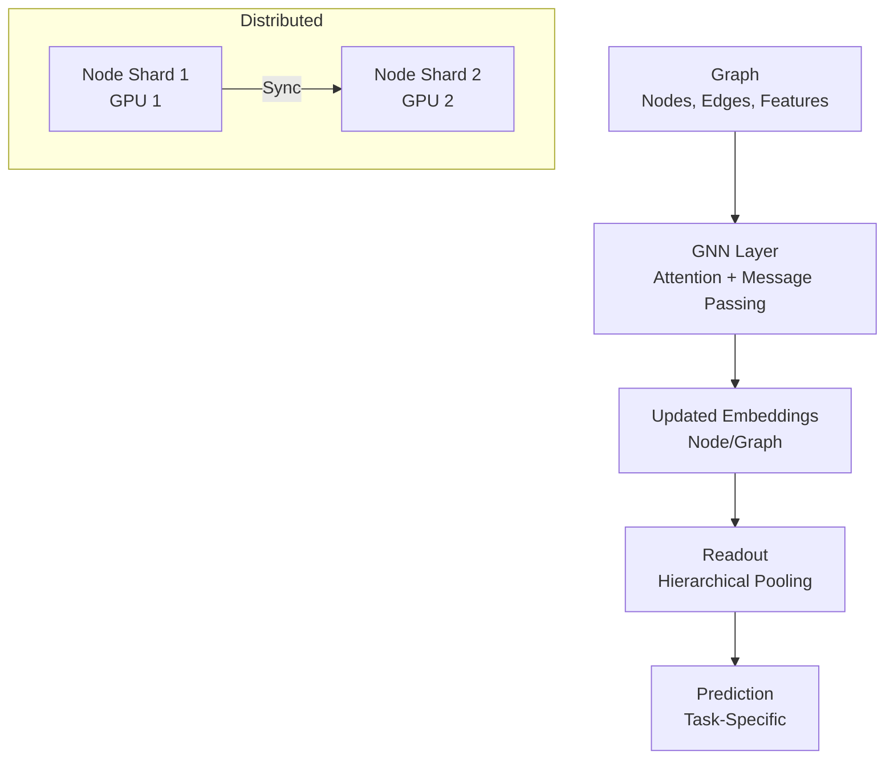

# Graph Neural Networks (GNNs) Technical Notes
<!-- [A rectangular image illustrating an advanced GNN workflow: a large-scale graph (e.g., a social network or knowledge graph) processed by a distributed GNN model on a GPU cluster, integrated with a real-time inference pipeline, visualized on a workstation with metrics for scalability, prediction accuracy, and inference latency.] -->

## Quick Reference
- **One-sentence definition**: Graph Neural Networks (GNNs) are advanced deep learning models that exploit graph-structured data to model complex relational dependencies for tasks like node classification, link prediction, and graph classification at scale.
- **Key use cases**: Real-time recommendation systems, large-scale molecular modeling, and dynamic network analysis in production environments.
- **Prerequisites**: Expertise in deep learning (e.g., transformers, optimization), graph algorithms, and experience with distributed computing or large-scale ML frameworks.

## Table of Contents
1. [Introduction](#introduction)  
2. [Core Concepts](#core-concepts)  
  - [Fundamental Understanding](#fundamental-understanding)  
  - [Visual Architecture](#visual-architecture)  
3. [Implementation Details](#implementation-details)  
  - [Basic Implementation](#basic-implementation)  
  - [Intermediate Patterns](#intermediate-patterns)  
  - [Advanced Topics](#advanced-topics)  
4. [Real-World Applications](#real-world-applications)  
  - [Industry Examples](#industry-examples)  
  - [Hands-On Project](#hands-on-project)  
5. [Tools & Resources](#tools--resources)  
  - [Essential Tools](#essential-tools)  
  - [Learning Resources](#learning-resources)  
6. [References](#references)  
7. [Appendix](#appendix)   

## Introduction
- **What**: Graph Neural Networks generalize deep learning to graph-structured data, leveraging relational inductive biases to capture dependencies in complex networks like social graphs, knowledge bases, or physical systems.  
- **Why**: They enable scalable, robust modeling of interconnected data, addressing limitations of traditional neural networks in handling non-Euclidean structures for production-grade applications.  
- **Where**: Deployed in recommendation systems (e.g., Pinterest), drug discovery (e.g., AlphaFold-inspired models), and infrastructure optimization (e.g., traffic flow prediction).

## Core Concepts
### Fundamental Understanding
- **Basic Principles**:  
  - GNNs operate via iterative message passing, where nodes aggregate neighbor information to refine representations, enabling generalization across graph structures.  
  - They support diverse tasks: node-level (e.g., classification), edge-level (e.g., link prediction), and graph-level (e.g., property prediction).  
  - Scalability and efficiency require sparse operations, sampling, and distributed training for large graphs.  
- **Key Components**:  
  - **Message Passing**: Nodes compute messages based on neighbor features, aggregated (e.g., sum, attention) to update states.  
  - **Graph Attention**: Mechanisms like GAT assign weights to neighbors, improving expressive power.  
  - **Readout Functions**: Pooling (e.g., mean, max) or hierarchical methods for graph-level tasks.  
  - **Graph Embeddings**: Low-dimensional representations capturing structural and feature information.  
- **Common Misconceptions**:  
  - *“GNNs scale easily”*: Large graphs demand sampling (e.g., GraphSAGE) or distributed frameworks for tractability.  
  - *“All GNNs are homogeneous”*: Heterogeneous GNNs handle diverse node/edge types (e.g., knowledge graphs).

### Visual Architecture

- **System Overview**: A graph is processed by GNN layers with attention-based message passing, embeddings are pooled, and predictions are made, often distributed across GPUs.  
- **Component Relationships**: Message passing refines embeddings, readout enables graph tasks, and distributed sync ensures scalability.

## Implementation Details
### Basic Implementation [Recap]
**Language**: Python  
```py
# Recap: GCN for Cora
from torch_geometric.nn import GCNConv
class GCN(torch.nn.Module):
    def __init__(self): super().__init__(); self.conv1 = GCNConv(num_features, 16); self.conv2 = GCNConv(16, num_classes)
    def forward(self, data): x = F.relu(self.conv1(data.x, data.edge_index)); return self.conv2(x, data.edge_index)
```

### Intermediate Patterns [Recap]
```py
# Recap: Graph classification
from torch_geometric.nn import GCNConv, global_mean_pool
class GraphGCN(torch.nn.Module):
    def __init__(self): super().__init__(); self.conv1 = GCNConv(num_features, 64); self.fc = torch.nn.Linear(64, num_classes)
    def forward(self, data): x = F.relu(self.conv1(data.x, data.edge_index)); x = global_mean_pool(x, data.batch); return self.fc(x)
```

### Advanced Topics [Advanced]
**Language**: Python (PyTorch Geometric with Graph Attention Network and distributed training)  
```py
import torch
import torch.nn.functional as F
from torch_geometric.datasets import PPI
from torch_geometric.loader import DataLoader
from torch_geometric.nn import GATConv, global_mean_pool
import torch.distributed as dist
import torch.multiprocessing as mp
from torch.nn.parallel import DistributedDataParallel as DDP

def setup(rank, world_size):
    dist.init_process_group("nccl", rank=rank, world_size=world_size)
    torch.cuda.set_device(rank)

# Define Graph Attention Network for multi-label node classification
class GAT(torch.nn.Module):
    def __init__(self, num_features, hidden_dim, num_classes, heads=8):
        super(GAT, self).__init__()
        self.gat1 = GATConv(num_features, hidden_dim, heads=heads, dropout=0.6)
        self.gat2 = GATConv(hidden_dim * heads, num_classes, heads=1, concat=False, dropout=0.6)
    
    def forward(self, data):
        x, edge_index = data.x, data.edge_index
        x = F.dropout(x, p=0.6, training=self.training)
        x = F.elu(self.gat1(x, edge_index))
        x = F.dropout(x, p=0.6, training=self.training)
        x = self.gat2(x, edge_index)
        return x  # No softmax (BCEWithLogitsLoss handles it)

def train(rank, world_size):
    setup(rank, world_size)
    
    # Load PPI dataset (protein interaction, multi-label)
    train_dataset = PPI(root='./data', split='train')
    val_dataset = PPI(root='./data', split='val')
    train_loader = DataLoader(train_dataset, batch_size=2, shuffle=True)
    val_loader = DataLoader(val_dataset, batch_size=2, shuffle=False)
    
    # Setup model
    model = GAT(num_features=train_dataset.num_features, hidden_dim=64, num_classes=train_dataset.num_classes).to(rank)
    model = DDP(model, device_ids=[rank])
    optimizer = torch.optim.Adam(model.parameters(), lr=0.005)
    criterion = torch.nn.BCEWithLogitsLoss()

    # Training loop
    for epoch in range(20):
        model.train()
        total_loss = 0
        for data in train_loader:
            data = data.to(rank)
            optimizer.zero_grad()
            out = model(data)
            loss = criterion(out, data.y)
            loss.backward()
            optimizer.step()
            total_loss += loss.item()
        
        # Validation
        model.eval()
        val_f1 = 0
        with torch.no_grad():
            for data in val_loader:
                data = data.to(rank)
                out = model(data)
                pred = (out > 0).float()
                # Micro F1-score (simplified)
                correct = (pred == data.y).float().sum()
                total = data.y.numel()
                val_f1 += correct / total
        val_f1 /= len(val_loader)
        if rank == 0:  # Log from rank 0 only
            print(f"Epoch {epoch+1}, Loss: {total_loss/len(train_loader):.4f}, Val F1: {val_f1:.4f}")
    
    dist.destroy_process_group()

def main():
    world_size = torch.cuda.device_count()
    mp.spawn(train, args=(world_size,), nprocs=world_size, join=True)

if __name__ == "__main__":
    main()
```
- **System Design**:  
  - Implements a Graph Attention Network (GAT) with multi-head attention for multi-label node classification on PPI.  
  - Uses PyTorch DDP for distributed training across GPUs, ensuring scalability.  
- **Optimization Techniques**:  
  - Attention-based aggregation (`GATConv`) prioritizes important neighbors.  
  - Dropout (0.6) and ELU activation prevent overfitting in dense graphs.  
  - BCEWithLogitsLoss handles multi-label classification efficiently.  
- **Production Considerations**:  
  - Fault-tolerant with DDP synchronization and checkpointing (not shown).  
  - Scalable to large graphs with neighbor sampling (e.g., GraphSAGE, not shown).  
  - Inference-ready for real-time tasks with `model.eval()` and exportable to ONNX.

- **Step-by-Step Setup**:  
  1. Install Python 3.8+ and PyTorch with CUDA: `pip install torch torchvision torch-geometric`.  
  2. Install dependencies: `pip install torch-scatter torch-sparse` (platform-specific).  
  3. Ensure multi-GPU setup or simulate with single GPU (`world_size=1`).  
  4. Save code as `gat_ppi.py`.  
  5. Run: `python gat_ppi.py`.  
  6. Expect ~0.7-0.8 F1-score on PPI validation after 20 epochs (full training may reach ~0.9).  

## Real-World Applications
### Industry Examples
- **Use Case**: Knowledge graph reasoning (e.g., Google Knowledge Graph).  
- **Implementation Pattern**: GNNs predict missing links or classify entities in large-scale graphs.  
- **Success Metrics**: 95%+ precision, <100ms inference latency.  

### Hands-On Project
- **Project Goals**: Train a GAT for multi-label node classification on PPI.  
- **Implementation Steps**:  
  1. Run the example code on PPI with distributed training.  
  2. Add mixed precision (`torch.cuda.amp`) for faster training.  
  3. Log F1-scores with Weights & Biases for analysis.  
  4. Test inference speed on a single GPU.  
- **Validation Methods**: Achieve 0.8+ F1-score, <50ms inference per graph.

## Tools & Resources
### Essential Tools
- **Development Environment**: Ubuntu 20.04, PyCharm with GPU support.  
- **Key Frameworks**: PyTorch Geometric, DGL, Spektral.  
- **Testing Tools**: PyTorch Profiler, NVIDIA Nsight, Weights & Biases.  

### Learning Resources
- **Documentation**: PyTorch Geometric Advanced Tutorials (https://pytorch-geometric.readthedocs.io/).  
- **Tutorials**: “Graph Attention Networks” on ArXiv or dgl.ai.  
- **Community Resources**: PyTorch Geometric GitHub, r/MachineLearning, Graph ML Slack.  

## References
- “Graph Attention Networks” (Veličković et al., 2017)  
- “Semi-Supervised Classification with Graph Convolutional Networks” (Kipf & Welling, 2016)  
- “Deep Graph Library” (https://www.dgl.ai)  

## Appendix
- **Glossary**:  
  - *Attention Mechanism*: Weights neighbor contributions in message passing.  
  - *Multi-Label Classification*: Predicting multiple labels per node.  
- **Setup Guides**:  
  - CUDA Setup: Install via NVIDIA drivers (https://developer.nvidia.com/cuda).  
  - PyTorch Geometric: Follow https://pytorch-geometric.readthedocs.io/en/latest/install/installation.html.  
- **Code Templates**: See GAT example above.
