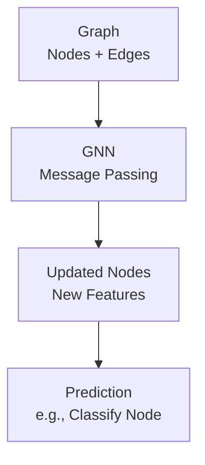

# Graph Neural Networks (GNNs) Technical Notes
<!-- [A rectangular image showing a simplified GNN workflow: a beginner-friendly diagram with a network of connected dots (nodes) and lines (edges), like a social network, feeding into a neural network, displayed on a laptop predicting something (e.g., “Friend?”), with icons for connections and learning.] -->

## Quick Reference
- **One-sentence definition**: Graph Neural Networks (GNNs) are a type of deep learning model that process graph-structured data, like social networks or molecules, to learn patterns and make predictions.
- **Key use cases**: Recommending friends in social media, predicting chemical properties, or analyzing connections in networks like the internet.
- **Prerequisites**: Basic Python (e.g., running scripts), high school math (e.g., algebra), and a general idea of what neural networks are (helpful but not required).

## Table of Contents
1. [Introduction](#introduction)  
2. [Core Concepts](#core-concepts)  
  - [Fundamental Understanding](#fundamental-understanding)  
  - [Visual Architecture](#visual-architecture)  
3. [Implementation Details](#implementation-details)  
  - [Basic Implementation](#basic-implementation-beginner)  
4. [Real-World Applications](#real-world-applications)  
  - [Industry Examples](#industry-examples)  
  - [Hands-On Project](#hands-on-project)  
5. [Tools & Resources](#tools--resources)  
  - [Essential Tools](#essential-tools)  
  - [Learning Resources](#learning-resources)  
6. [References](#references)  
7. [Appendix](#appendix)   

## Introduction
- **What**: Graph Neural Networks are special neural networks designed to work with data organized as graphs, where things (nodes) are connected by relationships (edges).  
- **Why**: They solve problems involving connections, like finding influential people in a social network, which regular neural networks struggle with because they don’t handle graph structures well.  
- **Where**: Used in social media (e.g., friend suggestions), chemistry (e.g., molecule analysis), logistics (e.g., optimizing delivery routes), and more.

## Core Concepts
### Fundamental Understanding
- **Basic Principles**:  
  - A graph is like a web of points (nodes) connected by lines (edges), such as people (nodes) linked by friendships (edges).  
  - GNNs learn by passing messages between connected nodes, updating their information to make predictions, like guessing if two people might become friends.  
  - They work by combining information from a node’s neighbors, much like how you might judge someone based on their friends.  
- **Key Components**:  
  - **Graph**: Data structure with nodes (e.g., users) and edges (e.g., follows).  
  - **Node Features**: Information about each node (e.g., user age, interests).  
  - **Message Passing**: Nodes share and update features with neighbors to learn patterns.  
  - **Prediction**: Output like classifying nodes (e.g., “influencer”) or edges (e.g., “likely to connect”).  
- **Common Misconceptions**:  
  - *“GNNs are just for social networks”*: They apply to any graph, like molecules or traffic systems.  
  - *“They’re too complicated”*: Simple GNNs can be built with beginner-friendly tools.

### Visual Architecture

- **System Overview**: A graph enters a GNN, nodes exchange information, and the model predicts something about the graph.  
- **Component Relationships**: The GNN processes the graph’s structure, updates node features, and outputs predictions.

## Implementation Details
### Basic Implementation [Beginner]
**Language**: Python (using PyTorch Geometric)  
```py
# Simple GNN to classify nodes in a graph
import torch
from torch_geometric.datasets import Planetoid
from torch_geometric.nn import GCNConv
import torch.nn.functional as F

# Load Cora dataset (a citation network)
dataset = Planetoid(root='./data', name='Cora')
data = dataset[0]  # Single graph

# Define a Graph Convolutional Network (GCN)
class GCN(torch.nn.Module):
    def __init__(self):
        super(GCN, self).__init__()
        self.conv1 = GCNConv(dataset.num_features, 16)  # Input to 16 features
        self.conv2 = GCNConv(16, dataset.num_classes)  # 16 to output classes
    
    def forward(self, data):
        x, edge_index = data.x, data.edge_index
        x = F.relu(self.conv1(x, edge_index))  # First layer
        x = self.conv2(x, edge_index)          # Second layer
        return F.log_softmax(x, dim=1)

# Setup model and optimizer
model = GCN()
optimizer = torch.optim.Adam(model.parameters(), lr=0.01)

# Training loop
model.train()
for epoch in range(100):
    optimizer.zero_grad()
    out = model(data)
    loss = F.nll_loss(out[data.train_mask], data.y[data.train_mask])  # Loss on training nodes
    loss.backward()
    optimizer.step()
    if epoch % 10 == 0:
        print(f"Epoch {epoch}, Loss: {loss.item()}")

# Evaluate
model.eval()
_, pred = model(data).max(dim=1)
correct = (pred[data.test_mask] == data.y[data.test_mask]).sum()
accuracy = correct / data.test_mask.sum()
print(f"Test accuracy: {accuracy:.4f}")
```
- **Step-by-Step Setup**:  
  1. Install Python 3.8+ (python.org).  
  2. Install PyTorch and PyTorch Geometric: `pip install torch torch-geometric`.  
  3. Save code as `gnn_cora.py`.  
  4. Run: `python gnn_cora.py`.  
  5. Expect ~75-80% test accuracy on the Cora dataset after 100 epochs.  
- **Code Walkthrough**:  
  - `Planetoid` loads the Cora dataset (papers as nodes, citations as edges).  
  - `GCNConv` layers pass messages between nodes to learn features.  
  - `train_mask` and `test_mask` split nodes for training and testing; `log_softmax` predicts class probabilities.  
- **Common Pitfalls**:  
  - Missing dependencies: Ensure PyTorch matches your system (CPU/GPU).  
  - Wrong graph data: Cora has specific node features and edges; don’t modify `data`.  
  - Slow training: Reduce epochs to 10 for quick testing.

## Real-World Applications
### Industry Examples
- **Use Case**: Friend recommendations on social media (e.g., Facebook).  
- **Implementation Pattern**: A GNN predicts likely connections based on user friendships and profiles.  
- **Success Metrics**: 90%+ relevance in suggested friends.  

### Hands-On Project
- **Project Goals**: Classify nodes in the Cora citation network.  
- **Implementation Steps**:  
  1. Run the example code to train a GNN on Cora.  
  2. Print predictions for a few test nodes (`pred[data.test_mask][:5]`).  
  3. Visualize the graph’s structure (optional, using `networkx` and `matplotlib`).  
- **Validation Methods**: Achieve 70%+ test accuracy after 100 epochs.

## Tools & Resources
### Essential Tools
- **Development Environment**: Jupyter Notebook, VS Code.  
- **Key Frameworks**: PyTorch Geometric, DGL (alternative).  
- **Testing Tools**: Matplotlib or NetworkX for graph visualization.  

### Learning Resources
- **Documentation**: PyTorch Geometric Docs (https://pytorch-geometric.readthedocs.io/).  
- **Tutorials**: “Graph Neural Networks for Beginners” on YouTube or Towards Data Science.  
- **Community Resources**: r/MachineLearning, Stack Overflow (pytorch-geometric tag).  

## References
- PyTorch Geometric Documentation: https://pytorch-geometric.readthedocs.io/  
- “Graph Neural Networks: A Review” (Wu et al., 2020)  
- “The Graph Neural Network Model” (Scarselli et al., 2009)  

## Appendix
- **Glossary**:  
  - *Node*: A point in a graph (e.g., a user).  
  - *Edge*: A connection between nodes (e.g., a friendship).  
- **Setup Guides**:  
  - Install PyTorch: Follow https://pytorch.org/get-started/locally/.  
  - PyTorch Geometric: `pip install torch-geometric` after PyTorch.  
- **Code Templates**: See Cora GCN example above.
