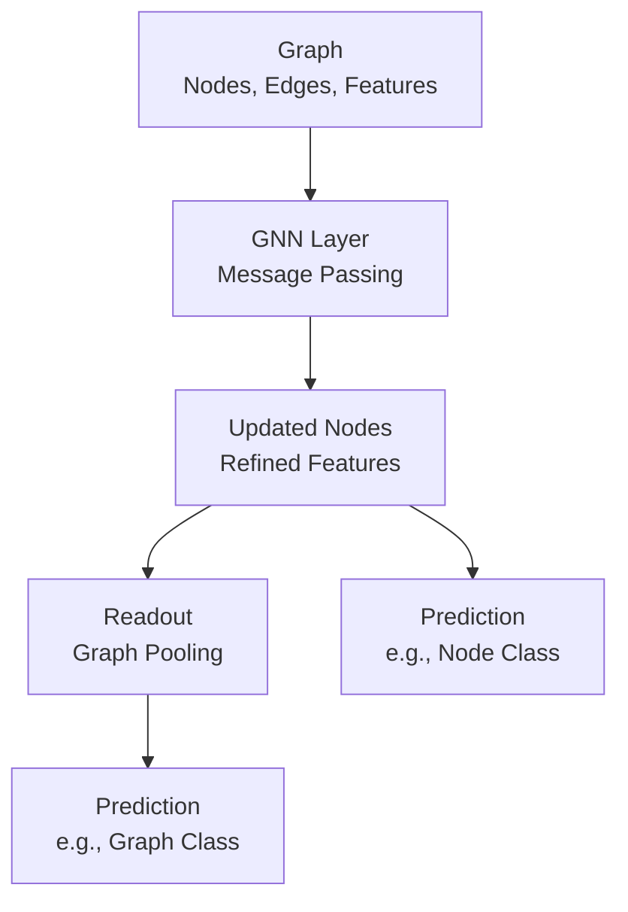

# Graph Neural Networks (GNNs) Technical Notes
<!-- [A rectangular image depicting an intermediate GNN workflow: a graph (e.g., a molecular structure with atoms as nodes and bonds as edges), processed by a GNN model on a GPU, visualized on a laptop with predictions (e.g., “Toxic?”), and metrics for accuracy, training time, and graph size.] -->

## Quick Reference
- **One-sentence definition**: Graph Neural Networks (GNNs) are deep learning models that leverage graph structures to learn relational patterns for tasks like node classification, link prediction, or graph classification.
- **Key use cases**: Predicting molecular properties, optimizing network traffic, or enhancing recommendation systems with relational data.
- **Prerequisites**: Familiarity with neural networks (e.g., CNNs, backpropagation), Python proficiency, and basic understanding of graphs (nodes, edges).

## Table of Contents
1. [Introduction](#introduction)  
2. [Core Concepts](#core-concepts)  
  - [Fundamental Understanding](#fundamental-understanding)  
  - [Visual Architecture](#visual-architecture)  
3. [Implementation Details](#implementation-details)  
  - [Basic Implementation](#basic-implementation-recap)  
  - [Intermediate Patterns](#intermediate-patterns-intermediate)  
4. [Real-World Applications](#real-world-applications)  
  - [Industry Examples](#industry-examples)  
  - [Hands-On Project](#hands-on-project)  
5. [Tools & Resources](#tools--resources)  
  - [Essential Tools](#essential-tools)  
  - [Learning Resources](#learning-resources)  
6. [References](#references)  
7. [Appendix](#appendix)  

## Introduction
- **What**: Graph Neural Networks extend deep learning to graph-structured data, modeling relationships between entities (nodes) and their connections (edges) to make predictions or uncover insights.  
- **Why**: They excel at capturing dependencies in relational data, like social networks or molecules, where traditional neural networks fail due to the lack of grid-like structure.  
- **Where**: Applied in chemistry (e.g., drug discovery), social media (e.g., influence analysis), and infrastructure (e.g., power grid optimization).

## Core Concepts
### Fundamental Understanding
- **Basic Principles**:  
  - GNNs operate by aggregating information from a node’s neighbors through message passing, updating node representations iteratively.  
  - They generalize across graph sizes and structures, unlike fixed-input neural networks.  
  - Tasks include node classification (e.g., label users), link prediction (e.g., predict connections), and graph classification (e.g., classify molecules).  
- **Key Components**:  
  - **Graph Structure**: Nodes (entities) and edges (relations), often with features (e.g., node attributes).  
  - **Message Passing**: Nodes exchange feature information with neighbors to refine representations.  
  - **Aggregation**: Combines neighbor messages (e.g., sum, mean) to update node states.  
  - **Readout**: Aggregates node features for graph-level tasks (e.g., pooling for classification).  
- **Common Misconceptions**:  
  - *“GNNs are only for node tasks”*: They handle node, edge, and graph-level predictions.  
  - *“All GNNs are the same”*: Variants like GCN, GAT, or GraphSAGE differ in aggregation and attention mechanisms.

### Visual Architecture

- **System Overview**: A graph is processed by GNN layers, updating node features, then used for node or graph-level predictions.  
- **Component Relationships**: Message passing refines features, readout enables graph tasks, and predictions depend on task type.

## Implementation Details
### Basic Implementation [Recap]
**Language**: Python  
```py
# Recap: GCN for Cora
from torch_geometric.nn import GCNConv
class GCN(torch.nn.Module):
    def __init__(self): super().__init__(); self.conv1 = GCNConv(num_features, 16); self.conv2 = GCNConv(16, num_classes)
    def forward(self, data): x = F.relu(self.conv1(data.x, data.edge_index)); return self.conv2(x, data.edge_index)
model = GCN()
```

### Intermediate Patterns [Intermediate]
**Language**: Python (using PyTorch Geometric for graph classification on TUDataset)  
```py
import torch
import torch.nn.functional as F
from torch_geometric.datasets import TUDataset
from torch_geometric.loader import DataLoader
from torch_geometric.nn import GCNConv, global_mean_pool

# Define Graph Convolutional Network for graph classification
class GraphGCN(torch.nn.Module):
    def __init__(self, num_features, hidden_dim, num_classes):
        super(GraphGCN, self).__init__()
        self.conv1 = GCNConv(num_features, hidden_dim)
        self.conv2 = GCNConv(hidden_dim, hidden_dim)
        self.fc = torch.nn.Linear(hidden_dim, num_classes)
    
    def forward(self, data):
        x, edge_index, batch = data.x, data.edge_index, data.batch
        # Two GCN layers with ReLU
        x = F.relu(self.conv1(x, edge_index))
        x = F.relu(self.conv2(x, edge_index))
        # Global pooling to get graph-level representation
        x = global_mean_pool(x, batch)
        # Fully connected layer for classification
        x = self.fc(x)
        return F.log_softmax(x, dim=1)

# Load PROTEINS dataset (graph classification)
dataset = TUDataset(root='./data', name='PROTEINS')
train_size = int(0.8 * len(dataset))
train_dataset, test_dataset = dataset[:train_size], dataset[train_size:]
train_loader = DataLoader(train_dataset, batch_size=32, shuffle=True)
test_loader = DataLoader(test_dataset, batch_size=32, shuffle=False)

# Setup model, optimizer, and device
device = torch.device('cuda' if torch.cuda.is_available() else 'cpu')
model = GraphGCN(num_features=dataset.num_features, hidden_dim=64, num_classes=dataset.num_classes).to(device)
optimizer = torch.optim.Adam(model.parameters(), lr=0.01)

# Training loop
def train():
    model.train()
    total_loss = 0
    for data in train_loader:
        data = data.to(device)
        optimizer.zero_grad()
        out = model(data)
        loss = F.nll_loss(out, data.y)
        loss.backward()
        optimizer.step()
        total_loss += loss.item()
    return total_loss / len(train_loader)

# Evaluation
def test(loader):
    model.eval()
    correct = 0
    for data in loader:
        data = data.to(device)
        out = model(data)
        pred = out.argmax(dim=1)
        correct += (pred == data.y).sum().item()
    return correct / len(loader.dataset)

# Run training and evaluation
for epoch in range(50):
    loss = train()
    train_acc = test(train_loader)
    test_acc = test(test_loader)
    if epoch % 10 == 0:
        print(f"Epoch {epoch}, Loss: {loss:.4f}, Train Acc: {train_acc:.4f}, Test Acc: {test_acc:.4f}")
```
- **Design Patterns**:  
  - **Graph Convolution**: Uses GCN layers for feature aggregation across neighbors.  
  - **Global Pooling**: `global_mean_pool` reduces node features to graph-level representations.  
  - **Batched Training**: `DataLoader` handles mini-batches of graphs for efficiency.  
- **Best Practices**:  
  - Normalize or preprocess node features if not provided (PROTEINS has features).  
  - Use dropout (`F.dropout`) or batch normalization for regularization (not shown).  
  - Save checkpoints (`torch.save`) to resume training.  
- **Performance Considerations**:  
  - Batch size (32) balances memory and speed; adjust for GPU memory.  
  - GPU acceleration (`cuda`) critical for large graphs; fallback to CPU if needed.  
  - Limit epochs (50) for demo; 200+ may improve accuracy (~75%+ on PROTEINS).

- **Step-by-Step Setup**:  
  1. Install Python 3.8+ (python.org).  
  2. Install PyTorch and PyTorch Geometric: `pip install torch torch-geometric`.  
  3. Save code as `gnn_proteins.py`.  
  4. Run: `python gnn_proteins.py`.  
  5. Expect ~70-75% test accuracy after 50 epochs, depending on random splits.  

## Real-World Applications
### Industry Examples
- **Use Case**: Drug discovery (e.g., predicting molecule toxicity).  
- **Implementation Pattern**: GNNs classify molecular graphs based on atom and bond features.  
- **Success Metrics**: 85%+ accuracy in toxicity prediction.  

### Hands-On Project
- **Project Goals**: Classify graphs in the PROTEINS dataset.  
- **Implementation Steps**:  
  1. Run the example code to train on PROTEINS.  
  2. Log training/test accuracy per epoch using `matplotlib` for visualization.  
  3. Experiment with adding dropout (`F.dropout(x, p=0.5, training=self.training)`) to reduce overfitting.  
- **Validation Methods**: Achieve 70%+ test accuracy; analyze loss curves for convergence.

## Tools & Resources
### Essential Tools
- **Development Environment**: Jupyter Notebook, PyCharm.  
- **Key Frameworks**: PyTorch Geometric, DGL, Graph Nets.  
- **Testing Tools**: NetworkX for graph analysis, TensorBoard for metrics.  

### Learning Resources
- **Documentation**: PyTorch Geometric Tutorials (https://pytorch-geometric.readthedocs.io/en/latest/).  
- **Tutorials**: “Graph Neural Networks: Hands-On” on Medium or YouTube (e.g., dgl.ai).  
- **Community Resources**: r/MachineLearning, PyTorch Geometric GitHub Issues.  

## References
- PyTorch Geometric Docs: https://pytorch-geometric.readthedocs.io/  
- “Graph Neural Networks: A Review of Methods and Applications” (Zhou et al., 2020)  
- “Relational Inductive Biases, Deep Learning, and Graph Networks” (Battaglia et al., 2018)  

## Appendix
- **Glossary**:  
  - *Message Passing*: Sharing features between connected nodes.  
  - *Readout*: Aggregating node features for graph-level tasks.  
- **Setup Guides**:  
  - PyTorch Geometric Dependencies: `pip install torch-scatter torch-sparse` (platform-specific).  
- **Code Templates**: See PROTEINS GCN example above.

