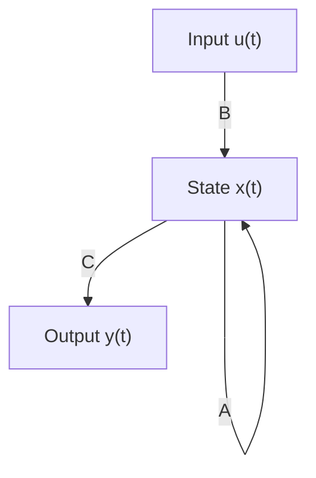

# State Space Models (SSMs) Technical Notes
<!-- A rectangular image showing a simplified state space model workflow, with a sequence input like text or time series data entering a system box representing hidden states, evolving over time with matrices A, B, C, and producing outputs, illustrated with arrows for state transitions and basic equations. -->

## Quick Reference
- **Definition**: State Space Models (SSMs) are mathematical frameworks for modeling dynamic systems, representing them through internal states that evolve over time based on inputs and produce outputs.
- **Key Use Cases**: Time series forecasting, control systems in engineering, and sequence modeling in machine learning like speech recognition or natural language processing.
- **Prerequisites**: Basic linear algebra (matrices, vectors), understanding of sequences or time series data, and familiarity with Python for simple implementations.

## Table of Contents
1. Introduction
2. Core Concepts
3. Implementation Details
4. Real-World Applications
5. Tools & Resources
6. References
7. Appendix

## Introduction
### What
State Space Models (SSMs) describe systems using internal "states" that capture hidden information, evolving with inputs to generate outputs, commonly used in control theory and modern machine learning.

### Why
SSMs provide a structured way to model complex dynamics, handling long-range dependencies efficiently compared to traditional methods, making them valuable for prediction and control tasks.

### Where
SSMs are applied in engineering for system control (e.g., robotics), finance for time series analysis, and AI for sequence tasks like language modeling.

## Core Concepts
### Fundamental Understanding
- **Basic Principles**: An SSM represents a system with states that change over time; inputs influence state transitions, and outputs are derived from states.
- **Key Components**:
  - **State Vector (x)**: Hidden variables representing the system's internal condition.
  - **Transition Matrix (A)**: Defines how states evolve without input.
  - **Input Matrix (B)**: Shows how inputs affect states.
  - **Output Matrix (C)**: Maps states to observable outputs.
- **Common Misconceptions**:
  - SSMs are only for control systems: They're also powerful in ML for sequences.
  - Too mathematical for beginners: Start with discrete-time linear models.
  - Inefficient for long sequences: Modern SSMs like S4 handle them well.

### Visual Architecture

- **System Overview**: Input influences the state via B, state evolves with A, and output is produced via C.
- **Component Relationships**: The state acts as memory, integrating inputs over time to generate outputs.

## Implementation Details
### Basic Implementation
```python
import numpy as np

# Define SSM parameters (simple discrete-time example)
A = np.array([[0.9]])  # Transition matrix (1D state)
B = np.array([[0.5]])  # Input matrix
C = np.array([[1.0]])  # Output matrix
x = np.array([[0.0]])  # Initial state

# Simulate over time steps
inputs = [1.0, 2.0, 3.0]  # Sample inputs
outputs = []

for u in inputs:
    x = A @ x + B * u  # State update
    y = C @ x          # Output
    outputs.append(y[0, 0])

print("Outputs:", outputs)
```
- **Step-by-Step Setup**:
  1. Install NumPy: `pip install numpy`.
  2. Define matrices A, B, C for your system.
  3. Initialize state and simulate with inputs.
- **Code Walkthrough**:
  - Matrices define the model; loop updates state and computes output.
- **Common Pitfalls**:
  - Matrix dimensions mismatch: Ensure shapes compatible (e.g., 1D for simple cases).
  - Forgetting initial state: Always initialize x.
  - Ignoring time steps: SSMs are sequential.

## Real-World Applications
### Industry Examples
- **Use Case**: Predicting stock prices from historical data.
- **Implementation Pattern**: Model market states with SSM for forecasting.
- **Success Metrics**: Improved prediction accuracy over baselines.

### Hands-On Project
- **Project Goals**: Simulate a basic SSM for a simple dynamic system.
- **Implementation Steps**:
  1. Use the code to model a fading memory system.
  2. Change inputs and observe outputs.
  3. Plot states over time with Matplotlib.
- **Validation Methods**: Verify outputs match expected decay.

## Tools & Resources
### Essential Tools
- **Development Environment**: Python with NumPy.
- **Key Frameworks**: SciPy for advanced SSMs.
- **Testing Tools**: Matplotlib for visualization.

### Learning Resources
- **Documentation**: SciPy signal docs.
- **Tutorials**: Khan Academy linear algebra.
- **Community Resources**: Stack Overflow.

## References
- Wikipedia: State-space representation.
- "State Space Models" by Kalman (1960).
- Modern ML: "Structured State Spaces" (S4 paper).

## Appendix
### Glossary
- **State**: Internal system variable.
- **Discrete-Time**: SSM for sampled data.
- **Linear SSM**: Assumes linear relationships.

### Setup Guides
- Install NumPy: `pip install numpy`.