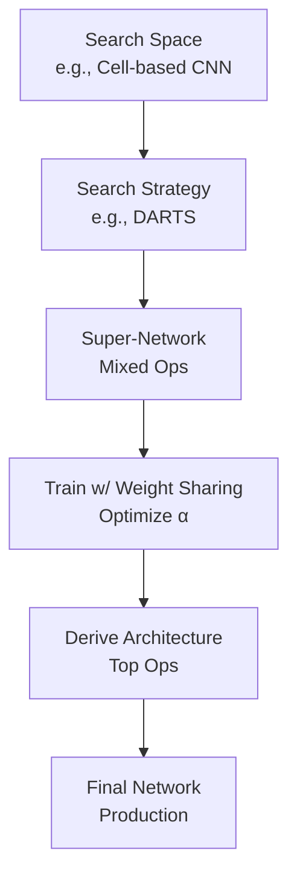

# Neural Architecture Search Technical Notes
<!-- [A rectangular image illustrating an advanced NAS workflow: a programmer defining a complex search space (e.g., convolutional blocks, skip connections), a gradient-based search algorithm (e.g., DARTS) optimizing it on a GPU cluster, and a final architecture deployed in a production environment, with detailed metrics like accuracy, latency, FLOPS, and a visualization of the search process over iterations.] -->

## Quick Reference
- **One-sentence definition**: Neural Architecture Search (NAS) leverages advanced algorithms to automate the discovery of high-performance neural network architectures tailored to specific objectives.
- **Key use cases**: Designing state-of-the-art models for large-scale vision tasks, resource-constrained edge inference, and domain-specific AI systems.
- **Prerequisites**: Expertise in deep learning (e.g., CNNs, RNNs), proficiency in Python and frameworks (e.g., PyTorch), and familiarity with optimization techniques.

## Table of Contents
- [Introduction](#introduction)
- [Core Concepts](#core-concepts)
    - [Fundamental Understanding](#fundamental-understanding)
    - [Visual Architecture](#visual-architecture)
- [Implementation Details](#implementation-details)
    - [Basic Implementation](#basic-implementation)
    - [Intermediate Patterns](#intermediate-patterns)
    - [Advanced Topics](#advanced-topics)
- [Real-World Applications](#real-world-applications)
    - [Industry Examples](#industry-examples)
    - [Hands-On Project](#hands-on-project)
- [Tools & Resources](#tools--resources)
    - [Essential Tools](#essential-tools)
    - [Learning Resources](#learning-resources)
- [References](#references)
- [Appendix](#appendix)

## Introduction
- **What**: Neural Architecture Search systematically explores a space of neural network designs using sophisticated algorithms to optimize for performance and efficiency.  
- **Why**: It pushes the boundaries of model capability beyond manual design, addressing scalability, latency, and resource constraints in production systems.  
- **Where**: Deployed in cutting-edge AI research, cloud-based ML services, and embedded systems requiring optimal trade-offs.

## Core Concepts
### Fundamental Understanding
- **Basic Principles**:  
  - NAS operates within a combinatorial search space, constrained by architectural primitives (e.g., convolutions, attention).  
  - Continuous relaxation (e.g., DARTS) or discrete sampling (e.g., evolutionary algorithms) drives efficient exploration.  
  - Multi-objective optimization balances accuracy, inference time, and model size.  
- **Key Components**:  
  - **Search Space**: Hierarchical or cell-based designs (e.g., repeated motifs with variable operations).  
  - **Search Strategy**: Gradient-based (e.g., DARTS), reinforcement learning, or evolutionary methods.  
  - **Performance Estimation**: Proxy tasks, weight sharing, or one-shot models for rapid evaluation.  
- **Common Misconceptions**:  
  - *“NAS is fully unsupervised”*: It requires careful objective definition and validation.  
  - *“One-size-fits-all”*: Architectures are task-specific; generalization is limited.

### Visual Architecture

- **System Overview**: A super-network with shared weights is optimized, then pruned to derive the final architecture.  
- **Component Relationships**: The strategy adjusts operation weights (α), training refines them, and derivation selects the best structure.

## Implementation Details
### Basic Implementation [Recap]
**Language**: Python  
```
# Recap: Simple NAS with KerasTuner
import keras_tuner as kt
def build_model(hp):
    model = keras.Sequential([keras.layers.Dense(hp.Choice('units', [32, 64]), activation='relu')])
    return model
tuner = kt.RandomSearch(build_model, objective='val_loss', max_trials=3)
```

### Intermediate Patterns [Recap]
```
# Recap: AutoKeras CNN
import autokeras as ak
model = ak.ImageClassifier(max_trials=5)
model.fit(x_train, y_train)
```

### Advanced Topics [Advanced]
**Language**: Python (using PyTorch and DARTS-inspired approach)  
```
import torch
import torch.nn as nn
import torch.optim as optim

# Define a mixed operation (simplified DARTS cell)
class MixedOp(nn.Module):
    def __init__(self):
        super().__init__()
        self.conv3x3 = nn.Conv2d(16, 16, 3, padding=1)
        self.conv5x5 = nn.Conv2d(16, 16, 5, padding=2)
        self.alpha = nn.Parameter(torch.zeros(2))  # Operation weights

    def forward(self, x):
        weights = torch.softmax(self.alpha, dim=0)
        return weights[0] * self.conv3x3(x) + weights[1] * self.conv5x5(x)

# Super-network with one cell
class Network(nn.Module):
    def __init__(self):
        super().__init__()
        self.stem = nn.Conv2d(1, 16, 3, padding=1)
        self.cell = MixedOp()
        self.fc = nn.Linear(16 * 28 * 28, 10)

    def forward(self, x):
        x = self.stem(x)
        x = self.cell(x)
        x = x.view(x.size(0), -1)
        return self.fc(x)

# Training (simplified)
model = Network()
optimizer = optim.Adam([p for p in model.parameters() if p.requires_grad], lr=0.001)
arch_optimizer = optim.Adam([model.cell.alpha], lr=0.01)

# Dummy MNIST data
x = torch.randn(32, 1, 28, 28)
y = torch.randint(0, 10, (32,))

for _ in range(10):  # Train architecture and weights
    optimizer.zero_grad()
    arch_optimizer.zero_grad()
    out = model(x)
    loss = nn.CrossEntropyLoss()(out, y)
    loss.backward()
    optimizer.step()
    arch_optimizer.step()

print(torch.softmax(model.cell.alpha, dim=0))  # Final op weights
```
- **System Design**:  
  - Implements a DARTS-like one-shot model with a continuous relaxation of operations.  
  - Jointly optimizes network weights and architecture parameters (α).  
- **Optimization Techniques**:  
  - Uses weight sharing to evaluate all ops in a super-network, reducing compute cost.  
  - Gradient descent on α differentiates through discrete choices via softmax.  
- **Production Considerations**:  
  - Scales to GPUs with distributed training (e.g., DataParallel).  
  - Validates on holdout data to prevent overfitting the search process.  
  - Exports discrete architecture for deployment (post-pruning).

## Real-World Applications
### Industry Examples
- **Use Case**: AmoebaNet (Google) for ImageNet classification.  
- **Implementation Pattern**: Evolutionary NAS with cell-based search space.  
- **Success Metrics**: Top-1 accuracy (78.8%) with competitive parameter count.  

### Hands-On Project
- **Project Goals**: Implement a DARTS-based NAS for CIFAR-10 classification.  
- **Implementation Steps**:  
  1. Define a cell with mixed ops (e.g., 3x3 conv, 5x5 conv, pooling).  
  2. Train a super-network with weight sharing on CIFAR-10.  
  3. Derive and retrain the final architecture.  
- **Validation Methods**: Measure test accuracy (aim for 90%+) and inference time.

## Tools & Resources
### Essential Tools
- **Development Environment**: PyCharm, Jupyter with GPU support.  
- **Key Frameworks**: PyTorch, TensorFlow (NASNet), DARTS library.  
- **Testing Tools**: NVIDIA Nsight, PyTorch Profiler for latency analysis.  

### Learning Resources
- **Documentation**: DARTS GitHub (https://github.com/quark0/darts).  
- **Tutorials**: “DARTS: Differentiable Architecture Search” paper walkthroughs.  
- **Community Resources**: r/MachineLearning, PyTorch Discuss forum.  

## References
- “DARTS: Differentiable Architecture Search” (Liu et al., 2018)  
- PyTorch Docs: https://pytorch.org/docs/  
- “Neural Architecture Search: A Survey” (Elsken et al., 2019)  

## Appendix
- **Glossary**:  
  - *Weight Sharing*: Reusing weights across candidates in a super-network.  
  - *Super-Network*: Single model encoding all possible architectures.  
- **Setup Guides**:  
  - GPU Setup: Install CUDA, PyTorch with `pip install torch torchvision`.  
- **Code Templates**: DARTS cell from above.
