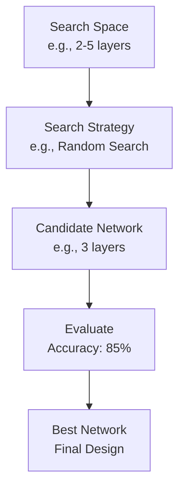

# Neural Architecture Search (NAS) Technical Notes
<!-- [A rectangular image showing a simplified Neural Architecture Search process: a beginner-friendly diagram with a starting neural network (e.g., a few layers), an arrow to a search algorithm tweaking its structure (e.g., adding layers or nodes), and a final optimized network displayed on a screen, with icons for accuracy and efficiency metrics.] -->

## Quick Reference
- **One-sentence definition**: Neural Architecture Search (NAS) is an automated process for designing neural network architectures tailored to specific tasks.
- **Key use cases**: Optimizing deep learning models for image recognition, natural language processing, and resource-constrained devices.
- **Prerequisites**: Basic knowledge of neural networks (e.g., layers, neurons), familiarity with Python, and interest in machine learning.

## Table of Contents
1. [Introduction](#introduction)  
2. [Core Concepts](#core-concepts)  
    - [Fundamental Understanding](#fundamental-understanding)  
    - [Visual Architecture](#visual-architecture)  
3. [Implementation Details](#implementation-details)  
    - [Basic Implementation](#basic-implementation)  
4. [Real-World Applications](#real-world-applications)  
    - [Industry Examples](#industry-examples)  
    - [Hands-On Project](#hands-on-project)  
5. [Tools & Resources](#tools--resources)  
    - [Essential Tools](#essential-tools)  
    - [Learning Resources](#learning-resources)  
6. [References](#references)  
7. [Appendix](#appendix)  

## Introduction
- **What**: Neural Architecture Search is a technique that uses algorithms to automatically find the best neural network design instead of relying on human trial-and-error.  
- **Why**: It saves time and improves performance by discovering architectures that humans might overlook, solving the challenge of manual network design.  
- **Where**: Used in AI research, mobile apps (e.g., efficient models), and large-scale machine learning projects.

## Core Concepts
### Fundamental Understanding
- **Basic Principles**:  
  - NAS explores a “search space” of possible network designs (e.g., number of layers, connections).  
  - It evaluates designs based on performance (e.g., accuracy) and sometimes efficiency (e.g., speed).  
  - A search algorithm (like random search or reinforcement learning) guides the process.  
- **Key Components**:  
  - **Search Space**: The set of all possible network architectures to choose from.  
  - **Search Strategy**: The method to pick and test architectures (e.g., random guessing, optimization).  
  - **Performance Evaluation**: Testing how good a network is, often by training it briefly.  
- **Common Misconceptions**:  
  - *“NAS is fully automatic”*: It still needs human input to define the search space and goals.  
  - *“It’s only for experts”*: Beginners can use simple NAS tools with pre-built options.

### Visual Architecture

- **System Overview**: A search space is sampled by a strategy, networks are evaluated, and the best one is selected.  
- **Component Relationships**: The search strategy picks from the space, evaluation scores the picks, and the process repeats until a winner emerges.

## Implementation Details
### Basic Implementation [Beginner]
**Language**: Python (using a simple NAS library)  
```
# Simple NAS example with KerasTuner
import tensorflow as tf
from tensorflow import keras
import keras_tuner as kt

# Define a model-building function with a search space
def build_model(hp):
    model = keras.Sequential()
    # Search for number of units in a layer (16, 32, or 64)
    units = hp.Choice('units', [16, 32, 64])
    model.add(keras.layers.Dense(units=units, activation='relu', input_shape=(8,)))
    model.add(keras.layers.Dense(1, activation='sigmoid'))
    model.compile(optimizer='adam', loss='binary_crossentropy', metrics=['accuracy'])
    return model

# Set up the tuner (random search)
tuner = kt.RandomSearch(build_model, objective='val_accuracy', max_trials=5)

# Dummy data (8 features, binary classification)
x_train = tf.random.uniform((100, 8))
y_train = tf.random.uniform((100,), maxval=2, dtype=tf.int32)

# Run the search
tuner.search(x_train, y_train, epochs=5, validation_split=0.2)

# Get the best model
best_model = tuner.get_best_models(num_models=1)[0]
```
- **Step-by-Step Setup**:  
  1. Install TensorFlow and KerasTuner: `pip install tensorflow keras-tuner`.  
  2. Copy the code into a Python file (e.g., `nas_example.py`).  
  3. Run it: `python nas_example.py`.  
- **Code Walkthrough**:  
  - `build_model` defines a network with a variable number of units.  
  - `RandomSearch` tries 5 different designs and picks the best based on validation accuracy.  
  - The best model is retrieved for use.  
- **Common Pitfalls**:  
  - Forgetting to install dependencies (`ImportError`).  
  - Using too small a dataset, leading to unreliable results.

## Real-World Applications
### Industry Examples
- **Use Case**: Image classification (e.g., identifying cats vs. dogs).  
- **Implementation Pattern**: NAS finds a compact convolutional neural network (CNN).  
- **Success Metrics**: High accuracy with fewer computations.  

### Hands-On Project
- **Project Goals**: Use NAS to design a small network for classifying random numbers (even vs. odd).  
- **Implementation Steps**:  
  1. Generate 100 random numbers (0-99) and label them (0 for even, 1 for odd).  
  2. Use KerasTuner to search for the best layer size (e.g., 8-32 units).  
  3. Train and test the best model.  
- **Validation Methods**: Check accuracy on a separate test set (e.g., 90%+ is good).

## Tools & Resources
### Essential Tools
- **Development Environment**: Python IDE (e.g., Jupyter Notebook, VS Code).  
- **Key Frameworks**: TensorFlow, KerasTuner (simple NAS library).  
- **Testing Tools**: TensorBoard for visualizing training progress.  

### Learning Resources
- **Documentation**: KerasTuner docs (https://keras.io/keras_tuner/).  
- **Tutorials**: “Getting Started with KerasTuner” on YouTube or TensorFlow.org.  
- **Community Resources**: Reddit’s r/MachineLearning, Stack Overflow (NAS tag).  

## References
- TensorFlow Documentation: https://www.tensorflow.org  
- KerasTuner Guide: https://keras.io/keras_tuner/  
- “Neural Architecture Search with Reinforcement Learning” (Zoph & Le, 2016)  

## Appendix
- **Glossary**:  
  - *Search Space*: All possible network designs to explore.  
  - *Hyperparameter*: A setting (like layer size) that NAS tunes.  
- **Setup Guides**:  
  - Install Python: Download from python.org, ensure pip works.  
- **Code Templates**: See the basic implementation above.
