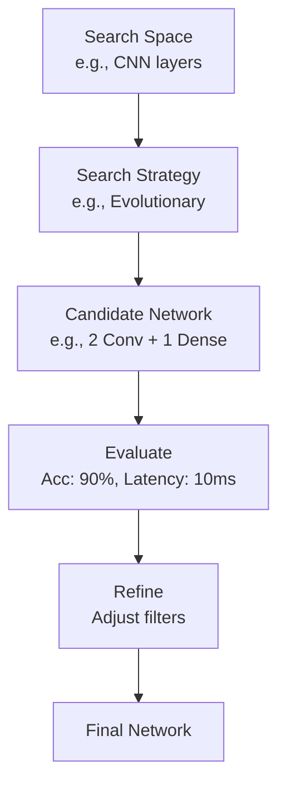

# Neural Architecture Search (NAS) Technical Notes
<!-- [A rectangular image depicting an intermediate NAS workflow: a programmer defining a search space with convolutional layers (e.g., filters, kernel sizes), a search algorithm (e.g., genetic algorithm) optimizing the structure, and a resulting neural network deployed on a GPU, with visual cues for accuracy, latency, and parameter count metrics.] -->

## Quick Reference
- **One-sentence definition**: Neural Architecture Search (NAS) automates the design of neural network architectures to optimize performance for specific tasks.
- **Key use cases**: Building efficient models for computer vision, NLP, and edge devices with balanced accuracy and resource use.
- **Prerequisites**: Understanding of neural networks (e.g., CNNs, loss functions), Python proficiency, and basic machine learning experience.

## Table of Contents
1. [Introduction](#introduction)  
2. [Core Concepts](#core-concepts)  
    - [Fundamental Understanding](#fundamental-understanding)  
    - [Visual Architecture](#visual-architecture)  
3. [Implementation Details](#implementation-details)  
    - [Basic Implementation](#basic-implementation)  
    - [Intermediate Patterns](#intermediate-patterns)  
4. [Real-World Applications](#real-world-applications)  
    - [Industry Examples](#industry-examples)  
    - [Hands-On Project](#hands-on-project)  
5. [Tools & Resources](#tools--resources)  
    - [Essential Tools](#essential-tools)  
    - [Learning Resources](#learning-resources)  
6. [References](#references)  
7. [Appendix](#appendix)  

## Introduction
- **What**: Neural Architecture Search is a method to algorithmically explore and select optimal neural network designs for a given problem.  
- **Why**: It reduces manual experimentation and finds architectures that balance accuracy, speed, and resource efficiency.  
- **Where**: Applied in production AI systems, mobile apps, and research for novel network designs.

## Core Concepts
### Fundamental Understanding
- **Basic Principles**:  
  - NAS iterates through a defined search space using a strategy to evaluate and refine architectures.  
  - Trade-offs between accuracy and efficiency (e.g., latency, memory) guide the search.  
  - Proxy tasks (e.g., training on a small dataset) speed up evaluation.  
- **Key Components**:  
  - **Search Space**: Options like layer types (convolutional, dense), sizes, and connections.  
  - **Search Strategy**: Algorithms like evolutionary methods or gradient-based optimization.  
  - **Performance Estimation**: Metrics (e.g., accuracy, FLOPS) assessed via training or estimation techniques.  
- **Common Misconceptions**:  
  - *“NAS always finds the best model”*: Results depend on the search space and evaluation quality.  
  - *“It’s too slow”*: Techniques like weight sharing make it practical.

### Visual Architecture

- **System Overview**: A strategy samples the search space, evaluates candidates, refines them, and outputs an optimized network.  
- **Component Relationships**: The strategy drives exploration, evaluation provides feedback, and refinement narrows the search.

## Implementation Details
### Basic Implementation [Recap]
**Language**: Python  
```
# Recap: Simple KerasTuner NAS
import keras_tuner as kt
from tensorflow import keras

def build_model(hp):
    model = keras.Sequential()
    model.add(keras.layers.Dense(hp.Choice('units', [16, 32]), activation='relu', input_shape=(10,)))
    model.add(keras.layers.Dense(1))
    model.compile(optimizer='adam', loss='mse')
    return model

tuner = kt.RandomSearch(build_model, objective='val_loss', max_trials=3)
```
- A quick baseline for context.

### Intermediate Patterns [Intermediate]
**Language**: Python (using AutoKeras)  
```
# NAS for a CNN with AutoKeras
import autokeras as ak
import tensorflow as tf

# Load a small dataset (e.g., MNIST)
(x_train, y_train), (x_test, y_test) = tf.keras.datasets.mnist.load_data()
x_train = x_train.reshape(-1, 28, 28, 1)[:1000]  # Subset for speed
y_train = y_train[:1000]

# Define NAS with a search space
model = ak.ImageClassifier(
    max_trials=5,  # Try 5 architectures
    overwrite=True,
    tuner='greedy'  # Greedy search strategy
)

# Search and train
model.fit(x_train, y_train, epochs=5, validation_split=0.2)

# Evaluate the best model
best_model = model.export_model()
best_model.summary()
```
- **Design Patterns**:  
  - **Modular Search Space**: AutoKeras pre-defines CNN components (e.g., conv layers, pooling), reducing complexity.  
  - **Greedy Search**: Prioritizes promising architectures early, balancing exploration and exploitation.  
- **Best Practices**:  
  - Use a small dataset subset to speed up initial searches.  
  - Normalize inputs (e.g., pixel values to 0-1) for stable training.  
  - Save intermediate models to avoid re-running costly searches.  
- **Performance Considerations**:  
  - Limit trials (e.g., `max_trials=5`) to manage compute time.  
  - Trade-off accuracy vs. model size by adjusting search objectives.  

## Real-World Applications
### Industry Examples
- **Use Case**: EfficientNet (Google’s NAS-designed model) for image classification.  
- **Implementation Pattern**: Balances depth, width, and resolution via compound scaling.  
- **Success Metrics**: High accuracy with fewer parameters than manual designs.  

### Hands-On Project
- **Project Goals**: Design a CNN for digit recognition using NAS on MNIST.  
- **Implementation Steps**:  
  1. Load and preprocess MNIST (reshape to 28x28x1, normalize).  
  2. Use AutoKeras to search for a CNN with 3-5 trials.  
  3. Train the best model and evaluate on test data.  
- **Validation Methods**: Check test accuracy (aim for 95%+) and inspect model size.

## Tools & Resources
### Essential Tools
- **Development Environment**: Jupyter Notebook or PyCharm.  
- **Key Frameworks**: AutoKeras, TensorFlow, PyTorch (with NAS extensions).  
- **Testing Tools**: TensorBoard for loss/accuracy plots.  

### Learning Resources
- **Documentation**: AutoKeras docs (https://autokeras.com/).  
- **Tutorials**: “Neural Architecture Search with AutoKeras” on Medium.  
- **Community Resources**: PyTorch forums, r/learnmachinelearning.  

## References
- AutoKeras Documentation: https://autokeras.com/  
- TensorFlow Tutorials: https://www.tensorflow.org/tutorials  
- “EfficientNet: Rethinking Model Scaling for CNNs” (Tan & Le, 2019)  

## Appendix
- **Glossary**:  
  - *Search Strategy*: Algorithm guiding architecture selection.  
  - *FLOPS*: Floating-point operations per second, a measure of efficiency.  
- **Setup Guides**:  
  - Install AutoKeras: `pip install autokeras`.  
- **Code Templates**: See intermediate example above.
