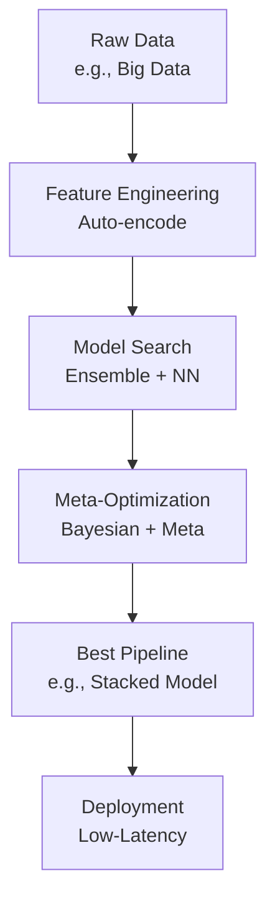

# AutoML Technical Notes
<!-- [A rectangular image illustrating an advanced AutoML workflow: a programmer feeding a large, complex dataset into an AutoML system running on a distributed cluster, the system orchestrating feature engineering, multi-model ensembling, and meta-learning, with a final optimized model deployed in a production environment, displaying detailed metrics like AUC, inference latency, and resource utilization.] -->

## Quick Reference
- **One-sentence definition**: AutoML is an advanced framework that automates the full machine learning lifecycle, optimizing data preparation, model architecture, and deployment for scalability and performance.
- **Key use cases**: Deploying high-performance models in production systems, tackling large-scale data challenges, and accelerating research-to-deployment pipelines.
- **Prerequisites**: Proficiency in ML (e.g., ensemble methods, deep learning), Python expertise, and experience with distributed computing or production ML systems.

## Table of Contents
1. [Introduction](#introduction)  
2. [Core Concepts](#core-concepts)  
    - [Fundamental Understanding](#fundamental-understanding)  
    - [Visual Architecture](#visual-architecture)  
3. [Implementation Details](#implementation-details)  
    - [Basic Implementation](#basic-implementation)  
    - [Intermediate Patterns](#intermediate-patterns)  
    - [Advanced Topics](#advanced-topics)  
4. [Real-World Applications](#real-world-applications)  
    - [Industry Examples](#industry-examples)  
    - [Hands-On Project](#hands-on-project)  
5. [Tools & Resources](#tools--resources)  
    - [Essential Tools](#essential-tools)  
    - [Learning Resources](#learning-resources)  
6. [References](#references)  
7. [Appendix](#appendix)  

## Introduction
- **What**: AutoML encompasses sophisticated techniques to automate the entire ML pipeline, from feature engineering to model ensembling and deployment, with a focus on robustness and efficiency.  
- **Why**: It addresses the complexity of manual ML workflows, enabling rapid iteration, scalability, and optimal performance in production environments.  
- **Where**: Used in enterprise AI (e.g., fraud detection), cloud platforms (e.g., AWS SageMaker), and cutting-edge research.

## Core Concepts
### Fundamental Understanding
- **Basic Principles**:  
  - AutoML leverages meta-learning and optimization to adaptively select and tune models across diverse tasks.  
  - It scales to distributed systems, handling big data and compute-intensive searches.  
  - Multi-objective optimization balances accuracy, latency, and resource cost.  
- **Key Components**:  
  - **Feature Engineering**: Automated feature selection, transformation, and encoding.  
  - **Model Search**: Explores algorithms and architectures (e.g., XGBoost, neural nets) with ensemble strategies.  
  - **Meta-Learning**: Uses prior task knowledge to guide future searches (e.g., warm-starting).  
- **Common Misconceptions**:  
  - *“AutoML is black-box”*: Advanced tools provide interpretability and customization options.  
  - *“It’s plug-and-play”*: Production use requires tuning for specific constraints (e.g., latency).

### Visual Architecture

- **System Overview**: Data is processed, models are searched and ensembled, optimized with meta-learning, and deployed efficiently.  
- **Component Relationships**: Feature engineering feeds model search, meta-optimization refines choices, and deployment operationalizes the pipeline.

## Implementation Details
### Basic Implementation [Recap]
**Language**: Python  
```py
# Recap: Auto-sklearn
from autosklearn.classification import AutoSklearnClassifier
X, y = load_iris(return_X_y=True)
automl = AutoSklearnClassifier(time_left_for_this_task=60)
automl.fit(X, y)
```

### Intermediate Patterns [Recap]
```py
# Recap: TPOT
from tpot import TPOTClassifier
tpot = TPOTClassifier(generations=5, max_time_mins=5)
tpot.fit(X_train, y_train)
```

### Advanced Topics [Advanced]
**Language**: Python (using H2O AutoML with custom constraints)  
```py
import h2o
from h2o.automl import H2OAutoML
import pandas as pd
from sklearn.datasets import fetch_california_housing

# Initialize H2O cluster
h2o.init()

# Load and prepare data (California housing)
data = fetch_california_housing()
df = pd.DataFrame(data.data, columns=data.feature_names)
df['target'] = data.target
h2o_df = h2o.H2OFrame(df)

# Define features and target
x = data.feature_names
y = 'target'

# Set up H2O AutoML with production constraints
aml = H2OAutoML(
    max_runtime_secs=300,  # 5 minutes total
    max_models=10,  # Limit to 10 models
    sort_metric='RMSE',  # Optimize for regression error
    balance_classes=False,  # No class imbalance here
    export_checkpoints_dir='./checkpoints'  # Save progress
)

# Train AutoML
aml.train(x=x, y=y, training_frame=h2o_df)

# Inspect leader model
leader = aml.leader
print(leader.model_performance(h2o_df).rmse())

# Export for production (e.g., MOJO format)
leader.download_mojo(path='./model_mojo.zip')
```
- **System Design**:  
  - Integrates feature engineering, model stacking, and ensembling in a distributed H2O cluster.  
  - Supports production deployment with MOJO (Machine Learning Object) exports.  
- **Optimization Techniques**:  
  - Bayesian optimization for hyperparameter tuning across models.  
  - Stacked ensembles combine predictions for better accuracy.  
- **Production Considerations**:  
  - Limits runtime (`max_runtime_secs`) and models (`max_models`) for resource efficiency.  
  - Saves checkpoints to resume or audit the process.  
  - Ensures low-latency inference with MOJO deployment.

## Real-World Applications
### Industry Examples
- **Use Case**: Fraud detection in banking (PayPal).  
- **Implementation Pattern**: AutoML ensembles gradient boosting and deep learning on transaction data.  
- **Success Metrics**: High AUC (0.95+) with sub-second inference time.  

### Hands-On Project
- **Project Goals**: Build an AutoML regression pipeline for housing price prediction.  
- **Implementation Steps**:  
  1. Load California housing dataset (provided in code).  
  2. Use H2O AutoML to optimize RMSE in 5 minutes.  
  3. Deploy the best model and test on a holdout set.  
- **Validation Methods**: Target RMSE < 0.5; profile inference latency with MOJO.

## Tools & Resources
### Essential Tools
- **Development Environment**: Jupyter with H2O cluster support, VS Code.  
- **Key Frameworks**: H2O AutoML, Google Cloud AutoML, Microsoft Azure AutoML.  
- **Testing Tools**: H2O Flow (UI), MLflow for tracking.  

### Learning Resources
- **Documentation**: H2O AutoML docs (https://docs.h2o.ai/h2o/latest-stable/).  
- **Tutorials**: “Advanced AutoML with H2O” on YouTube or H2O.ai blog.  
- **Community Resources**: H2O.ai forums, r/MachineLearning.  

## References
- H2O AutoML Docs: https://docs.h2o.ai/h2o/latest-stable/  
- “AutoML: Methods, Systems, Challenges” (Hutter et al., 2019)  
- “Stacked Ensembles in H2O” (H2O.ai whitepaper)  

## Appendix
- **Glossary**:  
  - *Meta-Learning*: Using past ML runs to inform new ones.  
  - *MOJO*: Portable, low-latency model format for deployment.  
- **Setup Guides**:  
  - Install H2O: `pip install h2o`.  
- **Code Templates**: H2O example above.