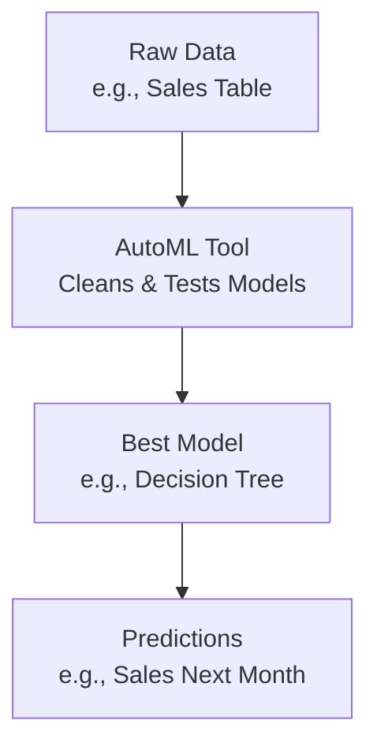

# AutoML Technical Notes
<!-- [A rectangular image showing a simplified AutoML process: a beginner-friendly diagram with a dataset (e.g., a table of numbers) being fed into an AutoML tool, the tool automatically selecting and tuning a model (e.g., a decision tree or neural network), and a final output showing predictions on a screen, with icons for accuracy and ease-of-use.] -->

## Quick Reference
- **One-sentence definition**: AutoML is a set of tools and techniques that automate the process of building, training, and deploying machine learning models.
- **Key use cases**: Simplifying data analysis for non-experts, speeding up model development, and optimizing predictions for tasks like classification or regression.
- **Prerequisites**: Basic understanding of data (e.g., tables, numbers), willingness to learn, no prior machine learning experience required.

## Table of Contents
- [Introduction](#introduction)
- [Core Concepts](#core-concepts)
    - [Fundamental Understanding](#fundamental-understanding)
    - [Visual Architecture](#visual-architecture)
- [Implementation Details](#implementation-details)
    - [Basic Implementation](#basic-implementation)
- [Real-World Applications](#real-world-applications)
    - [Industry Examples](#industry-examples)
    - [Hands-On Project](#hands-on-project)
- [Tools & Resources](#tools--resources)
    - [Essential Tools](#essential-tools)
    - [Learning Resources](#learning-resources)
- [References](#references)
- [Appendix](#appendix)

## Introduction
- **What**: AutoML automates the steps of machine learning, such as picking a model, tuning it, and making predictions, so anyone can use it without deep expertise.  
- **Why**: It saves time, reduces errors, and makes machine learning accessible, solving the problem of complex manual model-building.  
- **Where**: Used in business analytics (e.g., sales forecasting), healthcare (e.g., disease prediction), and education (e.g., student performance analysis).

## Core Concepts
### Fundamental Understanding
- **Basic Principles**:  
  - AutoML takes raw data and tries different models to find the best one for a task (e.g., predicting prices).  
  - It adjusts settings (like how fast a model learns) automatically to improve results.  
  - The goal is to make machine learning “push-button” easy while still being effective.  
- **Key Components**:  
  - **Data Preprocessing**: Cleaning and preparing data (e.g., filling missing values).  
  - **Model Selection**: Choosing from options like decision trees, neural networks, or linear models.  
  - **Hyperparameter Tuning**: Adjusting model settings to get better performance.  
- **Common Misconceptions**:  
  - *“AutoML does everything”*: You still need to provide good data and define the problem.  
  - *“It’s only for pros”*: AutoML is designed to help beginners too.

### Visual Architecture

- **System Overview**: Data goes into an AutoML tool, which processes it, picks a model, and outputs predictions.  
- **Component Relationships**: Preprocessing prepares data, model selection finds the best fit, and tuning refines it.

## Implementation Details
### Basic Implementation [Beginner]
**Language**: Python (using Auto-sklearn)  
```py
# Simple AutoML example with Auto-sklearn
from autosklearn.classification import AutoSklearnClassifier
import pandas as pd
from sklearn.datasets import load_iris
from sklearn.model_selection import train_test_split

# Load sample data (Iris dataset)
iris = load_iris()
X = iris.data  # Features (e.g., petal length)
y = iris.target  # Labels (e.g., flower type)

# Split data into training and testing
X_train, X_test, y_train, y_test = train_test_split(X, y, test_size=0.2, random_state=42)

# Set up AutoML
automl = AutoSklearnClassifier(time_left_for_this_task=120, per_run_time_limit=30)

# Run AutoML to find and train the best model
automl.fit(X_train, y_train)

# Test the model
accuracy = automl.score(X_test, y_test)
print(f"Accuracy: {accuracy}")
```
- **Step-by-Step Setup**:  
  1. Install Auto-sklearn: `pip install auto-sklearn` (Linux/Mac; Windows may need WSL).  
  2. Save code as `automl_example.py`.  
  3. Run: `python automl_example.py`.  
- **Code Walkthrough**:  
  - `load_iris()` provides a simple dataset (flower measurements).  
  - `AutoSklearnClassifier` tries different models in 120 seconds.  
  - `score()` checks how well predictions match the test data.  
- **Common Pitfalls**:  
  - Missing dependencies (e.g., `swig` for Auto-sklearn; install with `apt install swig`).  
  - Not splitting data, which mixes training and testing.

## Real-World Applications
### Industry Examples
- **Use Case**: Predicting customer churn (e.g., who will cancel a subscription).  
- **Implementation Pattern**: AutoML tests models on customer data (e.g., age, usage).  
- **Success Metrics**: High accuracy in identifying at-risk customers.  

### Hands-On Project
- **Project Goals**: Use AutoML to classify flowers in the Iris dataset.  
- **Implementation Steps**:  
  1. Load the Iris dataset (provided in code).  
  2. Run Auto-sklearn to find the best model.  
  3. Check accuracy on the test set.  
- **Validation Methods**: Aim for 90%+ accuracy on test data.

## Tools & Resources
### Essential Tools
- **Development Environment**: Python IDE (e.g., Jupyter Notebook, VS Code).  
- **Key Frameworks**: Auto-sklearn, Google AutoML (cloud-based option).  
- **Testing Tools**: Built-in accuracy scoring in AutoML libraries.  

### Learning Resources
- **Documentation**: Auto-sklearn docs (https://automl.github.io/auto-sklearn/).  
- **Tutorials**: “AutoML for Beginners” on YouTube or Towards Data Science.  
- **Community Resources**: Kaggle forums, r/MachineLearning.  

## References
- Auto-sklearn Documentation: https://automl.github.io/auto-sklearn/  
- “Automated Machine Learning: Methods, Systems, Challenges” (Hutter et al., 2019)  
- Scikit-learn Tutorials: https://scikit-learn.org/stable/tutorial  

## Appendix
- **Glossary**:  
  - *Hyperparameter*: A model - A setting in a model (e.g., learning rate) that AutoML tunes.  
  - *Preprocessing*: Cleaning data before modeling (e.g., fixing missing values).  
- **Setup Guides**:  
  - Install Python: Download from python.org.  
- **Code Templates**: See the basic implementation above.