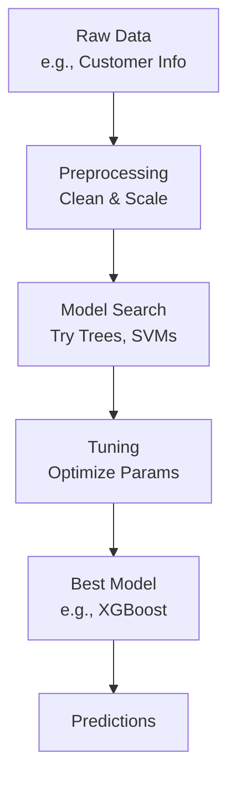

# AutoML Technical Notes
<!-- [A rectangular image depicting an intermediate AutoML workflow: a programmer inputting a dataset (e.g., tabular data with features), an AutoML tool processing it through data cleaning, model selection (e.g., ensemble of trees), and hyperparameter tuning, with the final model deployed on a server, showing metrics like accuracy, training time, and model complexity.] -->

## Quick Reference
- **One-sentence definition**: AutoML automates the end-to-end process of machine learning, from data preprocessing to model selection and optimization, for efficient and effective solutions.
- **Key use cases**: Streamlining predictive modeling for business analytics, optimizing ML pipelines, and enabling rapid prototyping across domains.
- **Prerequisites**: Familiarity with machine learning basics (e.g., classification, regression), Python proficiency, and experience with datasets.

## Table of Contents
1. [Introduction](#introduction)  
2. [Core Concepts](#core-concepts)  
    - [Fundamental Understanding](#fundamental-understanding)  
    - [Visual Architecture](#visual-architecture)  
3. [Implementation Details](#implementation-details)  
    - [Basic Implementation](#basic-implementation)  
    - [Intermediate Patterns](#intermediate-patterns)  
4. [Real-World Applications](#real-world-applications)  
    - [Industry Examples](#industry-examples)  
    - [Hands-On Project](#hands-on-project)  
5. [Tools & Resources](#tools--resources)  
    - [Essential Tools](#essential-tools)  
    - [Learning Resources](#learning-resources)  
6. [References](#references)  
7. [Appendix](#appendix)  

## Introduction
- **What**: AutoML is a framework that automates the machine learning workflow, including data preparation, algorithm selection, and tuning, to produce high-quality models with minimal manual effort.  
- **Why**: It accelerates development, improves model performance, and reduces the need for deep expertise, addressing inefficiencies in traditional ML workflows.  
- **Where**: Applied in finance (e.g., fraud detection), e-commerce (e.g., recommendation systems), and research prototyping.

## Core Concepts
### Fundamental Understanding
- **Basic Principles**:  
  - AutoML explores a range of preprocessing steps and models to fit the data and task.  
  - It uses optimization techniques (e.g., grid search, Bayesian methods) to fine-tune settings.  
  - Efficiency and scalability are balanced with predictive accuracy.  
- **Key Components**:  
  - **Data Preprocessing**: Handles missing values, scaling, and feature engineering automatically.  
  - **Model Selection**: Tests algorithms like random forests, gradient boosting, or neural networks.  
  - **Hyperparameter Tuning**: Adjusts parameters (e.g., tree depth, learning rate) for optimal results.  
- **Common Misconceptions**:  
  - *“AutoML replaces data scientists”*: It complements expertise, not replaces it.  
  - *“It’s always fast”*: Complex datasets or tasks can still take significant time.

### Visual Architecture

- **System Overview**: Data is cleaned, models are tested, settings are tuned, and the best model is selected for use.  
- **Component Relationships**: Preprocessing enables model search, tuning refines candidates, and the final model delivers results.

## Implementation Details
### Basic Implementation [Recap]
**Language**: Python  
```py
# Recap: Simple Auto-sklearn
from autosklearn.classification import AutoSklearnClassifier
from sklearn.datasets import load_iris
X, y = load_iris(return_X_y=True)
automl = AutoSklearnClassifier(time_left_for_this_task=60)
automl.fit(X, y)
```

### Intermediate Patterns [Intermediate]
**Language**: Python (using TPOT)  
```py
# AutoML with TPOT for classification
from tpot import TPOTClassifier
from sklearn.datasets import load_breast_cancer
from sklearn.model_selection import train_test_split
import pandas as pd

# Load dataset (breast cancer)
data = load_breast_cancer()
X = data.data
y = data.target

# Split data
X_train, X_test, y_train, y_test = train_test_split(X, y, test_size=0.2, random_state=42)

# Set up TPOT (genetic algorithm-based AutoML)
tpot = TPOTClassifier(
    generations=5,  # Number of iterations
    population_size=20,  # Models to test per iteration
    verbosity=2,  # Show progress
    random_state=42,
    max_time_mins=10  # Limit to 10 minutes
)

# Run AutoML
tpot.fit(X_train, y_train)

# Evaluate
accuracy = tpot.score(X_test, y_test)
print(f"Test Accuracy: {accuracy}")

# Export the best pipeline
tpot.export('best_pipeline.py')
```
- **Design Patterns**:  
  - **Pipeline Optimization**: TPOT builds and tests entire ML pipelines (preprocessing + model).  
  - **Genetic Algorithm**: Evolves models over generations, favoring high performers.  
- **Best Practices**:  
  - Set time limits (e.g., `max_time_mins`) to control runtime.  
  - Use random seeds (e.g., `random_state=42`) for reproducibility.  
  - Export pipelines for reuse or inspection.  
- **Performance Considerations**:  
  - Balance `generations` and `population_size` to explore more models without excessive compute.  
  - Pre-split data to ensure fair evaluation and avoid overfitting.

## Real-World Applications
### Industry Examples
- **Use Case**: Predicting house prices (real estate).  
- **Implementation Pattern**: AutoML tests regression models (e.g., XGBoost, linear regression) on features like size and location.  
- **Success Metrics**: Low error (e.g., RMSE) and fast training time.  

### Hands-On Project
- **Project Goals**: Build an AutoML classifier for breast cancer detection.  
- **Implementation Steps**:  
  1. Load the breast cancer dataset (provided in code).  
  2. Use TPOT to find the best pipeline in 5-10 minutes.  
  3. Test accuracy on the test set.  
- **Validation Methods**: Aim for 95%+ accuracy; check the exported pipeline for interpretability.

## Tools & Resources
### Essential Tools
- **Development Environment**: Jupyter Notebook or VS Code.  
- **Key Frameworks**: TPOT, Auto-sklearn, H2O AutoML.  
- **Testing Tools**: Scikit-learn metrics (e.g., accuracy_score).  

### Learning Resources
- **Documentation**: TPOT docs (http://epistasislab.github.io/tpot/).  
- **Tutorials**: “Automated Machine Learning with TPOT” on Medium.  
- **Community Resources**: Kaggle kernels, r/learnmachinelearning.  

## References
- TPOT Documentation: http://epistasislab.github.io/tpot/  
- “AutoML: Methods, Systems, Challenges” (Hutter et al., 2019)  
- Scikit-learn User Guide: https://scikit-learn.org/stable/user_guide.html  

## Appendix
- **Glossary**:  
  - *Pipeline*: A sequence of steps (e.g., preprocess, model) in ML.  
  - *Genetic Algorithm*: An optimization method inspired by evolution.  
- **Setup Guides**:  
  - Install TPOT: `pip install tpot`.  
- **Code Templates**: See intermediate example above.
