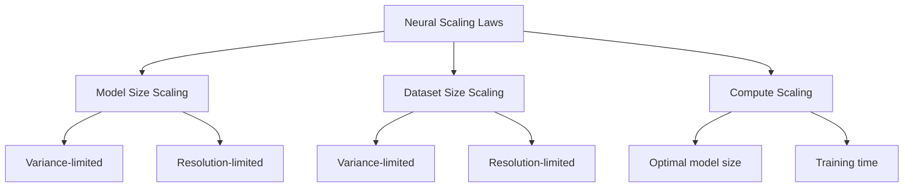

# Neural Scaling Law Technical Notes

<!--  -->

## Quick Reference
- Neural scaling laws describe how the performance of neural networks improves as key factors like model size, dataset size, and compute are scaled up.
- Key use cases: Predicting AI model performance, optimizing resource allocation in machine learning projects, and guiding AI research and development.
- Prerequisites: Basic understanding of neural networks, logarithms, and statistical concepts.

## Introduction

Neural scaling laws are empirical observations that describe how the performance of neural networks, typically measured by their loss or error rate, changes as various factors are scaled up or down. These laws have become increasingly important in the field of artificial intelligence, as they provide insights into the behavior of large-scale models and help guide the development of more efficient and powerful AI systems.

## Core Concepts

### Fundamental Understanding

Neural scaling laws typically follow a power-law relationship, which can be expressed as:

$$ L \propto x^{-\alpha} $$

Where:
- L is the loss or error rate
- x is the scaling factor (e.g., model size, dataset size, or compute)
- α is the scaling exponent

Key characteristics of neural scaling laws include:

1. **Log-log linearity**: When plotted on a log-log scale, these relationships appear as straight lines.
2. **Multiple regimes**: Different scaling behaviors may emerge depending on the factor being scaled and the range of values.
3. **Interdependence**: Scaling laws for different factors (e.g., model size and dataset size) are often interconnected.

### Visual Architecture



## Implementation Details

### Basic Implementation

To observe a neural scaling law:

1. Train multiple neural networks of varying sizes or with different dataset sizes.
2. Measure the test loss for each configuration.
3. Plot the results on a log-log scale.

```python
import numpy as np
import matplotlib.pyplot as plt

# Simulated data for model sizes and corresponding losses
model_sizes = np.logspace(6, 9, 20)  # From 1M to 1B parameters
losses = 0.5 * model_sizes**(-0.076)  # Hypothetical scaling law

plt.figure(figsize=(10, 6))
plt.loglog(model_sizes, losses, 'b-')
plt.xlabel('Model Size (parameters)')
plt.ylabel('Loss')
plt.title('Neural Scaling Law: Loss vs. Model Size')
plt.grid(True)
plt.show()
```

This code creates a log-log plot demonstrating a hypothetical neural scaling law for model size.

## Real-World Applications

### Industry Examples

Neural scaling laws are used in various AI applications:

- **Language Models**: Predicting performance improvements for larger models like GPT-3 and its successors.
- **Computer Vision**: Estimating the benefits of increasing model size or dataset size for image recognition tasks.
- **AI Research**: Guiding decisions on resource allocation and model architecture design.

### Hands-On Project

**Project: Investigating scaling laws in a simple classification task**

1. Choose a dataset (e.g., MNIST or CIFAR-10).
2. Train models of increasing size (e.g., varying numbers of layers or neurons).
3. For each model size, train with different fractions of the dataset.
4. Record the test loss for each configuration.
5. Plot the results on log-log scales to observe scaling behaviors.

## Tools & Resources

### Essential Tools

- Deep learning frameworks: TensorFlow, PyTorch
- Data analysis libraries: NumPy, Pandas
- Visualization tools: Matplotlib, Seaborn

### Learning Resources

- Paper: "Scaling Laws for Neural Language Models" by Kaplan et al.
- Online course: "Deep Learning Specialization" on Coursera
- Book: "Deep Learning" by Ian Goodfellow, Yoshua Bengio, and Aaron Courville

## Appendix

### Glossary

- **Power law**: A functional relationship between two quantities where one varies as a power of the other
- **Variance-limited scaling**: Scaling behavior limited by the statistical variance in finite datasets
- **Resolution-limited scaling**: Scaling behavior limited by the model's ability to capture fine details in the data

## References

- [1] https://research.google/pubs/explaining-neural-scaling-laws/
- [2] https://en.wikipedia.org/wiki/Neural_scaling_law
- [3] https://github.com/shehper/scaling_laws
- [4] https://arxiv.org/html/2402.05164v1
- [5] https://arxiv.org/html/2102.06701v2
- [6] https://www.researchgate.net/publication381667733_Explaining_neural_scaling_laws
- [7] https://kempnerinstitute.harvard.edu/research/deeper-learning/a-dynamical-model-of-neural-scaling-laws/
- [8] https://www.pnas.org/doi/10.1073/pnas.2311878121

