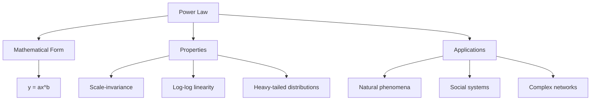

# Power Law Technical Notes

<!--  -->

## Quick Reference
- Power law is a relationship where a relative change in one quantity results in a proportional relative change in another.
- Key use cases: Describing natural phenomena, analyzing complex systems, and modeling various distributions.
- Prerequisites: Basic understanding of mathematical functions and logarithms.

## Introduction

Power laws are mathematical relationships that describe how two quantities are related, where one quantity varies as a power of another. These laws are ubiquitous in nature and human-made systems, providing insights into various phenomena across different fields of study.

## Core Concepts

### Fundamental Understanding

The power law is expressed mathematically as:

$$ y = ax^b $$

Where:
- y is the dependent variable
- x is the independent variable
- a is a constant (scaling factor)
- b is the power law exponent

Key characteristics of power laws include:

1. **Scale-invariance**: The relationship remains consistent regardless of the scale of measurement.
2. **Log-log linearity**: When plotted on logarithmic scales, power law relationships appear as straight lines.
3. **Heavy-tailed distributions**: Power laws often describe phenomena where extreme events are more common than in normal distributions.

### Visual Architecture



## Implementation Details

### Basic Implementation

To identify a power law relationship:

1. Collect data for the two quantities of interest.
2. Plot the data on a log-log scale.
3. If the relationship appears linear on the log-log plot, it likely follows a power law.

```python
import numpy as np
import matplotlib.pyplot as plt

# Generate data following a power law
x = np.logspace(0, 3, 100)
y = 2 * x**(-1.5)  # Power law with a=2 and b=-1.5

# Plot on log-log scale
plt.loglog(x, y)
plt.xlabel('x')
plt.ylabel('y')
plt.title('Power Law Relationship')
plt.grid(True)
plt.show()
```

This code creates a log-log plot of a power law relationship, demonstrating the characteristic straight line.

## Real-World Applications

### Industry Examples

Power laws appear in various fields:

- **Physics**: Distribution of earthquake magnitudes (Gutenberg-Richter law)
- **Linguistics**: Word frequency in languages (Zipf's law)
- **Economics**: Distribution of wealth and income (Pareto principle)
- **Urban planning**: City population sizes
- **Computer science**: Website sizes and connectivity in networks

### Hands-On Project

**Project: Analyzing word frequencies in a text**

1. Choose a large text (e.g., a book or article).
2. Count the frequency of each word.
3. Rank words by frequency.
4. Plot word rank vs. frequency on a log-log scale.
5. Determine if the relationship follows Zipf's law (a specific power law).

## Tools & Resources

### Essential Tools

- Data analysis libraries: NumPy, Pandas
- Visualization tools: Matplotlib, Seaborn
- Statistical software: R, SPSS

### Learning Resources

- Books: "The Science of Power Law and Networks" by Claudio Castellano
- Online courses: Coursera's "Network Science" by Albert-László Barabási
- Tutorials: Python Data Science Handbook (chapter on statistical data visualization)

## Appendix

### Glossary

- **Scale-invariance**: Property where the relationship remains consistent across different scales
- **Heavy-tailed distribution**: A probability distribution with a "tail" that decays more slowly than an exponential distribution
- **Zipf's law**: A specific power law relating to word frequencies in languages

## References

- [1] https://www.statisticshowto.com/power-law/
- [2] https://necsi.edu/power-law
- [3] https://pmc.ncbi.nlm.nih.gov/articles/PMC9727680/
- [4] https://en.wikipedia.org/wiki/Power_law
- [5] https://www.kdnuggets.com/2016/12/data-science-basics-power-laws-distributions.html
- [6] https://datascientest.com/en/all-about-the-power-law
- [7] https://fs.blog/power-laws/
- [8] http://piketty.pse.ens.fr/files/Gabaix2008.pdf
- [9] https://biolecta.com/articles/understanding-power-law-implications-applications/


