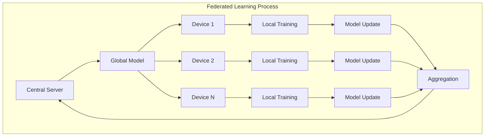

# Federated Learning for Edge AI Technical Notes


## Quick Reference

- One-sentence definition: Federated Learning is a machine learning technique that trains algorithms across multiple decentralized edge devices or servers holding local data samples, without exchanging them.
- Key use cases: Privacy-preserving machine learning, collaborative learning across IoT devices, personalized models on mobile devices.
- Prerequisites: Understanding of machine learning basics, distributed systems concepts, and edge computing principles.

## Table of Contents

- [Introduction](#introduction)
- [Core Concepts](#core-concepts)
- [Implementation Details](#implementation-details)
- [Real-World Applications](#real-world-applications)
- [Tools & Resources](#tools--resources)
- [References](#references)
- [Appendix](#appendix)

## Introduction

### What: Core definition and purpose

Federated Learning allows for training machine learning models on distributed datasets across multiple edge devices or servers, without the need to centralize the data. It enables collaborative learning while keeping the raw data localized, thus preserving privacy and reducing data transfer.

### Why: Problem it solves/value proposition

Federated Learning addresses several challenges in edge AI and distributed machine learning:

- Data privacy concerns by keeping raw data on local devices
- Regulatory compliance with data protection laws (e.g., GDPR)
- Reduced network bandwidth usage for model training
- Enabling learning from diverse, distributed datasets
- Allowing for personalization while benefiting from collective knowledge

### Where: Application domains

Federated Learning is applied in various fields:

- Mobile keyboard prediction and auto-correct
- Healthcare (analyzing patient data across multiple hospitals)
- Finance (fraud detection across banks without sharing customer data)
- Smart cities (traffic prediction using data from multiple sources)
- IoT networks (improving device performance across a fleet)

## Core Concepts

### Fundamental Understanding

- Basic principles:
    1. Local Training: Each device trains on its local data
    2. Model Aggregation: A central server aggregates model updates
    3. Global Model Distribution: Updated global model is shared back to devices
    4. Privacy Preservation: Raw data never leaves the local devices
    5. Secure Aggregation: Cryptographic techniques to protect individual updates
- Key components:
    - Local Datasets
    - Local Model Training Process
    - Secure Communication Channels
    - Central Aggregation Server
    - Model Update Mechanism
- Common misconceptions:
    - Federated Learning completely eliminates privacy concerns
    - It always produces better models than centralized learning
    - Federated Learning is only for mobile devices

### Visual Architecture



## Implementation Details

### Basic Implementation [Beginner]

For this example, we'll demonstrate a simple federated learning setup using Python and TensorFlow. This is a simplified version that doesn't include all the security features of a production system but illustrates the core concept.

```python
import tensorflow as tf
import numpy as np

class FederatedClient:
    def __init__(self, client_id, model):
        self.client_id = client_id
        self.model = model
        self.dataset = None

    def set_dataset(self, dataset):
        self.dataset = dataset

    def train(self, epochs=5):
        self.model.fit(self.dataset, epochs=epochs)
        return self.model.get_weights()

class FederatedServer:
    def __init__(self, model):
        self.global_model = model
        self.clients = []

    def add_client(self, client):
        self.clients.append(client)

    def aggregate_models(self, client_weights):
        # Simple averaging of weights
        avg_weights = [np.zeros_like(w) for w in client_weights[0]]
        for weights in client_weights:
            for i in range(len(avg_weights)):
                avg_weights[i] += weights[i]
        avg_weights = [w / len(client_weights) for w in avg_weights]
        return avg_weights

    def update_global_model(self, new_weights):
        self.global_model.set_weights(new_weights)

    def distribute_model(self):
        for client in self.clients:
            client.model.set_weights(self.global_model.get_weights())

    def federated_learning_round(self):
        client_weights = []
        for client in self.clients:
            weights = client.train()
            client_weights.append(weights)

        new_weights = self.aggregate_models(client_weights)
        self.update_global_model(new_weights)
        self.distribute_model()

# Example usage
def create_model():
    model = tf.keras.Sequential([
        tf.keras.layers.Dense(10, activation='relu', input_shape=(4,)),
        tf.keras.layers.Dense(3, activation='softmax')
    ])
    model.compile(optimizer='adam', loss='sparse_categorical_crossentropy', metrics=['accuracy'])
    return model

# Create server and clients
server = FederatedServer(create_model())
for i in range(3):
    client = FederatedClient(f"Client_{i}", create_model())
    server.add_client(client)

# Simulate data distribution (in real scenario, data would be on devices)
(x_train, y_train), _ = tf.keras.datasets.iris.load_data()
x_train = x_train.astype('float32') / 255.0
datasets = np.array_split(list(zip(x_train, y_train)), 3)

for i, client in enumerate(server.clients):
    client.set_dataset(tf.data.Dataset.from_tensor_slices(datasets[i]).batch(32))

# Run federated learning for a few rounds
for round in range(5):
    print(f"Federated Learning Round {round + 1}")
    server.federated_learning_round()

# Evaluate global model
_, (x_test, y_test) = tf.keras.datasets.iris.load_data()
x_test = x_test.astype('float32') / 255.0
test_loss, test_accuracy = server.global_model.evaluate(x_test, y_test)
print(f"Global Model Test Accuracy: {test_accuracy}")

```

- Step-by-step setup:
    1. Define `FederatedClient` class to represent edge devices.
    2. Create `FederatedServer` class to manage the global model and aggregation.
    3. Implement methods for local training, model aggregation, and distribution.
    4. Set up a simple neural network model for demonstration.
    5. Simulate data distribution across clients.
    6. Run multiple rounds of federated learning.
- Code walkthrough:
    - `FederatedClient` trains on local data and returns model weights.
    - `FederatedServer` aggregates weights from all clients (simple averaging in this case).
    - The server updates the global model and distributes it back to clients.
    - We simulate multiple rounds of this process to improve the global model.
- Common pitfalls:
    - Not handling non-IID (non-independent and identically distributed) data properly.
    - Ignoring communication efficiency in large-scale deployments.
    - Overlooking privacy concerns in the aggregation process.

## Real-World Applications

### Industry Examples

- Use cases:
    1. Google's Gboard mobile keyboard for next-word prediction
    2. Apple's Siri for improving voice recognition across users
    3. Healthcare consortiums for collaborative research on patient data
- Implementation patterns:
    - Secure aggregation using cryptographic techniques
    - Differential privacy to add noise to individual updates
    - Adaptive aggregation strategies based on client data quality
- Success metrics:
    - Model accuracy improvement over time
    - Privacy preservation (e.g., differential privacy guarantees)
    - Communication efficiency (reduced bandwidth usage)

### Hands-On Project

Project: Implement a federated learning system for sentiment analysis on mobile devices

- Project goals:
    1. Develop a base sentiment analysis model
    2. Create a simulated environment with multiple mobile devices
    3. Implement federated learning to improve the model without centralizing data
    4. Demonstrate improved accuracy while maintaining data privacy
- Implementation steps:
    1. Prepare a basic sentiment analysis model using TensorFlow
    2. Set up a simulated environment with multiple "devices" (could be separate processes)
    3. Distribute different subsets of a sentiment dataset to each device
    4. Implement the federated learning protocol (local training, aggregation, distribution)
    5. Run multiple rounds of federated learning
    6. Evaluate the global model's performance improvement
- Validation methods:
    - Compare federated model performance to centrally trained model
    - Analyze convergence rate across federated learning rounds
    - Verify that raw data remains on local devices throughout the process

## Tools & Resources

### Essential Tools

- TensorFlow Federated (TFF): https://www.tensorflow.org/federated
- PySyft: A library for secure and private Deep Learning
- FATE (Federated AI Technology Enabler): https://fate.fedai.org/

### Learning Resources

- Documentation:
    - TensorFlow Federated Tutorials: https://www.tensorflow.org/federated/tutorials/tutorials_overview
    - PySyft Tutorials: https://github.com/OpenMined/PySyft/tree/master/examples
- Tutorials:
    - "Federated Learning: Collaborative Machine Learning without Centralized Training Data" by Google AI
    - "Federated Learning: The Future of Distributed Machine Learning" course on Coursera
- Community resources:
    - OpenMined community: https://www.openmined.org/
    - Federated Learning Meetup groups

## References

- Official documentation:
    - TensorFlow Federated: https://www.tensorflow.org/federated
    - FATE: https://fate.fedai.org/
- Technical papers:
    - "Communication-Efficient Learning of Deep Networks from Decentralized Data" by McMahan et al.
    - "Federated Learning: Challenges, Methods, and Future Directions" by T. Li et al.
- Industry reports:
    - "Federated Learning: The Future of Distributed Machine Learning" by Gartner

## Appendix

### Glossary

- Federated Learning: A machine learning technique that trains an algorithm across multiple decentralized edge devices or servers holding local data samples, without exchanging them.
- Secure Aggregation: A cryptographic technique that allows a server to compute the sum of user-held data without learning any individual's data.
- Differential Privacy: A system for publicly sharing information about a dataset by describing the patterns of groups within the dataset while withholding information about individuals in the dataset.
- Non-IID Data: Data that is not Independent and Identically Distributed, a common challenge in federated learning where different clients may have very different data distributions.

### Setup Guide

1. Install TensorFlow and TensorFlow Federated:
    
    ```
    pip install tensorflow tensorflow_federated
    
    ```
    
2. For PySyft:
    
    ```
    pip install syft
    
    ```
    
3. Prepare your development environment:
    - Use Google Colab for easy setup with TensorFlow Federated
    - Or set up a local Python environment with the necessary libraries

### Code Template

```python
import tensorflow as tf
import tensorflow_federated as tff

# Define a simple model
def create_keras_model():
    return tf.keras.models.Sequential([
        tf.keras.layers.Input(shape=(784,)),
        tf.keras.layers.Dense(10, activation=tf.nn.softmax)
    ])

# Define client TFF computation
@tf.function
def client_update(model, dataset, server_weights, client_optimizer):
    client_weights = model.trainable_variables
    tf.nest.map_structure(lambda x, y: x.assign(y), client_weights, server_weights)

    for batch in dataset:
        with tf.GradientTape() as tape:
            outputs = model(batch['x'])
            loss = tf.keras.losses.sparse_categorical_crossentropy(batch['y'], outputs)
        grads = tape.gradient(loss, client_weights)
        client_optimizer.apply_gradients(zip(grads, client_weights))

    return client_weights

# Wrap client computation as TFF computation
client_update_fn = tff.tf_computation(
    client_update,
    tf.keras.Model,
    tf.data.Dataset,
    tf.nest.map_structure(tf.TensorSpec, create_keras_model().trainable_variables),
    tf.keras.optimizers.Optimizer
)

# Implement federated averaging
@tff.federated_computation
def federated_avg(server_weights, client_datasets):
    client_weights = tff.federated_map(
        client_update_fn,
        (tff.federated_broadcast(server_weights), client_datasets)
    )
    return tff.federated_mean(client_weights)

# Initialize the model and run federated learning
model = create_keras_model()
server_weights = model.trainable_variables
for round in range(num_rounds):
    server_weights = federated_avg(server_weights, federated_train_data)

# Evaluate the final model
metric = tf.keras.metrics.SparseCategoricalAccuracy()
for batch in test_data:
    metric.update_state(batch['y'], model(batch['x']))
print(f'Test accuracy: {metric.result().numpy()}')

```

