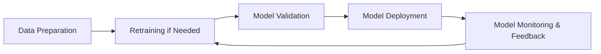

# MLOps Technical Notes - [Beginner]

## Quick Reference

- **Definition**: MLOps (Machine Learning Operations) is the practice of automating and streamlining the lifecycle of machine learning models, from development to deployment and maintenance in production environments.
- **Key Use Cases**: Scaling AI deployments, monitoring model performance, and ensuring reproducibility in machine learning pipelines.
- **Prerequisites**: Basic understanding of machine learning and familiarity with DevOps concepts (e.g., CI/CD pipelines).

## Content Overview
1. **Introduction**: Overview of MLOps, its purpose, and importance.
2. **Core Concepts**: Key principles, components, and beginner misconceptions.
3. **Implementation**: Setting up a simple MLOps pipeline with minimal complexity.
4. **Real-World Applications**: Use cases and practical examples across industries.
5. **Tools & Resources**: Beginner-friendly tools, frameworks, and learning materials.

---

## Introduction
- **What**: MLOps integrates machine learning and software engineering practices to automate the lifecycle of ML models. It covers everything from data preparation and model training to deployment, monitoring, and maintenance.
- **Why**: Traditional machine learning processes often lack scalability, reproducibility, and robustness for production use. MLOps solves these challenges by introducing standardization and automation.
- **Where**: MLOps is applied across industries such as finance (fraud detection), healthcare (predictive analytics), and retail (recommendation systems).

---

## Core Concepts

### Fundamental Understanding
- **Lifecycle Phases**:
  - **Development**: Building and training machine learning models.
  - **Deployment**: Moving models from experimentation to production environments.
  - **Monitoring**: Ensuring models remain accurate and relevant over time.
- **Reproducibility**: Ensuring that ML experiments can be replicated, critical for debugging and validation.
- **Continuous Integration/Continuous Deployment (CI/CD)**: Applying software engineering practices to ML workflows to automate testing, integration, and deployment.

### Key Components
1. **Version Control**:
   - For code (e.g., Git) and data/model versions.
2. **Automated Pipelines**:
   - Streamlining tasks such as data preprocessing, training, and evaluation.
3. **Monitoring Tools**:
   - To track model performance, drift, and health in production.

### Common Misconceptions
- MLOps is just DevOps: While related, MLOps also addresses unique challenges like data versioning, model drift, and retraining.
- MLOps is only for large companies: Beginners and small teams can benefit by implementing simple MLOps practices.

---

### Visual Architecture

- **System Overview**: A high-level MLOps workflow showing continuous improvement and feedback loops.
- **Component Relationships**: Each stage feeds into the next, ensuring a robust and iterative ML pipeline.

---

## Implementation Details

### Basic Implementation [Beginner]
```python
# Simple MLOps pipeline using MLflow
import mlflow
import mlflow.sklearn
from sklearn.ensemble import RandomForestClassifier
from sklearn.model_selection import train_test_split
from sklearn.datasets import load_iris

# Load data
data = load_iris()
X_train, X_test, y_train, y_test = train_test_split(data.data, data.target, test_size=0.2, random_state=42)

# Enable MLflow tracking
mlflow.set_experiment("Beginner_MLOps")

with mlflow.start_run():
    # Train model
    model = RandomForestClassifier()
    model.fit(X_train, y_train)
    
    # Log model
    mlflow.sklearn.log_model(model, "model")
    print("Model logged in MLflow.")
```
- **Step-by-Step Setup**:
  - **1. Experiment Tracking**: Use a tool like MLflow to track experiments and model performance.
  - **2. Simple Model Training**: Train a basic machine learning model (e.g., Random Forest).
  - **3. Logging**: Save the trained model and relevant metrics in a reproducible format.
- **Common Pitfalls**:
  - Ignoring model drift: Failing to monitor production models may lead to decreased performance over time.
  - Lack of automation: Without pipelines, manual processes slow down iteration and deployment.

---

## Real-World Applications

### Industry Examples
- **Finance**: Automating fraud detection models with MLOps pipelines to ensure up-to-date performance as fraud patterns evolve.
- **Healthcare**: Managing predictive analytics models for patient risk assessment with automated monitoring and retraining.
- **Retail**: Continuously updating recommendation systems based on evolving customer preferences.

### Hands-On Project
**Project Goal**: Create a basic MLOps pipeline to train, deploy, and monitor a simple classification model.
- **Implementation Steps**:
  - Load a dataset and preprocess it.
  - Train a model and log it with MLflow.
  - Simulate deployment by saving and loading the model.
  - Implement basic monitoring by evaluating the model on a test set.
- **Validation**: Check the model's accuracy and retrain if it falls below a threshold.

---

## Tools & Resources

### Essential Tools
- **Development Environment**: Jupyter Notebook or Google Colab for easy prototyping.
- **Key Frameworks**:
  - **MLflow**: For experiment tracking and model management.
  - **DVC (Data Version Control)**: For data and model versioning.
  - **Airflow**: To create automated pipelines.
- **Testing Tools**:
  - Simple CI/CD tools like GitHub Actions to automate basic workflows.

### Learning Resources
- **Documentation**:
  - [MLflow Tracking Guide](https://mlflow.org/docs/latest/tracking.html)
  - [DVC Getting Started](https://dvc.org/doc/start)
- **Tutorials**:
  - Hands-on tutorials for setting up basic MLOps pipelines with MLflow.
- **Community Resources**: Online forums, GitHub repositories, and beginner-friendly MLOps courses.

---

## References
- **Official Documentation**: MLflow, DVC, and Airflow documentation for MLOps beginners.
- **Industry Blogs**: Medium articles and blogs explaining real-world MLOps practices.
- **Books**: Beginner guides to MLOps, such as *Introducing MLOps*.

---

## Appendix
- **Glossary**:
  - **CI/CD**: Continuous Integration and Continuous Deployment.
  - **Model Drift**: A phenomenon where model performance degrades over time due to changes in input data patterns.
  - **Experiment Tracking**: The process of recording and managing details about machine learning experiments.
- **Setup Guides**:
  - Step-by-step guides for installing MLflow or DVC.
- **Code Templates**:
  - Pre-built templates for simple MLOps pipelines.

---

This guide offers a foundational understanding of MLOps and equips beginners with the tools and knowledge to get started with core concepts and workflows.
