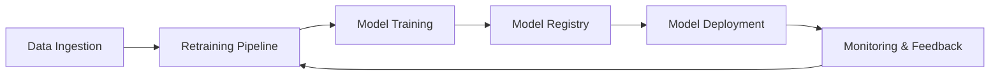

# MLOps Technical Notes - [Intermediate]

## Table of Contents
- [Quick Reference](#quick-reference)
- [Introduction](#introduction)
- [Core Concepts](#core-concepts)
- [Implementation](#implementation)
- [Real-World Applications](#real-world-applications)
- [Tools & Resources](#tools--resources)

---

## Quick Reference
- **Definition**: MLOps (Machine Learning Operations) applies DevOps practices to machine learning, automating the lifecycle of ML models from development to production while ensuring reproducibility, scalability, and reliability.
- **Key Use Cases**: Productionizing ML models, automating retraining, and monitoring deployed models.
- **Prerequisites**: Understanding of machine learning pipelines, basic DevOps knowledge (e.g., CI/CD), and familiarity with tools like Docker and Git.

---

## Introduction
- **What**: MLOps integrates machine learning with software engineering practices to streamline model lifecycle management, enabling consistent and efficient deployment, monitoring, and updating of models in production.
- **Why**: ML models often fail in production due to a lack of automation, monitoring, and scalability. MLOps solves these issues by ensuring reliability and reproducibility.
- **Where**: Used in industries such as finance (risk management), healthcare (diagnostic tools), and e-commerce (personalized recommendations).

---

## Core Concepts

### Fundamental Understanding
- **Key Pillars of MLOps**:
  1. **Automation**: Automate repetitive tasks like data preprocessing, model training, and deployment.
  2. **Reproducibility**: Version control for data, code, and models.
  3. **Monitoring**: Ensure deployed models perform well over time.
  4. **Scalability**: Handle increasing data and user demands efficiently.
- **Lifecycle Phases**:
  - **Development**: Experiment tracking, hyperparameter tuning.
  - **Deployment**: Containerization, CI/CD pipelines.
  - **Maintenance**: Model monitoring, automated retraining.
- **CI/CD for ML**:
  - Continuous Integration: Automating testing and validation of ML code and models.
  - Continuous Deployment: Automating deployment to production.

### Key Components
1. **Data Management**:
   - Tools like **DVC** for data versioning.
   - Automated data pipelines for consistent preprocessing.
2. **Experiment Tracking**:
   - Platforms like **MLflow** or **Weights & Biases** for reproducibility.
3. **Model Deployment**:
   - Frameworks like **TensorFlow Serving**, **TorchServe**, or containerized deployments using Docker.
4. **Monitoring**:
   - Detecting model drift and performance degradation in production.

### Common Misconceptions
- **MLOps is only about deployment**: It encompasses the entire lifecycle, including monitoring and retraining.
- **CI/CD for ML is the same as traditional CI/CD**: ML CI/CD involves additional challenges, such as versioning datasets and ensuring model reproducibility.

---

### Visual Architecture

- **System Overview**: A modular MLOps pipeline with feedback loops for continuous improvement.
- **Component Relationships**: Each phase interacts with the next to create a robust and scalable ML workflow.

---

## Implementation Details

### Intermediate Patterns [Intermediate]
```python
# Example MLOps pipeline with MLflow and Airflow
from airflow import DAG
from airflow.operators.python_operator import PythonOperator
from datetime import datetime

def preprocess_data():
    # Code for data preprocessing
    print("Preprocessing data...")

def train_model():
    # Code for training a model
    print("Training model...")

def deploy_model():
    # Code for deploying the model
    print("Deploying model...")

# Define DAG
default_args = {
    'owner': 'mlops_user',
    'start_date': datetime(2024, 1, 1),
}
dag = DAG('mlops_pipeline', default_args=default_args, schedule_interval='@daily')

t1 = PythonOperator(task_id='preprocess_data', python_callable=preprocess_data, dag=dag)
t2 = PythonOperator(task_id='train_model', python_callable=train_model, dag=dag)
t3 = PythonOperator(task_id='deploy_model', python_callable=deploy_model, dag=dag)

t1 >> t2 >> t3
```
- **Design Patterns**:
  - Modular pipelines for reusability and scalability.
  - Use DAGs (Directed Acyclic Graphs) to structure workflows.
- **Best Practices**:
  - Separate environments for staging, testing, and production.
  - Automate model retraining with monitoring-triggered workflows.
- **Performance Considerations**:
  - Optimize pipeline steps to reduce latency.
  - Use caching to avoid redundant computations.

---

## Real-World Applications

### Industry Examples
- **Finance**: Automating credit scoring pipelines to adapt to changing economic conditions.
- **Healthcare**: Deploying ML models for medical imaging and ensuring compliance with regulations.
- **Retail**: Managing and scaling personalized recommendation systems for millions of users.

### Hands-On Project
**Project Goal**: Build and automate an MLOps pipeline for a classification model.
- **Implementation Steps**:
  - Preprocess data and version it with DVC.
  - Train and log the model with MLflow.
  - Deploy the model using Docker and TensorFlow Serving.
  - Monitor performance with Prometheus or Grafana.
- **Validation**: Create automated retraining triggers based on monitored metrics.

---

## Tools & Resources

### Essential Tools
- **Experiment Tracking**: MLflow, Weights & Biases.
- **Pipeline Orchestration**: Apache Airflow, Kubeflow.
- **Model Deployment**: Docker, Kubernetes, TensorFlow Serving.
- **Monitoring**: Prometheus, Grafana.
- **Data Versioning**: DVC, Delta Lake.

### Learning Resources
- **Documentation**:
  - [MLflow Tracking Documentation](https://mlflow.org/docs/latest/tracking.html)
  - [Airflow DAGs Guide](https://airflow.apache.org/docs/apache-airflow/stable/concepts/dags.html)
- **Tutorials**:
  - Setting up an MLOps pipeline with MLflow and Airflow.
- **Community Resources**: Open-source projects and forums like MLOps Community.

---

## References
- **Books**: *Building Machine Learning Pipelines* by Hannes Hapke and Catherine Nelson.
- **Technical Papers**: Google’s TFX pipeline papers.
- **Industry Blogs**: Medium articles on MLOps patterns and case studies.

---

## Appendix
- **Glossary**:
  - **Model Drift**: Changes in model performance due to evolving data patterns.
  - **Pipeline Orchestration**: Managing tasks and dependencies in workflows.
  - **Experiment Tracking**: Logging model training details for reproducibility.
- **Setup Guides**:
  - Installing Airflow for pipeline orchestration.
  - Setting up DVC for data versioning.
- **Code Templates**:
  - Pre-built templates for Airflow-based MLOps workflows.

---

This guide provides intermediate-level practitioners with actionable insights into MLOps principles, tools, and workflows, bridging the gap between foundational knowledge and advanced practices.
