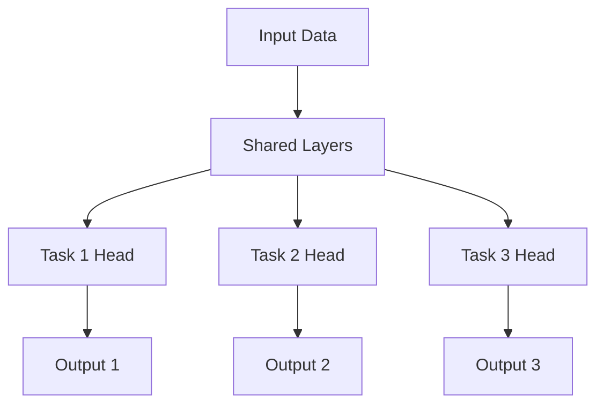

# Multi-Task Learning (MTL) Technical Notes
<!-- [Illustration showing a neural network with shared layers branching into multiple task-specific layers, highlighting the concept of shared representations and task-specific outputs.] -->

## Quick Reference
- One-sentence definition: Multi-task learning (MTL) is a machine learning paradigm where a model is trained to perform multiple related tasks simultaneously, leveraging shared representations to improve generalization.
- Key use cases: Natural language processing (e.g., sentiment analysis and named entity recognition), computer vision (e.g., object detection and segmentation), recommendation systems.
- Prerequisites:  
  - Advanced: Deep understanding of neural networks, optimization techniques, and experience with frameworks like PyTorch or TensorFlow.

## Table of Contents
1. [Introduction](#introduction)  
2. [Core Concepts](#core-concepts)  
  - [Fundamental Understanding](#fundamental-understanding)  
  - [Visual Architecture](#visual-architecture)  
3. [Implementation Details](#implementation-details)  
  - [Advanced Topics](#advanced-topics)  
4. [Real-World Applications](#real-world-applications)  
  - [Industry Examples](#industry-examples)  
  - [Hands-On Project](#hands-on-project)  
5. [Tools & Resources](#tools--resources)  
6. [References](#references)  
7. [Appendix](#appendix)  

## Introduction
### What: Core Definition and Purpose
Multi-task learning (MTL) is a machine learning approach where a single model is trained to perform multiple tasks simultaneously. The goal is to improve the model's performance on each task by sharing knowledge across tasks.

### Why: Problem It Solves/Value Proposition
MTL addresses the challenge of training separate models for each task, which can be computationally expensive and inefficient. By sharing representations, MTL reduces overfitting, improves generalization, and often requires less data for each task.

### Where: Application Domains
MTL is widely used in:
- Natural Language Processing (NLP): Sentiment analysis, named entity recognition, and machine translation.
- Computer Vision: Object detection, segmentation, and pose estimation.
- Healthcare: Disease prediction and patient outcome analysis.

## Core Concepts
### Fundamental Understanding
- **Basic Principles**:  
  - Shared Representations: A single model learns shared features that are useful across multiple tasks.  
  - Task-Specific Layers: Each task has its own output layer to handle task-specific details.  
  - Loss Function: Combines losses from all tasks, often weighted to balance their importance.  

- **Key Components**:  
  - Shared Layers: Layers that learn common features for all tasks.  
  - Task-Specific Heads: Layers that process task-specific outputs.  
  - Loss Aggregation: A mechanism to combine losses from multiple tasks.  

- **Common Misconceptions**:  
  - MTL always improves performance: While MTL can improve generalization, it may not always outperform single-task models if tasks are unrelated.  
  - All tasks must be equally important: Tasks can have different weights in the loss function to reflect their relative importance.  

### Visual Architecture


## Implementation Details
### Advanced Topics [Advanced]
```python
import torch
import torch.nn as nn
import torch.optim as optim

# Define a multi-task learning model with gradient normalization
class MultiTaskModel(nn.Module):
    def __init__(self):
        super(MultiTaskModel, self).__init__()
        self.shared_layer = nn.Sequential(
            nn.Linear(10, 50),
            nn.ReLU(),
            nn.Dropout(0.5)
        )
        self.task1_head = nn.Linear(50, 1)  # Regression task
        self.task2_head = nn.Linear(50, 5)  # Classification task

    def forward(self, x):
        shared_output = self.shared_layer(x)
        output1 = self.task1_head(shared_output)
        output2 = self.task2_head(shared_output)
        return output1, output2

# Gradient normalization for balanced training
def grad_norm_loss(loss1, loss2, model, alpha=0.12):
    grads1 = torch.autograd.grad(loss1, model.parameters(), retain_graph=True, create_graph=True)
    grads2 = torch.autograd.grad(loss2, model.parameters(), retain_graph=True, create_graph=True)
    grad_norm1 = torch.norm(torch.stack([torch.norm(g) for g in grads1]))
    grad_norm2 = torch.norm(torch.stack([torch.norm(g) for g in grads2]))
    grad_ratio = grad_norm1 / grad_norm2
    return loss1 + loss2 + alpha * torch.abs(grad_ratio - 1.0)

# Initialize model, loss functions, and optimizer
model = MultiTaskModel()
criterion1 = nn.MSELoss()  # Loss for regression task
criterion2 = nn.CrossEntropyLoss()  # Loss for classification task
optimizer = optim.Adam(model.parameters(), lr=0.001)

# Example training loop
for epoch in range(10):
    optimizer.zero_grad()
    input_data = torch.randn(5, 10)  # Example input
    target1 = torch.randn(5, 1)  # Regression target
    target2 = torch.randint(0, 5, (5,))  # Classification target

    output1, output2 = model(input_data)
    loss1 = criterion1(output1, target1)
    loss2 = criterion2(output2, target2)
    total_loss = grad_norm_loss(loss1, loss2, model)  # Combine losses with gradient normalization
    total_loss.backward()
    optimizer.step()

    print(f"Epoch {epoch+1}, Loss: {total_loss.item()}")
```

- **System Design**:  
  - Gradient Normalization: Balances gradients from different tasks to ensure stable training.  
  - Shared Feature Extraction: Uses shared layers to extract common features across tasks.  

- **Optimization Techniques**:  
  - Dynamic Loss Weighting: Automatically balances the contribution of each task's loss based on task uncertainty.  
  - Gradient Clipping: Prevents exploding gradients in multi-task scenarios.  

- **Production Considerations**:  
  - Scalability: Ensure the model can handle large-scale datasets and multiple tasks efficiently.  
  - Monitoring: Track task-specific performance and gradients during training.  

## Real-World Applications
### Industry Examples
- **NLP**: Google Translate uses MTL to improve translation quality across multiple languages.  
- **Computer Vision**: Autonomous vehicles use MTL for object detection, lane detection, and depth estimation.  
- **Healthcare**: Predicting multiple patient outcomes (e.g., disease progression and treatment response) using a single model.  

### Hands-On Project
- **Project Goals**: Build a multi-task model to predict both sentiment and topic from text data.  
- **Implementation Steps**:  
  1. Preprocess text data (tokenization, padding).  
  2. Define a model with shared embedding and LSTM layers.  
  3. Add task-specific heads for sentiment and topic classification.  
  4. Train the model using a combined loss function.  
- **Validation Methods**: Evaluate performance using accuracy for sentiment and F1-score for topic classification.  


## Tools & Resources
### Essential Tools
- **Development Environment**: Python, Jupyter Notebook, PyTorch/TensorFlow.  
- **Key Frameworks**: Hugging Face Transformers, Keras.  
- **Testing Tools**: pytest, unittest.  

### Learning Resources
- **Documentation**: PyTorch MTL tutorials, TensorFlow MTL guides.  
- **Tutorials**: "Multi-Task Learning with PyTorch" by Medium.  
- **Community Resources**: Stack Overflow, GitHub repositories.  

## References
- Official documentation: [PyTorch](https://pytorch.org), [TensorFlow](https://tensorflow.org).  
- Technical papers: "An Overview of Multi-Task Learning in Deep Neural Networks" by Ruder (2017).  
- Industry standards: MTL applications in NLP and computer vision.  

## Appendix
### Glossary
- **Shared Layers**: Layers that learn features common to all tasks.  
- **Task-Specific Heads**: Layers that process outputs for individual tasks.  
- **Loss Aggregation**: Combining losses from multiple tasks into a single loss value.  

### Setup Guides
- Install PyTorch: `pip install torch`.  
- Install TensorFlow: `pip install tensorflow`.  
