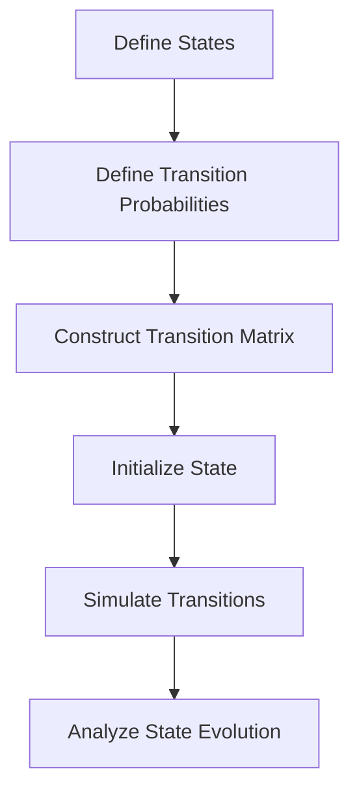

# Markov Chain - Notes

## Table of Contents (ToC)
  - [Introduction](#introduction)
    - [What's Markov Chain?](#whats-markov-chain)
    - [Key Concepts and Terminology](#key-concepts-and-terminology)
    - [Applications](#applications)
  - [Fundamentals](#fundamentals)
    - [Markov Chain Architecture Pipeline](#markov-chain-architecture-pipeline)
    - [How Markov Chain works?](#how-markov-chain-works)
    - [Types of Markov Chains](#types-of-markov-chains)
    - [Some hands-on examples](#some-hands-on-examples)
  - [Tools \& Frameworks](#tools--frameworks)
  - [Hello World!](#hello-world)
  - [Lab: Zero to Hero Projects](#lab-zero-to-hero-projects)
  - [References](#references)


## Introduction
A Markov Chain is a mathematical system that undergoes transitions from one state to another on a state space, with the probability of each state only depending on the previous state.

### What's Markov Chain?
- A stochastic model describing a sequence of possible events.
- Transitions between states are determined by fixed probabilities.
- The system's future state depends only on its current state, not on the sequence of events that preceded it (memoryless property).

### Key Concepts and Terminology
- **State Space:** The set of all possible states.
- **Transition Matrix:** A matrix that describes the probabilities of transitioning from one state to another.
- **Stationary Distribution:** A probability distribution that remains unchanged as the system evolves.
- **Absorbing State:** A state that, once entered, cannot be left.
- **Ergodicity:** The condition under which a Markov chain is irreducible and aperiodic, ensuring that long-term behavior is independent of the initial state.

### Applications
- **Economics:** Modeling stock market fluctuations and consumer behavior.
- **Physics:** Describing the behavior of particles in a gas.
- **Biology:** Studying population dynamics and genetic sequences.
- **Computer Science:** PageRank algorithm for web page ranking.

## Fundamentals

### Markov Chain Architecture Pipeline


### How Markov Chain works?
- **Define States:** Identify all possible states of the system.
- **Define Transition Probabilities:** Determine the probability of moving from one state to another.
- **Construct Transition Matrix:** Create a matrix representing the transition probabilities between states.
- **Initialize State:** Start the system in an initial state.
- **Simulate Transitions:** Use the transition matrix to simulate state transitions over time.
- **Analyze State Evolution:** Study the long-term behavior of the system and determine stationary distributions if they exist.

### Types of Markov Chains
| Name | Techniques | Description | Application examples/interests |
|------|------------|-------------|--------------------------------|
| Discrete-Time Markov Chain (DTMC) | Transition probabilities in discrete time steps | State transitions occur at discrete intervals | Queueing theory, inventory management |
| Continuous-Time Markov Chain (CTMC) | Transition rates in continuous time | State transitions occur continuously over time | Chemical reaction networks, population dynamics |
| Absorbing Markov Chain | Presence of absorbing states | Contains states that cannot be left once entered | Gambling problems, reliability theory |
| Ergodic Markov Chain | Irreducible and aperiodic | Every state is reachable from every other state, and no periodic cycles | Long-term behavior analysis, PageRank algorithm |

### Some hands-on examples
- **Weather Modeling:** Predicting weather patterns based on current conditions.
- **Board Games:** Analyzing game strategies and outcomes.
- **Queueing Systems:** Modeling customer service systems and optimizing performance.
- **Genetic Sequence Analysis:** Studying the sequences of DNA bases.

## Tools & Frameworks
- **NumPy:** Library for numerical computing with support for matrix operations.
- **NetworkX:** Python library for creating and analyzing complex networks.
- **Markovify:** Simple library for creating Markov models from text data.
- **MATLAB:** Comprehensive tool for mathematical modeling and analysis.

## Hello World!
```python
import numpy as np

# Define transition matrix
transition_matrix = np.array([[0.7, 0.3],
                              [0.4, 0.6]])

# Define initial state distribution
initial_state = np.array([1, 0])

# Simulate Markov Chain
num_steps = 10
state = initial_state
states_over_time = [state]

for _ in range(num_steps):
    state = np.dot(state, transition_matrix)
    states_over_time.append(state)

# Print states over time
for i, state in enumerate(states_over_time):
    print(f"Step {i}: {state}")
```

## Lab: Zero to Hero Projects
- **Weather Prediction:** Build a model to predict weather changes using Markov Chains.
- **Game Strategy Analysis:** Use Markov Chains to analyze strategies for board games.
- **Customer Service Optimization:** Model a queueing system and optimize service efficiency.
- **DNA Sequence Modeling:** Create a Markov Chain model for genetic sequence analysis.

## References
- Norris, J. R. (1998). Markov Chains. Cambridge University Press.
- Ross, S. M. (2014). Introduction to Probability Models. Academic Press.
- Grinstead, C. M., & Snell, J. L. (1997). Introduction to Probability. American Mathematical Society.
- Levin, D. A., Peres, Y., & Wilmer, E. L. (2009). Markov Chains and Mixing Times. American Mathematical Society.