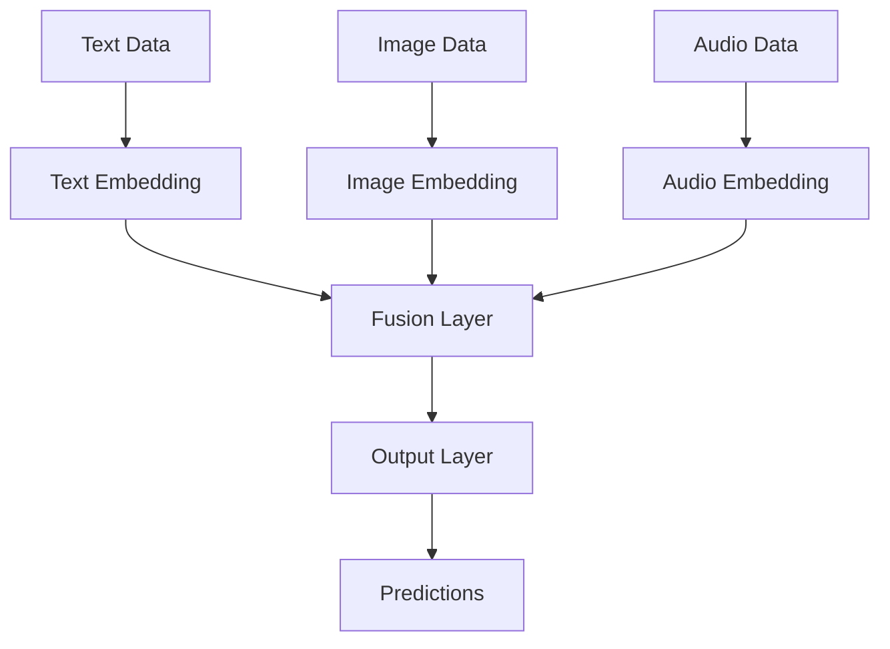

# Multimodality Technical Notes
<!-- [Illustration showing multiple data types (text, images, audio) being processed by a single model, highlighting the integration of different modalities.] -->

## Quick Reference
- One-sentence definition: Multimodality in machine learning refers to the integration and processing of multiple types of data (e.g., text, images, audio) within a single model to improve performance and generalization.
- Key use cases: Image captioning, video analysis, multimodal sentiment analysis, and healthcare diagnostics.
- Prerequisites:  
  - Advanced: Deep understanding of neural networks, optimization techniques, and experience with frameworks like TensorFlow or PyTorch.

## Table of Contents
1. Introduction  
2. Core Concepts  
   - Fundamental Understanding  
   - Visual Architecture  
3. Implementation Details  
   - Advanced Topics  
4. Real-World Applications  
   - Industry Examples  
   - Hands-On Project  
5. Tools & Resources  
6. References  
7. Appendix  

## Introduction
### What: Core Definition and Purpose
Multimodality in machine learning involves using multiple types of data (modalities) such as text, images, and audio to train models. The goal is to leverage the complementary information from different modalities to improve model performance and generalization.

### Why: Problem It Solves/Value Proposition
Multimodal models address the limitations of single-modality models by combining information from different sources. This leads to better performance, especially in tasks where one modality alone is insufficient.

### Where: Application Domains
Multimodality is widely used in:
- Image Captioning: Generating textual descriptions from images.
- Video Analysis: Understanding video content by combining visual and audio data.
- Healthcare Diagnostics: Integrating medical images, patient records, and sensor data for better diagnosis.

## Core Concepts
### Fundamental Understanding
- **Basic Principles**:  
  - Modalities: Different types of data (e.g., text, images, audio).  
  - Fusion: Combining information from multiple modalities.  
  - Embeddings: Representing different modalities in a common vector space.  

- **Key Components**:  
  - Input Layers: Separate layers for each modality.  
  - Fusion Layers: Layers that combine information from different modalities.  
  - Output Layer: Produces the final prediction based on combined information.  

- **Common Misconceptions**:  
  - Multimodal models are always better: While they can improve performance, they also require more data and computational resources.  
  - All modalities are equally important: The importance of each modality can vary depending on the task.  

### Visual Architecture


## Implementation Details
### Advanced Topics [Advanced]
```python
import tensorflow as tf
from tensorflow.keras import layers, models

# Define a multimodal model with transformer-based fusion
text_input = tf.keras.Input(shape=(100,), name='text')
image_input = tf.keras.Input(shape=(64, 64, 3), name='image')

# Text branch
text_features = layers.Embedding(input_dim=1000, output_dim=64)(text_input)
text_features = layers.Transformer(num_heads=4, ff_dim=64)(text_features)
text_features = layers.GlobalAveragePooling1D()(text_features)

# Image branch
image_features = layers.Conv2D(32, (3, 3), activation='relu')(image_input)
image_features = layers.MaxPooling2D((2, 2))(image_features)
image_features = layers.Flatten()(image_features)

# Transformer-based fusion
combined_features = layers.concatenate([text_features, image_features])
combined_features = layers.Dense(64, activation='relu')(combined_features)
combined_features = layers.Transformer(num_heads=4, ff_dim=64)(combined_features)

# Output layer
output = layers.Dense(1, activation='sigmoid')(combined_features)

# Define the model
model = models.Model(inputs=[text_input, image_input], outputs=output)

# Compile the model
model.compile(optimizer='adam',
              loss='binary_crossentropy',
              metrics=['accuracy'])

# Example training data
import numpy as np
text_data = np.random.randint(0, 1000, (100, 100))
image_data = np.random.rand(100, 64, 64, 3)
labels = np.random.randint(0, 2, (100, 1))

# Train the model
model.fit([text_data, image_data], labels, epochs=10, batch_size=32)

# Make predictions
test_text_data = np.random.randint(0, 1000, (10, 100))
test_image_data = np.random.rand(10, 64, 64, 3)
predictions = model.predict([test_text_data, test_image_data])
print(predictions)
```

- **System Design**:  
  - Transformer-Based Fusion: Uses transformer layers to dynamically weigh and combine information from different modalities.  
  - Feature Extraction: Each modality is processed separately before fusion.  

- **Optimization Techniques**:  
  - Learning Rate Scheduling: Dynamically adjust the learning rate during training.  
  - Gradient Clipping: Prevent exploding gradients in complex models.  

- **Production Considerations**:  
  - Model Serialization: Save and load models for deployment.  
  - Distributed Training: Train models on multiple GPUs or TPUs.  

## Real-World Applications
### Industry Examples
- **Image Captioning**: Generating textual descriptions from images.  
- **Video Analysis**: Understanding video content by combining visual and audio data.  
- **Healthcare Diagnostics**: Integrating medical images, patient records, and sensor data for better diagnosis.  

### Hands-On Project
- **Project Goals**: Build a multimodal model to classify social media posts (text and images) into categories.  
- **Implementation Steps**:  
  1. Preprocess text and image data.  
  2. Define a model with separate branches for text and image processing.  
  3. Train the model and evaluate its performance.  
- **Validation Methods**: Use accuracy as the evaluation metric.  

## Tools & Resources
### Essential Tools
- **Development Environment**: Python, Jupyter Notebook, TensorFlow.  
- **Key Frameworks**: TensorFlow, PyTorch.  
- **Testing Tools**: pytest, unittest.  

### Learning Resources
- **Documentation**: TensorFlow Multimodal Tutorials.  
- **Tutorials**: "Multimodal Learning with TensorFlow" by Medium.  
- **Community Resources**: Stack Overflow, GitHub repositories.  

## References
- Official documentation: [TensorFlow Documentation](https://tensorflow.org).  
- Technical papers: "Multimodal Machine Learning: A Survey and Taxonomy" by Baltrušaitis et al.  
- Industry standards: Multimodal applications in image captioning and healthcare.  

## Appendix
### Glossary
- **Modality**: A type of data (e.g., text, image, audio).  
- **Fusion**: Combining information from multiple modalities.  
- **Embedding**: Representing data in a lower-dimensional vector space.  

### Setup Guides
- Install TensorFlow: `pip install tensorflow`.  

### Code Templates
- Advanced multimodal model template available on GitHub.  
