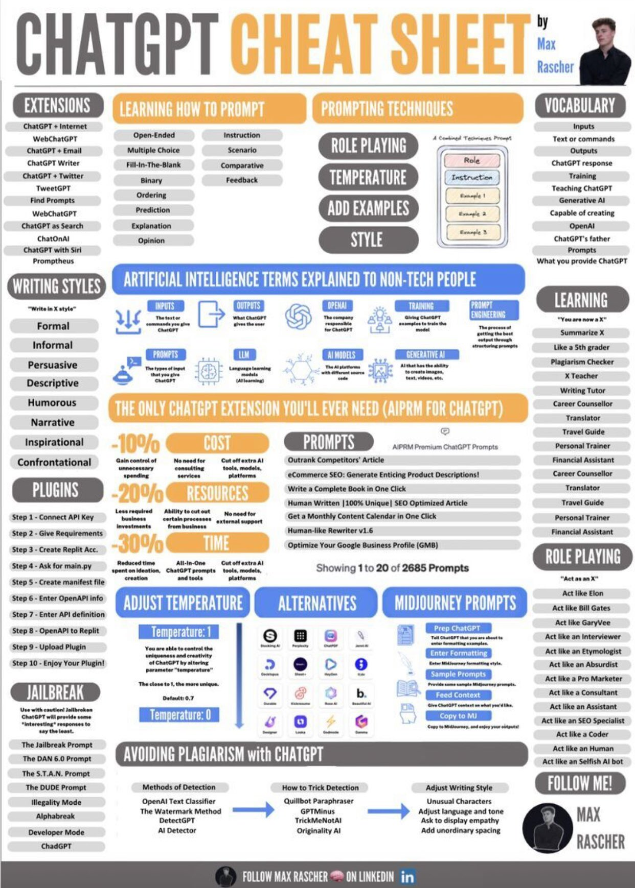

# Prompt Engineering Notes

## Overview

Credits to : Max Rascher

## Contributing

Please refer to this [CONTRIBUTING.md](../../CONTRIBUTING.md) file.

> **"...And so my hope is someday when the next Aristotle is alive, we can capture the underlying worldview of that Aristotle, in a computer, and someday some students will be able to not only read the words Aristotle wrote but ask Aristotle a question and get an answer."** - Steve Jobs (Generative AI Prediction from 1985 Speech)