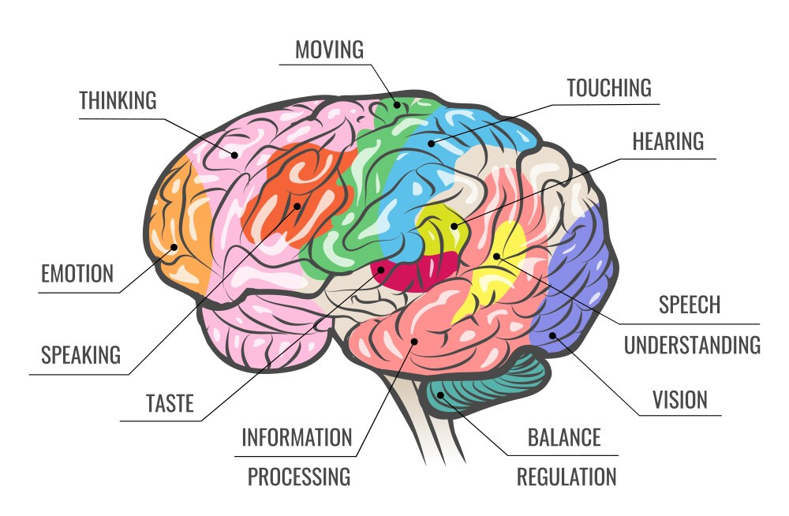

# 🤖 Artificial Intelligence (AI) - Notes 

(Src: [High-Level Human Brain Function Mapping](https://www.vectorstock.com/royalty-free-vector/human-brain-function-map-vector-35975559))

## Overview

AI notes & resources. 

## Contributing

Please refer to [CONTRIBUTING.md](../CONTRIBUTING.md) file.

> ### "In a properly automated and educated world, then, machines may prove to be the true humanizing influence. It may be that machines will do the work that makes life possible and that human beings will do all the other things that make life pleasant and worthwhile" 
> ## ― Isaac Asimov
