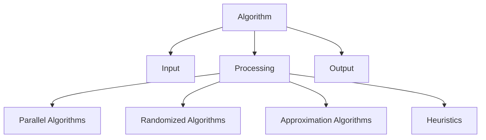

# Algorithms Technical Notes  
<!-- Algorithms are step-by-step procedures or formulas for solving problems and performing computations. This guide is designed for advanced learners who are already proficient in algorithms and want to master advanced core concepts, system design, and optimization techniques for production-level applications.   -->

## Quick Reference  
- **One-sentence definition**: Algorithms are step-by-step procedures for solving problems or performing computations.  
- **Key use cases**: Sorting, searching, data processing, and optimization.  
- **Prerequisites**: Strong understanding of algorithms, data structures, and intermediate concepts like dynamic programming and greedy algorithms.  

## Table of Contents  
1. Introduction  
2. Core Concepts  
   - Fundamental Understanding  
   - Visual Architecture  
3. Implementation Details  
   - Advanced Topics  
4. Real-World Applications  
   - Industry Examples  
   - Hands-On Project  
5. Tools & Resources  
6. References  
7. Appendix  

## Introduction  
### What: Core Definition and Purpose  
An algorithm is a finite sequence of well-defined instructions used to solve a specific problem or perform a computation. Algorithms are fundamental to computer science and are used in various applications, from sorting data to optimizing routes.  

### Why: Problem It Solves/Value Proposition  
Algorithms provide efficient and effective solutions to complex problems. They enable automation, optimization, and scalability in software applications.  

### Where: Application Domains  
Algorithms are used in:  
- Data processing and analysis  
- Search engines  
- Machine learning and artificial intelligence  
- Network routing and optimization  

## Core Concepts  
### Fundamental Understanding  
#### Advanced Principles  
- **Parallel Algorithms**: Algorithms designed to run on multiple processors or cores simultaneously.  
- **Randomized Algorithms**: Algorithms that use randomness to solve problems more efficiently (e.g., QuickSort).  
- **Approximation Algorithms**: Algorithms that find approximate solutions to NP-hard problems.  
- **Heuristics**: Techniques that find good-enough solutions when exact solutions are impractical.  

#### Key Components  
- **Parallelism**: Techniques for dividing work across multiple processors or threads.  
- **Randomization**: Using random choices to improve efficiency or simplify algorithms.  
- **Approximation**: Finding solutions that are close to the optimal solution.  

#### Common Misconceptions  
- **All algorithms are deterministic**: Randomized algorithms use randomness to improve efficiency.  
- **Approximation algorithms are not useful**: Approximation algorithms are essential for solving NP-hard problems.  

### Visual Architecture  


## Implementation Details  
### Advanced Topics [Advanced]  
```python  
# Example: Randomized QuickSort Algorithm  
import random  

def quicksort(arr):  
    if len(arr) <= 1:  
        return arr  
    pivot = random.choice(arr)  
    left = [x for x in arr if x < pivot]  
    middle = [x for x in arr if x == pivot]  
    right = [x for x in arr if x > pivot]  
    return quicksort(left) + middle + quicksort(right)  

# Step-by-Step Setup  
arr = [3, 6, 8, 10, 1, 2, 1]  
sorted_arr = quicksort(arr)  
print("Sorted array:", sorted_arr)  
```  

#### System Design  
- **Parallel Algorithms**: Use libraries like `multiprocessing` in Python to implement parallel algorithms.  
- **Randomized Algorithms**: Use randomness to improve efficiency or simplify algorithms.  
- **Approximation Algorithms**: Implement algorithms that find approximate solutions to NP-hard problems.  

#### Optimization Techniques  
- **Parallelism**: Divide work across multiple processors or threads to improve performance.  
- **Randomization**: Use random choices to improve efficiency or simplify algorithms.  
- **Heuristics**: Implement techniques that find good-enough solutions when exact solutions are impractical.  

#### Production Considerations  
- **Code Maintainability**: Follow coding standards and use static analysis tools.  
- **Testing**: Implement unit tests, integration tests, and stress tests.  
- **Deployment**: Use CI/CD pipelines for automated builds and deployments.  

## Real-World Applications  
### Industry Examples  
#### Use Cases  
- **Search Engines**: Use algorithms like PageRank to rank web pages.  
- **Data Compression**: Use algorithms like Huffman coding to compress data.  
- **Route Optimization**: Use algorithms like Dijkstra's algorithm to find the shortest path.  

#### Implementation Patterns  
- **Search Engines**: Use graph algorithms and ranking algorithms.  
- **Data Compression**: Use greedy algorithms and dynamic programming.  
- **Route Optimization**: Use graph algorithms and heuristics.  

### Hands-On Project  
#### Project Goals  
Implement a parallel algorithm for matrix multiplication.  

#### Implementation Steps  
1. Define the matrix multiplication problem and its constraints.  
2. Implement a parallel solution using the `multiprocessing` library in Python.  
3. Test the solution with different inputs and analyze its performance.  

#### Validation Methods  
- Test the solution with various inputs (e.g., different matrix sizes).  
- Ensure the solution handles edge cases gracefully.  

## Tools & Resources  
### Essential Tools  
- **IDEs**: PyCharm, VS Code, Jupyter Notebook  
- **Libraries**: NumPy, Pandas  
- **Debuggers**: Built-in Python debugger (pdb)  

### Learning Resources  
- **Documentation**: [Python Official Documentation](https://docs.python.org/3/)  
- **Books**: "Introduction to Algorithms" by Thomas H. Cormen  
- **Communities**: Stack Overflow, Reddit (r/algorithms)  

## References  
- **Official Documentation**: [Python Official Documentation](https://docs.python.org/3/)  
- **Books**: "Algorithms Unlocked" by Thomas H. Cormen  
- **Standards**: IEEE, ACM  

## Appendix  
### Glossary  
- **Parallel Algorithm**: An algorithm designed to run on multiple processors or cores simultaneously.  
- **Randomized Algorithm**: An algorithm that uses randomness to solve problems more efficiently.  
- **Approximation Algorithm**: An algorithm that finds approximate solutions to NP-hard problems.  

### Setup Guides  
- [Installing Python on Windows](https://www.python.org/downloads/windows/)  
- [Installing Python on macOS](https://www.python.org/downloads/macos/)  

### Code Templates  
- Advanced algorithm template:  
```python  
def algorithm(input):  
    # Your code here  
    pass  

if __name__ == "__main__":  
    input = [...]  # Define input  
    result = algorithm(input)  
    print(result)  
```