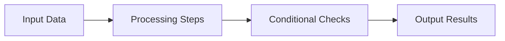

# Algorithms Technical Notes

<!-- ![Illustration of algorithms at work, featuring flowcharts, graphs, and pseudocode snippets, all in a clean and beginner-friendly style.] -->

## Quick Reference
- **One-sentence definition:** An algorithm is a step-by-step set of instructions designed to perform a specific task or solve a problem.
- **Key use cases:** Sorting data, searching for information, optimizing processes, and automating tasks.
- **Prerequisites:** Basic understanding of logical thinking and familiarity with simple programming concepts (like loops and conditionals).

## Table of Contents
1. [Introduction](introduction.md)
2. [Core Concepts](core-concepts.md)
   - [Fundamental Understanding](fundamental-understanding.md)
   - [Key Components](key-components.md)
   - [Common Misconceptions](common-misconceptions.md)
3. [Visual Architecture](visual-architecture.md)
4. [Implementation Details](implementation-details.md)
   - [Basic Implementation](basic-implementation.md)
5. [Real-World Applications](real-world-applications.md)
   - [Industry Examples](industry-examples.md)
   - [Hands-On Project](hands-on-project.md)
6. [Tools & Resources](tools-resources.md)
   - [Essential Tools](essential-tools.md)
   - [Learning Resources](learning-resources.md)
7. [References](references.md)
8. [Appendix](appendix.md)

## Introduction
- **What:**  
  An algorithm is a sequence of instructions that takes input, processes it, and produces an output. It is the foundation of all programming and computational tasks.

- **Why:**  
  Algorithms help solve problems efficiently and are critical to creating software, automating repetitive tasks, and optimizing systems.

- **Where:**  
  Algorithms are used in various domains, such as computer science, data analysis, artificial intelligence, and everyday applications like GPS routing and recommendation systems.

## Core Concepts

### Fundamental Understanding
- **Basic principles:**  
  1. **Input:** The data provided to the algorithm.  
  2. **Process:** The steps the algorithm performs to transform the input.  
  3. **Output:** The final result of the algorithm.

- **Key components:**  
  - **Correctness:** Produces the right output for all valid inputs.  
  - **Efficiency:** Performs tasks with minimal time and resource usage.  
  - **Clarity:** Easy to understand and maintain.  

- **Common misconceptions:**  
  - Algorithms are not necessarily complex; even simple tasks like making a sandwich can be broken into algorithmic steps.  
  - They are not always about coding; pseudocode and flowcharts are algorithm representations too.

### Visual Architecture


## Implementation Details

### Basic Implementation
**Example:** A simple algorithm to find the largest number in a list.

```python
# Input: List of numbers
numbers = [3, 5, 1, 8, 2]

# Algorithm: Find the largest number
largest = numbers[0]
for num in numbers:
    if num > largest:
        largest = num

# Output: Largest number
print("The largest number is:", largest)
```

- **Step-by-step setup:**  
  1. Define the problem (e.g., find the largest number).  
  2. Create a loop to compare each number in the list.  
  3. Update the largest number if a bigger one is found.  

- **Code walkthrough:**  
  - Initialize the first number as the largest.  
  - Iterate through the list.  
  - Compare and update the largest number.  

- **Common pitfalls:**  
  - Forgetting to handle empty lists.  
  - Not initializing the largest variable correctly.

## Real-World Applications

### Industry Examples
- **Sorting Algorithms:** Used in databases to organize information efficiently.  
- **Search Algorithms:** Power search engines and recommendation systems.  
- **Pathfinding Algorithms:** Optimize routes in navigation apps like Google Maps.

### Hands-On Project
**Project:** Create a sorting algorithm.  
- **Goal:** Write a program that sorts a list of numbers in ascending order using the Bubble Sort technique.  
- **Steps:**  
  1. Understand the Bubble Sort logic.  
  2. Write pseudocode for the steps.  
  3. Implement the algorithm in Python.  
  4. Test it with different inputs.  
- **Validation methods:** Compare the result with Python's built-in `sorted()` function.

## Tools & Resources

### Essential Tools
- **Development environment:** Python and an IDE like VS Code or Jupyter Notebook.  
- **Key frameworks:** None required for beginners.  

### Learning Resources
- **Documentation:** Python official documentation.  
- **Tutorials:** FreeCodeCamp's introduction to algorithms.  
- **Community resources:** Stack Overflow, Reddit’s r/learnprogramming.

## References
- "Introduction to Algorithms" by Cormen, Leiserson, and Rivest (simplified explanation for beginners available online).  
- Khan Academy's "Algorithms" course.  
- MIT OpenCourseWare on basic algorithms.

## Appendix

### Glossary
- **Algorithm:** A procedure or formula for solving a problem.  
- **Pseudocode:** A high-level description of an algorithm's steps.  
- **Big O Notation:** A way to describe the efficiency of an algorithm.

### Setup Guides
- Installing Python: [Python.org](https://www.python.org)  
- Setting up VS Code: [VS Code Docs](https://code.visualstudio.com/docs)
