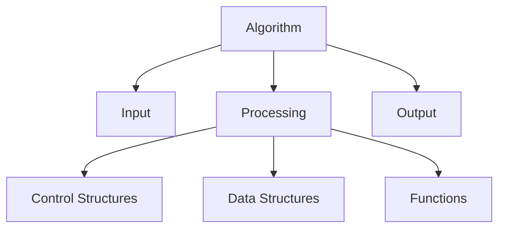

# Algorithms Technical Notes  
<!-- Algorithms are step-by-step procedures or formulas for solving problems and performing computations. This guide is designed for beginners who are new to algorithms and want to understand their core concepts, basic types, and practical implementation.   -->


## Quick Reference  
- **One-sentence definition**: Algorithms are step-by-step procedures for solving problems or performing computations.  
- **Key use cases**: Sorting, searching, data processing, and optimization.  
- **Prerequisites**: Basic understanding of programming concepts (e.g., variables, loops, functions).  

## Table of Contents  
1. Introduction  
2. Core Concepts  
   - Fundamental Understanding  
   - Visual Architecture  
3. Implementation Details  
   - Basic Implementation  
4. Real-World Applications  
   - Hands-On Project  
5. Tools & Resources  
6. References  
7. Appendix  

## Introduction  
### What: Core Definition and Purpose  
An algorithm is a finite sequence of well-defined instructions used to solve a specific problem or perform a computation. Algorithms are fundamental to computer science and are used in various applications, from sorting data to optimizing routes.  

### Why: Problem It Solves/Value Proposition  
Algorithms provide efficient and effective solutions to complex problems. They enable automation, optimization, and scalability in software applications.  

### Where: Application Domains  
Algorithms are used in:  
- Data processing and analysis  
- Search engines  
- Machine learning and artificial intelligence  
- Network routing and optimization  

## Core Concepts  
### Fundamental Understanding  
#### Basic Principles  
- **Input and Output**: Algorithms take inputs, process them, and produce outputs.  
- **Correctness**: An algorithm should produce the correct output for every valid input.  
- **Efficiency**: Algorithms should use minimal resources (time and space) to solve problems.  

#### Key Components  
- **Variables and Data Structures**: Store and manipulate data (e.g., arrays, lists).  
- **Control Structures**: Manage the flow of execution (e.g., loops, conditionals).  
- **Functions**: Encapsulate reusable blocks of code.  

#### Common Misconceptions  
- **Algorithms are only for advanced programmers**: Beginners can start with simple algorithms and gradually progress to more complex ones.  
- **All algorithms are efficient**: The efficiency of an algorithm depends on its design and implementation.  

### Visual Architecture  


## Implementation Details  
### Basic Implementation [Beginner]  
```python  
# Example: Linear Search Algorithm  
def linear_search(arr, target):  
    for i in range(len(arr)):  
        if arr[i] == target:  
            return i  # Return the index of the target element  
    return -1  # Return -1 if the target is not found  

# Step-by-Step Setup  
arr = [3, 5, 2, 8, 9]  
target = 8  
result = linear_search(arr, target)  

if result != -1:  
    print(f"Element found at index {result}")  
else:  
    print("Element not found")  
```  

#### Step-by-Step Setup  
1. Define the algorithm (e.g., linear search).  
2. Implement the algorithm in a programming language (e.g., Python).  
3. Test the algorithm with different inputs to ensure correctness.  

#### Code Walkthrough  
- `linear_search`: A function that takes an array and a target value as inputs.  
- `for i in range(len(arr))`: Iterates through the array.  
- `if arr[i] == target`: Checks if the current element matches the target.  
- `return i`: Returns the index of the target element if found.  
- `return -1`: Returns -1 if the target is not found.  

#### Common Pitfalls  
- Not handling edge cases (e.g., empty array, target not found).  
- Inefficient algorithms for large datasets.  
- Incorrect implementation leading to incorrect outputs.  

## Real-World Applications  
### Hands-On Project  
#### Project Goals  
Implement a simple sorting algorithm (e.g., Bubble Sort) and analyze its performance.  

#### Implementation Steps  
1. Define the Bubble Sort algorithm.  
2. Implement the algorithm in Python.  
3. Test the algorithm with different datasets.  
4. Measure the time complexity and compare it with other sorting algorithms.  

#### Validation Methods  
- Test the algorithm with various inputs (e.g., sorted, unsorted, and partially sorted arrays).  
- Ensure the algorithm handles edge cases gracefully.  

## Tools & Resources  
### Essential Tools  
- **IDEs**: PyCharm, VS Code, Jupyter Notebook  
- **Libraries**: NumPy, Pandas  
- **Debuggers**: Built-in Python debugger (pdb)  

### Learning Resources  
- **Documentation**: [Python Official Documentation](https://docs.python.org/3/)  
- **Books**: "Introduction to Algorithms" by Thomas H. Cormen  
- **Communities**: Stack Overflow, Reddit (r/algorithms)  

## References  
- **Official Documentation**: [Python Official Documentation](https://docs.python.org/3/)  
- **Books**: "Algorithms Unlocked" by Thomas H. Cormen  
- **Standards**: IEEE, ACM  

## Appendix  
### Glossary  
- **Algorithm**: A step-by-step procedure for solving a problem.  
- **Time Complexity**: The amount of time an algorithm takes to complete as a function of the input size.  
- **Space Complexity**: The amount of memory an algorithm uses as a function of the input size.  

### Setup Guides  
- [Installing Python on Windows](https://www.python.org/downloads/windows/)  
- [Installing Python on macOS](https://www.python.org/downloads/macos/)  

### Code Templates  
- Basic algorithm template:  
```python  
def algorithm(input):  
    # Your code here  
    pass  

if __name__ == "__main__":  
    input = [...]  # Define input  
    result = algorithm(input)  
    print(result)  
```