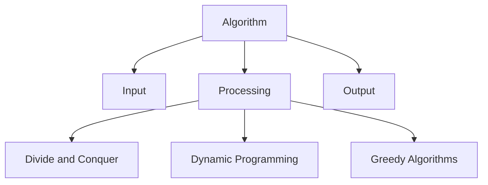

# Algorithms Technical Notes  
<!-- Algorithms are step-by-step procedures or formulas for solving problems and performing computations. This guide is tailored for intermediate learners who are familiar with basic algorithms and want to deepen their understanding of core concepts, design patterns, and optimization techniques.   -->

## Quick Reference  
- **One-sentence definition**: Algorithms are step-by-step procedures for solving problems or performing computations.  
- **Key use cases**: Sorting, searching, data processing, and optimization.  
- **Prerequisites**: Basic understanding of algorithms, data structures, and programming concepts.  

## Table of Contents  
1. Introduction  
2. Core Concepts  
   - Fundamental Understanding  
   - Visual Architecture  
3. Implementation Details  
   - Intermediate Patterns  
4. Real-World Applications  
   - Industry Examples  
   - Hands-On Project  
5. Tools & Resources  
6. References  
7. Appendix  

## Introduction  
### What: Core Definition and Purpose  
An algorithm is a finite sequence of well-defined instructions used to solve a specific problem or perform a computation. Algorithms are fundamental to computer science and are used in various applications, from sorting data to optimizing routes.  

### Why: Problem It Solves/Value Proposition  
Algorithms provide efficient and effective solutions to complex problems. They enable automation, optimization, and scalability in software applications.  

### Where: Application Domains  
Algorithms are used in:  
- Data processing and analysis  
- Search engines  
- Machine learning and artificial intelligence  
- Network routing and optimization  

## Core Concepts  
### Fundamental Understanding  
#### Intermediate Principles  
- **Divide and Conquer**: Break problems into smaller subproblems, solve them recursively, and combine the results (e.g., Merge Sort).  
- **Dynamic Programming**: Solve problems by breaking them down into overlapping subproblems and storing intermediate results (e.g., Fibonacci sequence).  
- **Greedy Algorithms**: Make locally optimal choices at each step to find a global optimum (e.g., Dijkstra's algorithm).  

#### Key Components  
- **Recursion**: Functions that call themselves to solve smaller instances of the same problem.  
- **Memoization**: Storing the results of expensive function calls to avoid redundant computations.  
- **Backtracking**: Systematically search for solutions by exploring all possible candidates (e.g., N-Queens problem).  

#### Common Misconceptions  
- **All algorithms are efficient**: The efficiency of an algorithm depends on its design and implementation.  
- **Dynamic programming is always better**: Dynamic programming is useful for problems with overlapping subproblems but may not be suitable for all scenarios.  

### Visual Architecture  


## Implementation Details  
### Intermediate Patterns [Intermediate]  
```python  
# Example: Merge Sort Algorithm  
def merge_sort(arr):  
    if len(arr) > 1:  
        mid = len(arr) // 2  
        left_half = arr[:mid]  
        right_half = arr[mid:]  

        merge_sort(left_half)  
        merge_sort(right_half)  

        i = j = k = 0  

        while i < len(left_half) and j < len(right_half):  
            if left_half[i] < right_half[j]:  
                arr[k] = left_half[i]  
                i += 1  
            else:  
                arr[k] = right_half[j]  
                j += 1  
            k += 1  

        while i < len(left_half):  
            arr[k] = left_half[i]  
            i += 1  
            k += 1  

        while j < len(right_half):  
            arr[k] = right_half[j]  
            j += 1  
            k += 1  

# Step-by-Step Setup  
arr = [38, 27, 43, 3, 9, 82, 10]  
merge_sort(arr)  
print("Sorted array:", arr)  
```  

#### Design Patterns  
- **Divide and Conquer**: Break problems into smaller subproblems and solve them recursively.  
- **Dynamic Programming**: Store intermediate results to avoid redundant computations.  
- **Greedy Algorithms**: Make locally optimal choices to find a global optimum.  

#### Best Practices  
- Use recursion judiciously to avoid stack overflow.  
- Leverage memoization to optimize dynamic programming solutions.  
- Analyze time and space complexity to choose the most efficient algorithm.  

#### Performance Considerations  
- Optimize algorithms for time and space complexity.  
- Use profiling tools to identify bottlenecks.  
- Consider trade-offs between different algorithms (e.g., time vs. space).  

## Real-World Applications  
### Industry Examples  
#### Use Cases  
- **Search Engines**: Use algorithms like PageRank to rank web pages.  
- **Data Compression**: Use algorithms like Huffman coding to compress data.  
- **Route Optimization**: Use algorithms like Dijkstra's algorithm to find the shortest path.  

#### Implementation Patterns  
- **Search Engines**: Use graph algorithms and ranking algorithms.  
- **Data Compression**: Use greedy algorithms and dynamic programming.  
- **Route Optimization**: Use graph algorithms and heuristics.  

### Hands-On Project  
#### Project Goals  
Implement a dynamic programming solution for the Knapsack problem.  

#### Implementation Steps  
1. Define the Knapsack problem and its constraints.  
2. Implement a dynamic programming solution using memoization.  
3. Test the solution with different inputs and analyze its performance.  

#### Validation Methods  
- Test the solution with various inputs (e.g., different weights and values).  
- Ensure the solution handles edge cases gracefully.  

## Tools & Resources  
### Essential Tools  
- **IDEs**: PyCharm, VS Code, Jupyter Notebook  
- **Libraries**: NumPy, Pandas  
- **Debuggers**: Built-in Python debugger (pdb)  

### Learning Resources  
- **Documentation**: [Python Official Documentation](https://docs.python.org/3/)  
- **Books**: "Introduction to Algorithms" by Thomas H. Cormen  
- **Communities**: Stack Overflow, Reddit (r/algorithms)  

## References  
- **Official Documentation**: [Python Official Documentation](https://docs.python.org/3/)  
- **Books**: "Algorithms Unlocked" by Thomas H. Cormen  
- **Standards**: IEEE, ACM  

## Appendix  
### Glossary  
- **Divide and Conquer**: A problem-solving paradigm that breaks problems into smaller subproblems.  
- **Dynamic Programming**: A method for solving problems by breaking them down into overlapping subproblems.  
- **Greedy Algorithm**: An algorithm that makes locally optimal choices at each step.  

### Setup Guides  
- [Installing Python on Windows](https://www.python.org/downloads/windows/)  
- [Installing Python on macOS](https://www.python.org/downloads/macos/)  

### Code Templates  
- Intermediate algorithm template:  
```python  
def algorithm(input):  
    # Your code here  
    pass  

if __name__ == "__main__":  
    input = [...]  # Define input  
    result = algorithm(input)  
    print(result)  
```