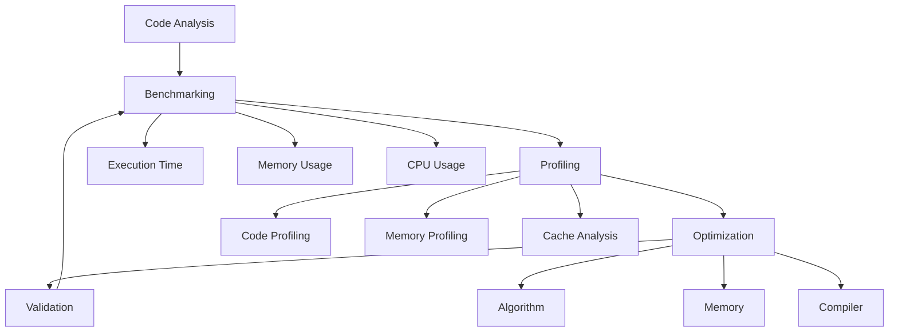

# Benchmarking and Performance Optimization Guide

This guide provides a framework for systematic performance optimization, suitable for real-time applications where predictable performance is critical.

## Table of Contents

- [System Overview](#system-overview)
- [Step-by-Step Guide](#step-by-step-guide)
    - [1. Initial Setup](#1-initial-setup)
    - [2. Benchmarking Implementation](#2-benchmarking-implementation)
    - [3. Memory Tracking](#3-memory-tracking)
- [Performance Metrics Table](#performance-metrics-table)
- [Optimization Checklist](#optimization-checklist)
- [Compilation Commands](#compilation-commands)
- [Profiling Commands](#profiling-commands)
- [Real-time Considerations](#real-time-considerations)


## System Overview



## Step-by-Step Guide

### 1. Initial Setup
```bash
# Install necessary tools
sudo apt-get update
sudo apt-get install -y build-essential gdb valgrind perf linux-tools-common criterion-dev
```

### 2. Benchmarking Implementation
````c
#include <time.h>
#include <stdio.h>

#define BENCHMARK_START(name) \
    clock_t start_##name = clock(); \
    const char* benchmark_name_##name = #name;

#define BENCHMARK_END(name) \
    clock_t end_##name = clock(); \
    printf("%s: %f seconds\n", \
           benchmark_name_##name, \
           ((double)(end_##name - start_##name))/CLOCKS_PER_SEC);
````

### 3. Memory Tracking
````c
#include <stdlib.h>

static size_t current_memory = 0;
static size_t peak_memory = 0;

void* tracked_malloc(size_t size) {
    void* ptr = malloc(size);
    if (ptr) {
        current_memory += size;
        peak_memory = (current_memory > peak_memory) ? current_memory : peak_memory;
    }
    return ptr;
}
````

## Performance Metrics Table

| Metric Category | Metric | Target Value | Tools |
|----------------|--------|--------------|-------|
| **Time Performance** | | | |
| | Execution Time | < 1ms | clock(), gettimeofday() |
| | Response Time | < 10ms | Profiling tools |
| | CPU Usage | < 80% | top, perf |
| **Memory** | | | |
| | Peak Usage | < 1GB | valgrind |
| | Leak Rate | 0 bytes | valgrind --leak-check |
| | Fragmentation | < 10% | custom tracking |
| **Cache** | | | |
| | Miss Rate | < 5% | perf stat |
| | Line Usage | > 90% | cachegrind |
| **Real-time** | | | |
| | Jitter | < 1ms | custom timing |
| | Deadline Miss | 0% | custom tracking |
| **Resource Usage** | | | |
| | Thread Count | Optimal | ps, top |
| | File Handles | < system limit | lsof |

## Optimization Checklist

- [ ] Algorithm efficiency (O-notation)
- [ ] Memory access patterns
- [ ] Cache utilization
- [ ] Compiler optimizations
- [ ] Thread synchronization
- [ ] I/O operations
- [ ] Error handling
- [ ] Resource cleanup

## Compilation Commands

```bash
# Debug build
gcc -g -O0 source.c -o debug_build

# Release build with optimizations
gcc -O3 -march=native -flto source.c -o release_build

# Profiling build
gcc -pg -g source.c -o profile_build
```

## Profiling Commands

```bash
# CPU profiling
perf record ./your_program
perf report

# Memory analysis
valgrind --tool=massif ./your_program
ms_print massif.out.*

# Cache analysis
valgrind --tool=cachegrind ./your_program
```

## Real-time Considerations

1. **Deterministic Execution**
   - Avoid dynamic memory allocation
   - Use static scheduling
   - Minimize system calls

2. **Resource Management**
   - Pre-allocate resources
   - Use lock-free algorithms
   - Implement proper cleanup

3. **Monitoring**
   - Implement watchdogs
   - Log performance metrics
   - Set up alerts for violations

