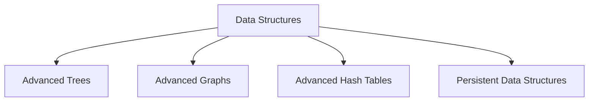

# Data Structures Technical Notes  
<!-- Data structures are ways of organizing and storing data to enable efficient access and modification. This guide is designed for advanced learners who are already proficient in data structures and want to master advanced core concepts, system design, and optimization techniques for production-level applications.   -->

## Quick Reference  
- **One-sentence definition**: Data structures are ways of organizing and storing data to enable efficient access and modification.  
- **Key use cases**: Storing and managing data in applications, optimizing data access and manipulation.  
- **Prerequisites**: Strong understanding of data structures, algorithms, and intermediate concepts like trees, graphs, and hash tables.  

## Table of Contents  
1. Introduction  
2. Core Concepts  
   - Fundamental Understanding  
   - Visual Architecture  
3. Implementation Details  
   - Advanced Topics  
4. Real-World Applications  
   - Industry Examples  
   - Hands-On Project  
5. Tools & Resources  
6. References  
7. Appendix  

## Introduction  
### What: Core Definition and Purpose  
Data structures are specialized formats for organizing, processing, retrieving, and storing data. They are essential for efficient data management and are used in various applications, from databases to algorithm design.  

### Why: Problem It Solves/Value Proposition  
Data structures enable efficient data access and manipulation, which is crucial for optimizing the performance of software applications.  

### Where: Application Domains  
Data structures are used in:  
- Databases  
- Operating systems  
- Compilers  
- Artificial intelligence and machine learning  

## Core Concepts  
### Fundamental Understanding  
#### Advanced Principles  
- **Advanced Trees**: B-trees, Red-Black trees, and Trie structures.  
- **Advanced Graphs**: Directed acyclic graphs (DAGs), weighted graphs, and network flow.  
- **Advanced Hash Tables**: Perfect hashing, cuckoo hashing, and distributed hash tables.  
- **Persistent Data Structures**: Immutable data structures that preserve previous versions.  

#### Key Components  
- **Balancing Techniques**: Techniques to maintain the balance of advanced trees.  
- **Graph Algorithms**: Algorithms for shortest paths, maximum flow, and minimum spanning trees.  
- **Hash Functions**: Advanced hash functions for efficient data distribution.  

#### Common Misconceptions  
- **All data structures are efficient**: The efficiency of a data structure depends on its design and the operations performed on it.  
- **Advanced data structures are only for theoretical use**: Advanced data structures are used in real-world applications like databases and distributed systems.  

### Visual Architecture  


## Implementation Details  
### Advanced Topics  
```python  
# Example: Red-Black Tree Implementation  
class Node:  
    def __init__(self, key, color='red'):  
        self.key = key  
        self.left = None  
        self.right = None  
        self.parent = None  
        self.color = color  

class RedBlackTree:  
    def __init__(self):  
        self.nil = Node(None, 'black')  
        self.root = self.nil  

    def insert(self, key):  
        new_node = Node(key)  
        new_node.left = self.nil  
        new_node.right = self.nil  
        new_node.color = 'red'  

        parent = None  
        current = self.root  

        while current != self.nil:  
            parent = current  
            if new_node.key < current.key:  
                current = current.left  
            else:  
                current = current.right  

        new_node.parent = parent  
        if parent is None:  
            self.root = new_node  
        elif new_node.key < parent.key:  
            parent.left = new_node  
        else:  
            parent.right = new_node  

        self._fix_insert(new_node)  

    def _fix_insert(self, node):  
        while node.parent.color == 'red':  
            if node.parent == node.parent.parent.left:  
                uncle = node.parent.parent.right  
                if uncle.color == 'red':  
                    node.parent.color = 'black'  
                    uncle.color = 'black'  
                    node.parent.parent.color = 'red'  
                    node = node.parent.parent  
                else:  
                    if node == node.parent.right:  
                        node = node.parent  
                        self._left_rotate(node)  
                    node.parent.color = 'black'  
                    node.parent.parent.color = 'red'  
                    self._right_rotate(node.parent.parent)  
            else:  
                uncle = node.parent.parent.left  
                if uncle.color == 'red':  
                    node.parent.color = 'black'  
                    uncle.color = 'black'  
                    node.parent.parent.color = 'red'  
                    node = node.parent.parent  
                else:  
                    if node == node.parent.left:  
                        node = node.parent  
                        self._right_rotate(node)  
                    node.parent.color = 'black'  
                    node.parent.parent.color = 'red'  
                    self._left_rotate(node.parent.parent)  
        self.root.color = 'black'  

    def _left_rotate(self, x):  
        y = x.right  
        x.right = y.left  
        if y.left != self.nil:  
            y.left.parent = x  
        y.parent = x.parent  
        if x.parent is None:  
            self.root = y  
        elif x == x.parent.left:  
            x.parent.left = y  
        else:  
            x.parent.right = y  
        y.left = x  
        x.parent = y  

    def _right_rotate(self, y):  
        x = y.left  
        y.left = x.right  
        if x.right != self.nil:  
            x.right.parent = y  
        x.parent = y.parent  
        if y.parent is None:  
            self.root = x  
        elif y == y.parent.right:  
            y.parent.right = x  
        else:  
            y.parent.left = x  
        x.right = y  
        y.parent = x  

# Step-by-Step Setup  
rbt = RedBlackTree()  
rbt.insert(10)  
rbt.insert(20)  
rbt.insert(30)  
rbt.insert(15)  
rbt.insert(25)  
```  

#### System Design  
- **Advanced Trees**: Use B-trees for databases and Red-Black trees for balanced search trees.  
- **Advanced Graphs**: Implement algorithms for shortest paths, maximum flow, and minimum spanning trees.  
- **Advanced Hash Tables**: Use perfect hashing and distributed hash tables for efficient data distribution.  

#### Optimization Techniques  
- **Balancing Techniques**: Maintain the balance of advanced trees for optimal performance.  
- **Graph Algorithms**: Optimize algorithms for shortest paths and network flow.  
- **Hash Functions**: Use advanced hash functions for efficient data distribution.  

#### Production Considerations  
- **Code Maintainability**: Follow coding standards and use static analysis tools.  
- **Testing**: Implement unit tests, integration tests, and stress tests.  
- **Deployment**: Use CI/CD pipelines for automated builds and deployments.  

## Real-World Applications  
### Industry Examples  
#### Use Cases  
- **Databases**: Use B-trees and hash indexes for efficient data retrieval.  
- **Social Networks**: Use graphs to represent relationships and connections.  
- **Operating Systems**: Use priority queues for task scheduling.  

#### Implementation Patterns  
- **Databases**: Use B-trees for indexing and hash tables for fast lookups.  
- **Social Networks**: Use graph algorithms for recommendations and search.  
- **Operating Systems**: Use heaps for priority queues and task scheduling.  

### Hands-On Project  
#### Project Goals  
Implement a distributed hash table (DHT) for a peer-to-peer network.  

#### Implementation Steps  
1. Define the DHT data structure and its operations.  
2. Implement the DHT using consistent hashing.  
3. Test the DHT with different network sizes and analyze its performance.  

#### Validation Methods  
- Test the DHT with various network sizes and data distributions.  
- Ensure the DHT handles edge cases gracefully.  

## Tools & Resources  
### Essential Tools  
- **IDEs**: PyCharm, VS Code, Jupyter Notebook  
- **Libraries**: NumPy, Pandas  
- **Debuggers**: Built-in Python debugger (pdb)  

### Learning Resources  
- **Documentation**: [Python Official Documentation](https://docs.python.org/3/)  
- **Books**: "Data Structures and Algorithms in Python" by Michael T. Goodrich  
- **Communities**: Stack Overflow, Reddit (r/learnprogramming)  

## References  
- **Official Documentation**: [Python Official Documentation](https://docs.python.org/3/)  
- **Books**: "Introduction to Algorithms" by Thomas H. Cormen  
- **Standards**: IEEE, ACM  

## Appendix  
### Glossary  
- **B-tree**: A self-balancing tree data structure that maintains sorted data.  
- **Red-Black Tree**: A balanced binary search tree with additional properties to ensure balance.  
- **Distributed Hash Table (DHT)**: A decentralized distributed system for key-value storage.  

### Setup Guides  
- [Installing Python on Windows](https://www.python.org/downloads/windows/)  
- [Installing Python on macOS](https://www.python.org/downloads/macos/)  

### Code Templates  
- Advanced data structure template:  
```python  
class DataStructure:  
    def __init__(self):  
        # Initialize data structure  
        pass  

    def operation(self):  
        # Define operation  
        pass  

if __name__ == "__main__":  
    ds = DataStructure()  
    ds.operation()  
```