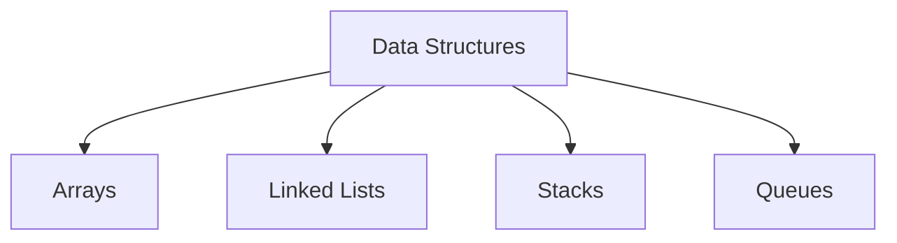

# Data Structures Technical Notes  
<!-- Data structures are ways of organizing and storing data to enable efficient access and modification. This guide is designed for beginners who are new to data structures and want to understand their core concepts, basic types, and practical implementation.   -->

## Quick Reference  
- **One-sentence definition**: Data structures are ways of organizing and storing data to enable efficient access and modification.  
- **Key use cases**: Storing and managing data in applications, optimizing data access and manipulation.  
- **Prerequisites**: Basic understanding of programming concepts (e.g., variables, loops, functions).  

## Table of Contents  
1. Introduction  
2. Core Concepts  
   - Fundamental Understanding  
   - Visual Architecture  
3. Implementation Details  
   - Basic Implementation  
4. Real-World Applications  
   - Hands-On Project  
5. Tools & Resources  
6. References  
7. Appendix  

## Introduction  
### What: Core Definition and Purpose  
Data structures are specialized formats for organizing, processing, retrieving, and storing data. They are essential for efficient data management and are used in various applications, from databases to algorithm design.  

### Why: Problem It Solves/Value Proposition  
Data structures enable efficient data access and manipulation, which is crucial for optimizing the performance of software applications.  

### Where: Application Domains  
Data structures are used in:  
- Databases  
- Operating systems  
- Compilers  
- Artificial intelligence and machine learning  

## Core Concepts  
### Fundamental Understanding  
#### Basic Principles  
- **Arrays**: A collection of elements identified by index or key.  
- **Linked Lists**: A sequence of elements where each element points to the next.  
- **Stacks**: A collection of elements with Last-In-First-Out (LIFO) access.  
- **Queues**: A collection of elements with First-In-First-Out (FIFO) access.  

#### Key Components  
- **Nodes**: Basic units of data structures like linked lists and trees.  
- **Pointers**: References to memory locations used in linked structures.  
- **Operations**: Common operations include insertion, deletion, traversal, and searching.  

#### Common Misconceptions  
- **Data structures are only for advanced programmers**: Beginners can start with simple data structures and gradually progress to more complex ones.  
- **All data structures are efficient**: The efficiency of a data structure depends on its design and the operations performed on it.  

### Visual Architecture  


## Implementation Details  
### Basic Implementation [Beginner]  
```python  
# Example: Array Implementation  
arr = [10, 20, 30, 40, 50]  

# Accessing elements  
print("Element at index 2:", arr[2])  

# Modifying elements  
arr[2] = 35  
print("Modified array:", arr)  

# Example: Stack Implementation  
stack = []  

# Push operation  
stack.append(10)  
stack.append(20)  
stack.append(30)  
print("Stack after push operations:", stack)  

# Pop operation  
print("Popped element:", stack.pop())  
print("Stack after pop operation:", stack)  
```  

#### Step-by-Step Setup  
1. Define the data structure (e.g., array, stack).  
2. Implement basic operations (e.g., insertion, deletion).  
3. Test the data structure with different inputs to ensure correctness.  

#### Code Walkthrough  
- `arr = [10, 20, 30, 40, 50]`: Defines an array.  
- `arr[2]`: Accesses the element at index 2.  
- `arr[2] = 35`: Modifies the element at index 2.  
- `stack.append(10)`: Pushes an element onto the stack.  
- `stack.pop()`: Pops an element from the stack.  

#### Common Pitfalls  
- Not handling edge cases (e.g., empty stack, out-of-bounds array access).  
- Inefficient operations for large datasets.  
- Incorrect implementation leading to incorrect outputs.  


## Real-World Applications  
### Hands-On Project  
#### Project Goals  
Implement a simple queue data structure and use it to manage a task scheduler.  

#### Implementation Steps  
1. Define the queue data structure.  
2. Implement basic operations (e.g., enqueue, dequeue).  
3. Use the queue to manage tasks in a task scheduler.  

#### Validation Methods  
- Test the queue with various inputs (e.g., adding and removing tasks).  
- Ensure the queue handles edge cases gracefully.  

## Tools & Resources  
### Essential Tools  
- **IDEs**: PyCharm, VS Code, Jupyter Notebook  
- **Libraries**: NumPy, Pandas  
- **Debuggers**: Built-in Python debugger (pdb)  

### Learning Resources  
- **Documentation**: [Python Official Documentation](https://docs.python.org/3/)  
- **Books**: "Data Structures and Algorithms in Python" by Michael T. Goodrich  
- **Communities**: Stack Overflow, Reddit (r/learnprogramming)  

## References  
- **Official Documentation**: [Python Official Documentation](https://docs.python.org/3/)  
- **Books**: "Introduction to Algorithms" by Thomas H. Cormen  
- **Standards**: IEEE, ACM  

## Appendix  
### Glossary  
- **Array**: A collection of elements identified by index or key.  
- **Linked List**: A sequence of elements where each element points to the next.  
- **Stack**: A collection of elements with Last-In-First-Out (LIFO) access.  
- **Queue**: A collection of elements with First-In-First-Out (FIFO) access.  

### Setup Guides  
- [Installing Python on Windows](https://www.python.org/downloads/windows/)  
- [Installing Python on macOS](https://www.python.org/downloads/macos/)  

### Code Templates  
- Basic data structure template:  
```python  
class DataStructure:  
    def __init__(self):  
        # Initialize data structure  
        pass  

    def operation(self):  
        # Define operation  
        pass  

if __name__ == "__main__":  
    ds = DataStructure()  
    ds.operation()  
```