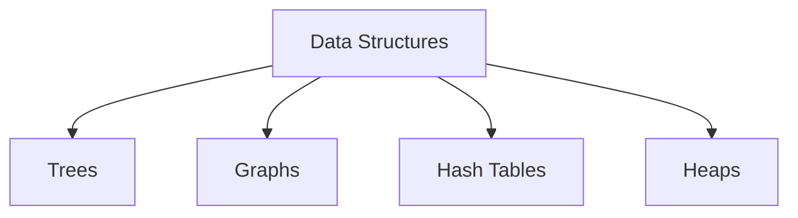

# Data Structures Technical Notes  
<!-- Data structures are ways of organizing and storing data to enable efficient access and modification. This guide is tailored for intermediate learners who are familiar with basic data structures and want to deepen their understanding of core concepts, design patterns, and optimization techniques.   -->

## Quick Reference  
- **One-sentence definition**: Data structures are ways of organizing and storing data to enable efficient access and modification.  
- **Key use cases**: Storing and managing data in applications, optimizing data access and manipulation.  
- **Prerequisites**: Basic understanding of data structures, algorithms, and programming concepts.  

## Table of Contents  
1. Introduction  
2. Core Concepts  
   - Fundamental Understanding  
   - Visual Architecture  
3. Implementation Details  
   - Intermediate Patterns  
4. Real-World Applications  
   - Industry Examples  
   - Hands-On Project  
5. Tools & Resources  
6. References  
7. Appendix  

## Introduction  
### What: Core Definition and Purpose  
Data structures are specialized formats for organizing, processing, retrieving, and storing data. They are essential for efficient data management and are used in various applications, from databases to algorithm design.  

### Why: Problem It Solves/Value Proposition  
Data structures enable efficient data access and manipulation, which is crucial for optimizing the performance of software applications.  

### Where: Application Domains  
Data structures are used in:  
- Databases  
- Operating systems  
- Compilers  
- Artificial intelligence and machine learning  

## Core Concepts  
### Fundamental Understanding  
#### Intermediate Principles  
- **Trees**: Hierarchical data structures with nodes and edges (e.g., binary trees, AVL trees).  
- **Graphs**: Collections of nodes connected by edges (e.g., directed and undirected graphs).  
- **Hash Tables**: Data structures that map keys to values for efficient lookup.  
- **Heaps**: Specialized trees used for priority queues (e.g., min-heap, max-heap).  

#### Key Components  
- **Nodes and Edges**: Basic units of trees and graphs.  
- **Hash Functions**: Functions that map keys to indices in a hash table.  
- **Balancing**: Techniques to maintain the balance of trees for optimal performance.  

#### Common Misconceptions  
- **All data structures are efficient**: The efficiency of a data structure depends on its design and the operations performed on it.  
- **Trees and graphs are only for advanced applications**: Trees and graphs are used in many everyday applications, such as file systems and social networks.  

### Visual Architecture  


## Implementation Details  
### Intermediate Patterns [Intermediate]  
```python  
# Example: Binary Search Tree Implementation  
class Node:  
    def __init__(self, key):  
        self.left = None  
        self.right = None  
        self.val = key  

def insert(root, key):  
    if root is None:  
        return Node(key)  
    else:  
        if root.val < key:  
            root.right = insert(root.right, key)  
        else:  
            root.left = insert(root.left, key)  
    return root  

def inorder_traversal(root):  
    if root:  
        inorder_traversal(root.left)  
        print(root.val, end=" ")  
        inorder_traversal(root.right)  

# Step-by-Step Setup  
root = None  
root = insert(root, 50)  
insert(root, 30)  
insert(root, 20)  
insert(root, 40)  
insert(root, 70)  
insert(root, 60)  
insert(root, 80)  

print("Inorder traversal of the BST:")  
inorder_traversal(root)  
```  

#### Design Patterns  
- **Balanced Trees**: Use AVL or Red-Black trees for balanced binary search trees.  
- **Graph Traversal**: Implement Depth-First Search (DFS) and Breadth-First Search (BFS).  
- **Hash Collision Resolution**: Use chaining or open addressing to handle hash collisions.  

#### Best Practices  
- Choose the right data structure for the problem (e.g., hash tables for fast lookups).  
- Balance trees to ensure optimal performance.  
- Use libraries and built-in data structures when available (e.g., `collections` in Python).  

#### Performance Considerations  
- Optimize data structures for time and space complexity.  
- Use profiling tools to identify bottlenecks.  
- Consider trade-offs between different data structures (e.g., time vs. space).  

## Real-World Applications  
### Industry Examples  
#### Use Cases  
- **Databases**: Use B-trees and hash indexes for efficient data retrieval.  
- **Social Networks**: Use graphs to represent relationships and connections.  
- **Operating Systems**: Use priority queues for task scheduling.  

#### Implementation Patterns  
- **Databases**: Use B-trees for indexing and hash tables for fast lookups.  
- **Social Networks**: Use graph algorithms for recommendations and search.  
- **Operating Systems**: Use heaps for priority queues and task scheduling.  

### Hands-On Project  
#### Project Goals  
Implement a graph data structure and use it to find the shortest path between two nodes.  

#### Implementation Steps  
1. Define the graph data structure using adjacency lists.  
2. Implement Dijkstra's algorithm to find the shortest path.  
3. Test the implementation with different graphs and analyze its performance.  

#### Validation Methods  
- Test the implementation with various graphs (e.g., different sizes and edge weights).  
- Ensure the implementation handles edge cases gracefully.  

## Tools & Resources  
### Essential Tools  
- **IDEs**: PyCharm, VS Code, Jupyter Notebook  
- **Libraries**: NumPy, Pandas  
- **Debuggers**: Built-in Python debugger (pdb)  

### Learning Resources  
- **Documentation**: [Python Official Documentation](https://docs.python.org/3/)  
- **Books**: "Data Structures and Algorithms in Python" by Michael T. Goodrich  
- **Communities**: Stack Overflow, Reddit (r/learnprogramming)  

## References  
- **Official Documentation**: [Python Official Documentation](https://docs.python.org/3/)  
- **Books**: "Introduction to Algorithms" by Thomas H. Cormen  
- **Standards**: IEEE, ACM  

## Appendix  
### Glossary  
- **Tree**: A hierarchical data structure with nodes and edges.  
- **Graph**: A collection of nodes connected by edges.  
- **Hash Table**: A data structure that maps keys to values for efficient lookup.  
- **Heap**: A specialized tree used for priority queues.  

### Setup Guides  
- [Installing Python on Windows](https://www.python.org/downloads/windows/)  
- [Installing Python on macOS](https://www.python.org/downloads/macos/)  

### Code Templates  
- Intermediate data structure template:  
```python  
class DataStructure:  
    def __init__(self):  
        # Initialize data structure  
        pass  

    def operation(self):  
        # Define operation  
        pass  

if __name__ == "__main__":  
    ds = DataStructure()  
    ds.operation()  
```
