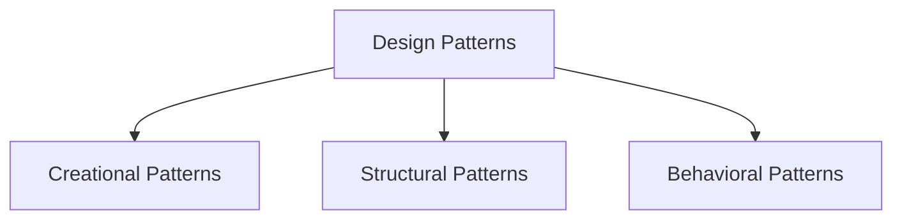

# Design Patterns Technical Notes  
<!-- Design patterns are reusable solutions to common problems in software design. This guide is designed for advanced learners who are already proficient in design patterns and want to master advanced core concepts, system design, and optimization techniques for production-level applications.   -->

## Quick Reference  
- **One-sentence definition**: Design patterns are reusable solutions to common problems in software design.  
- **Key use cases**: Improving code readability, maintainability, and scalability.  
- **Prerequisites**: Strong understanding of design patterns, object-oriented programming, and advanced programming concepts.  

## Table of Contents  
1. Introduction  
2. Core Concepts  
   - Fundamental Understanding  
   - Visual Architecture  
3. Implementation Details  
   - Advanced Topics  
4. Real-World Applications  
   - Industry Examples  
   - Hands-On Project  
5. Tools & Resources  
6. References  
7. Appendix  

## Introduction  
### What: Core Definition and Purpose  
Design patterns are standardized solutions to recurring design problems in software development. They provide templates for solving issues in a way that promotes best practices and code reusability.  

### Why: Problem It Solves/Value Proposition  
Design patterns help developers write clean, maintainable, and scalable code by providing proven solutions to common problems. They also improve communication among developers by providing a common vocabulary.  

### Where: Application Domains  
Design patterns are used in:  
- Object-oriented programming  
- Web development  
- Game development  
- Enterprise applications  

## Core Concepts  
### Fundamental Understanding  
#### Advanced Principles  
- **Creational Patterns**: Advanced object creation mechanisms (e.g., Prototype, Object Pool).  
- **Structural Patterns**: Advanced object composition and class relationships (e.g., Flyweight, Bridge).  
- **Behavioral Patterns**: Advanced object interaction and responsibility distribution (e.g., Mediator, Memento).  

#### Key Components  
- **Classes and Objects**: The building blocks of design patterns.  
- **Interfaces and Abstract Classes**: Define contracts and common behavior.  
- **Inheritance and Composition**: Mechanisms for code reuse and flexibility.  

#### Common Misconceptions  
- **Design patterns are only for advanced programmers**: Advanced learners can effectively use and understand complex design patterns.  
- **Design patterns are language-specific**: While some patterns are more suited to certain languages, the concepts are generally applicable across languages.  

### Visual Architecture  


## Implementation Details  
### Advanced Topics [Advanced]  
```python  
# Example: Prototype Pattern  
import copy  

class Prototype:  
    def __init__(self):  
        self._objects = {}  

    def register_object(self, name, obj):  
        self._objects[name] = obj  

    def unregister_object(self, name):  
        del self._objects[name]  

    def clone(self, name, **attrs):  
        obj = copy.deepcopy(self._objects.get(name))  
        obj.__dict__.update(attrs)  
        return obj  

class Car:  
    def __init__(self):  
        self.make = "Tesla"  
        self.model = "Model S"  
        self.color = "Red"  

    def __str__(self):  
        return f"{self.color} {self.make} {self.model}"  

# Step-by-Step Setup  
prototype = Prototype()  
car = Car()  
prototype.register_object('Tesla', car)  

cloned_car = prototype.clone('Tesla', color="Blue")  
print(cloned_car)  
```  

#### System Design  
- **Prototype**: Create new objects by copying an existing object.  
- **Flyweight**: Use sharing to support large numbers of fine-grained objects efficiently.  
- **Mediator**: Define an object that encapsulates how a set of objects interact.  

#### Optimization Techniques  
- **Object Pooling**: Reuse objects to reduce the overhead of object creation and garbage collection.  
- **Lazy Initialization**: Delay the creation of an object until it is needed.  
- **Caching**: Store the results of expensive operations and reuse them when needed.  

#### Production Considerations  
- **Code Maintainability**: Follow coding standards and use static analysis tools.  
- **Testing**: Implement unit tests, integration tests, and stress tests.  
- **Deployment**: Use CI/CD pipelines for automated builds and deployments.  

## Real-World Applications  
### Industry Examples  
#### Use Cases  
- **Web Development**: Use the MVC (Model-View-Controller) pattern to separate concerns in web applications.  
- **Game Development**: Use the State pattern to manage game states and transitions.  
- **Enterprise Applications**: Use the Dependency Injection pattern to manage object dependencies.  

#### Implementation Patterns  
- **Web Development**: Implement the Observer pattern for event handling.  
- **Game Development**: Use the Command pattern for input handling.  
- **Enterprise Applications**: Use the Facade pattern to simplify complex subsystems.  

### Hands-On Project  
#### Project Goals  
Implement a simple Mediator pattern to handle communication between different components of a chat application.  

#### Implementation Steps  
1. Define a Mediator interface with a `send` method.  
2. Implement concrete mediator classes for different communication channels.  
3. Create Colleague classes that communicate through the mediator.  
4. Test the implementation with different communication scenarios.  

#### Validation Methods  
- Test the Mediator pattern with various communication scenarios to ensure correct execution.  
- Ensure the pattern handles edge cases gracefully.  

## Tools & Resources  
### Essential Tools  
- **IDEs**: PyCharm, VS Code, Jupyter Notebook  
- **Libraries**: Standard Python libraries  
- **Debuggers**: Built-in Python debugger (pdb)  

### Learning Resources  
- **Documentation**: [Python Official Documentation](https://docs.python.org/3/)  
- **Books**: "Design Patterns: Elements of Reusable Object-Oriented Software" by Erich Gamma et al.  
- **Communities**: Stack Overflow, Reddit (r/learnprogramming)  

## References  
- **Official Documentation**: [Python Official Documentation](https://docs.python.org/3/)  
- **Books**: "Head First Design Patterns" by Eric Freeman and Elisabeth Robson  
- **Standards**: IEEE, ACM  

## Appendix  
### Glossary  
- **Prototype**: A creational pattern that creates new objects by copying an existing object.  
- **Flyweight**: A structural pattern that uses sharing to support large numbers of fine-grained objects efficiently.  
- **Mediator**: A behavioral pattern that defines an object that encapsulates how a set of objects interact.  

### Setup Guides  
- [Installing Python on Windows](https://www.python.org/downloads/windows/)  
- [Installing Python on macOS](https://www.python.org/downloads/macos/)  

### Code Templates  
- Advanced design pattern template:  
```python  
from abc import ABC, abstractmethod  

class Pattern(ABC):  
    @abstractmethod  
    def operation(self):  
        pass  

class ConcretePattern(Pattern):  
    def operation(self):  
        return "ConcretePattern operation"  

if __name__ == "__main__":  
    pattern = ConcretePattern()  
    print(pattern.operation())  
```