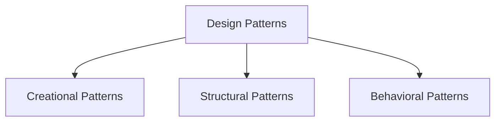

# Design Patterns Technical Notes  
<!-- Design patterns are reusable solutions to common problems in software design. This guide is designed for beginners who are new to design patterns and want to understand their core concepts, basic types, and practical implementation.   -->

## Quick Reference  
- **One-sentence definition**: Design patterns are reusable solutions to common problems in software design.  
- **Key use cases**: Improving code readability, maintainability, and scalability.  
- **Prerequisites**: Basic understanding of programming concepts (e.g., variables, loops, functions).  

## Table of Contents  
1. Introduction  
2. Core Concepts  
   - Fundamental Understanding  
   - Visual Architecture  
3. Implementation Details  
   - Basic Implementation  
4. Real-World Applications  
   - Hands-On Project  
5. Tools & Resources  
6. References  
7. Appendix  

## Introduction  
### What: Core Definition and Purpose  
Design patterns are standardized solutions to recurring design problems in software development. They provide templates for solving issues in a way that promotes best practices and code reusability.  

### Why: Problem It Solves/Value Proposition  
Design patterns help developers write clean, maintainable, and scalable code by providing proven solutions to common problems. They also improve communication among developers by providing a common vocabulary.  

### Where: Application Domains  
Design patterns are used in:  
- Object-oriented programming  
- Web development  
- Game development  
- Enterprise applications  

## Core Concepts  
### Fundamental Understanding  
#### Basic Principles  
- **Creational Patterns**: Deal with object creation mechanisms (e.g., Singleton, Factory).  
- **Structural Patterns**: Deal with object composition and class relationships (e.g., Adapter, Decorator).  
- **Behavioral Patterns**: Deal with object interaction and responsibility distribution (e.g., Observer, Strategy).  

#### Key Components  
- **Classes and Objects**: The building blocks of design patterns.  
- **Interfaces and Abstract Classes**: Define contracts and common behavior.  
- **Inheritance and Composition**: Mechanisms for code reuse and flexibility.  

#### Common Misconceptions  
- **Design patterns are only for advanced programmers**: Beginners can start with simple patterns and gradually progress to more complex ones.  
- **Design patterns are language-specific**: While some patterns are more suited to certain languages, the concepts are generally applicable across languages.  

### Visual Architecture  


## Implementation Details  
### Basic Implementation [Beginner]  
```python  
# Example: Singleton Pattern  
class Singleton:  
    _instance = None  

    def __new__(cls, *args, **kwargs):  
        if not cls._instance:  
            cls._instance = super(Singleton, cls).__new__(cls, *args, **kwargs)  
        return cls._instance  

# Step-by-Step Setup  
singleton1 = Singleton()  
singleton2 = Singleton()  

print(singleton1 is singleton2)  # Output: True  
```  

#### Step-by-Step Setup  
1. Define the Singleton class with a private class variable `_instance`.  
2. Override the `__new__` method to control the instantiation process.  
3. Ensure that only one instance of the class is created and returned.  

#### Code Walkthrough  
- `_instance`: A class variable to store the single instance.  
- `__new__`: A method that controls the creation of new instances.  
- `singleton1 is singleton2`: Checks if both variables point to the same instance.  

#### Common Pitfalls  
- Not handling thread safety in a multi-threaded environment.  
- Overusing the Singleton pattern, which can lead to global state issues.  
- Misunderstanding the difference between `__new__` and `__init__`.  

## Real-World Applications  
### Hands-On Project  
#### Project Goals  
Implement a simple Factory pattern to create different types of shapes (e.g., Circle, Square).  

#### Implementation Steps  
1. Define an interface or base class for shapes.  
2. Implement concrete classes for each shape.  
3. Create a Factory class to generate instances of shapes based on input.  

#### Validation Methods  
- Test the Factory with different inputs to ensure it creates the correct shape.  
- Ensure the Factory handles invalid inputs gracefully.  

## Tools & Resources  
### Essential Tools  
- **IDEs**: PyCharm, VS Code, Jupyter Notebook  
- **Libraries**: Standard Python libraries  
- **Debuggers**: Built-in Python debugger (pdb)  

### Learning Resources  
- **Documentation**: [Python Official Documentation](https://docs.python.org/3/)  
- **Books**: "Design Patterns: Elements of Reusable Object-Oriented Software" by Erich Gamma et al.  
- **Communities**: Stack Overflow, Reddit (r/learnprogramming)  

## References  
- **Official Documentation**: [Python Official Documentation](https://docs.python.org/3/)  
- **Books**: "Head First Design Patterns" by Eric Freeman and Elisabeth Robson  
- **Standards**: IEEE, ACM  

## Appendix  
### Glossary  
- **Singleton**: A creational pattern that ensures a class has only one instance.  
- **Factory**: A creational pattern that provides an interface for creating objects.  
- **Observer**: A behavioral pattern that defines a one-to-many dependency between objects.  

### Setup Guides  
- [Installing Python on Windows](https://www.python.org/downloads/windows/)  
- [Installing Python on macOS](https://www.python.org/downloads/macos/)  

### Code Templates  
- Basic design pattern template:  
```python  
class Pattern:  
    def __init__(self):  
        # Initialize pattern  
        pass  

    def operation(self):  
        # Define operation  
        pass  

if __name__ == "__main__":  
    pattern = Pattern()  
    pattern.operation()  
```