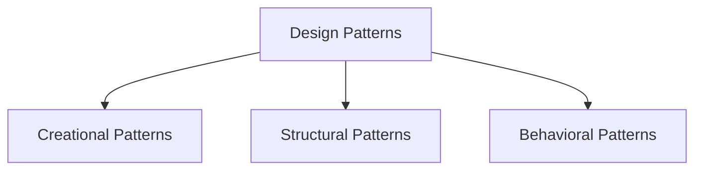

# Design Patterns Technical Notes  
<!-- Design patterns are reusable solutions to common problems in software design. This guide is tailored for intermediate learners who are familiar with basic design patterns and want to deepen their understanding of core concepts, design patterns, and best practices.   -->


## Quick Reference  
- **One-sentence definition**: Design patterns are reusable solutions to common problems in software design.  
- **Key use cases**: Improving code readability, maintainability, and scalability.  
- **Prerequisites**: Basic understanding of design patterns, object-oriented programming, and intermediate programming concepts.  

## Table of Contents  
1. Introduction  
2. Core Concepts  
   - Fundamental Understanding  
   - Visual Architecture  
3. Implementation Details  
   - Intermediate Patterns  
4. Real-World Applications  
   - Industry Examples  
   - Hands-On Project  
5. Tools & Resources  
6. References  
7. Appendix  

## Introduction  
### What: Core Definition and Purpose  
Design patterns are standardized solutions to recurring design problems in software development. They provide templates for solving issues in a way that promotes best practices and code reusability.  

### Why: Problem It Solves/Value Proposition  
Design patterns help developers write clean, maintainable, and scalable code by providing proven solutions to common problems. They also improve communication among developers by providing a common vocabulary.  

### Where: Application Domains  
Design patterns are used in:  
- Object-oriented programming  
- Web development  
- Game development  
- Enterprise applications  

## Core Concepts  
### Fundamental Understanding  
#### Intermediate Principles  
- **Creational Patterns**: Deal with object creation mechanisms (e.g., Abstract Factory, Builder).  
- **Structural Patterns**: Deal with object composition and class relationships (e.g., Composite, Proxy).  
- **Behavioral Patterns**: Deal with object interaction and responsibility distribution (e.g., Command, Template Method).  

#### Key Components  
- **Classes and Objects**: The building blocks of design patterns.  
- **Interfaces and Abstract Classes**: Define contracts and common behavior.  
- **Inheritance and Composition**: Mechanisms for code reuse and flexibility.  

#### Common Misconceptions  
- **Design patterns are only for advanced programmers**: Intermediate learners can effectively use and understand design patterns.  
- **Design patterns are language-specific**: While some patterns are more suited to certain languages, the concepts are generally applicable across languages.  

### Visual Architecture  


## Implementation Details  
### Intermediate Patterns [Intermediate]  
```python  
# Example: Factory Method Pattern  
from abc import ABC, abstractmethod  

class Product(ABC):  
    @abstractmethod  
    def operation(self) -> str:  
        pass  

class ConcreteProductA(Product):  
    def operation(self) -> str:  
        return "Result of ConcreteProductA"  

class ConcreteProductB(Product):  
    def operation(self) -> str:  
        return "Result of ConcreteProductB"  

class Creator(ABC):  
    @abstractmethod  
    def factory_method(self) -> Product:  
        pass  

    def some_operation(self) -> str:  
        product = self.factory_method()  
        result = f"Creator: The same creator's code has just worked with {product.operation()}"  
        return result  

class ConcreteCreatorA(Creator):  
    def factory_method(self) -> Product:  
        return ConcreteProductA()  

class ConcreteCreatorB(Creator):  
    def factory_method(self) -> Product:  
        return ConcreteProductB()  

# Step-by-Step Setup  
creator_a = ConcreteCreatorA()  
print(creator_a.some_operation())  

creator_b = ConcreteCreatorB()  
print(creator_b.some_operation())  
```  

#### Design Patterns  
- **Factory Method**: Defines an interface for creating an object but lets subclasses alter the type of objects that will be created.  
- **Abstract Factory**: Provides an interface for creating families of related or dependent objects.  
- **Builder**: Separates the construction of a complex object from its representation.  

#### Best Practices  
- Use design patterns to solve specific problems, not to over-engineer solutions.  
- Follow the Single Responsibility Principle to ensure each class has only one reason to change.  
- Leverage composition over inheritance for greater flexibility.  

#### Performance Considerations  
- Consider the performance implications of design patterns, especially in resource-constrained environments.  
- Use profiling tools to identify and address bottlenecks.  
- Optimize patterns for specific use cases to avoid unnecessary overhead.  


## Real-World Applications  
### Industry Examples  
#### Use Cases  
- **Web Development**: Use the MVC (Model-View-Controller) pattern to separate concerns in web applications.  
- **Game Development**: Use the State pattern to manage game states and transitions.  
- **Enterprise Applications**: Use the Dependency Injection pattern to manage object dependencies.  

#### Implementation Patterns  
- **Web Development**: Implement the Observer pattern for event handling.  
- **Game Development**: Use the Command pattern for input handling.  
- **Enterprise Applications**: Use the Facade pattern to simplify complex subsystems.  

### Hands-On Project  
#### Project Goals  
Implement a simple Command pattern to handle user actions in a text editor.  

#### Implementation Steps  
1. Define a Command interface with an `execute` method.  
2. Implement concrete command classes for different actions (e.g., Copy, Paste).  
3. Create an Invoker class to execute commands.  
4. Test the implementation with different user actions.  

#### Validation Methods  
- Test the Command pattern with various actions to ensure correct execution.  
- Ensure the pattern handles edge cases gracefully.  


## Tools & Resources  
### Essential Tools  
- **IDEs**: PyCharm, VS Code, Jupyter Notebook  
- **Libraries**: Standard Python libraries  
- **Debuggers**: Built-in Python debugger (pdb)  

### Learning Resources  
- **Documentation**: [Python Official Documentation](https://docs.python.org/3/)  
- **Books**: "Design Patterns: Elements of Reusable Object-Oriented Software" by Erich Gamma et al.  
- **Communities**: Stack Overflow, Reddit (r/learnprogramming)  

## References  
- **Official Documentation**: [Python Official Documentation](https://docs.python.org/3/)  
- **Books**: "Head First Design Patterns" by Eric Freeman and Elisabeth Robson  
- **Standards**: IEEE, ACM  

## Appendix  
### Glossary  
- **Factory Method**: A creational pattern that defines an interface for creating an object but lets subclasses alter the type of objects that will be created.  
- **Abstract Factory**: A creational pattern that provides an interface for creating families of related or dependent objects.  
- **Command**: A behavioral pattern that encapsulates a request as an object.  

### Setup Guides  
- [Installing Python on Windows](https://www.python.org/downloads/windows/)  
- [Installing Python on macOS](https://www.python.org/downloads/macos/)  

### Code Templates  
- Intermediate design pattern template:  
```python  
from abc import ABC, abstractmethod  

class Pattern(ABC):  
    @abstractmethod  
    def operation(self):  
        pass  

class ConcretePattern(Pattern):  
    def operation(self):  
        return "ConcretePattern operation"  

if __name__ == "__main__":  
    pattern = ConcretePattern()  
    print(pattern.operation())  
```