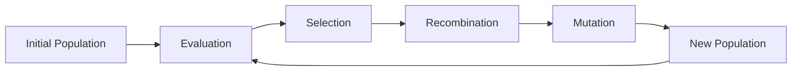

# Evolutionary Computing Technical Notes

<!--  -->

## Quick Reference
- Evolutionary Computing is a subfield of AI that mimics natural evolution to solve complex problems.
- Key use cases: Optimization, machine learning, problem-solving tasks.
- Prerequisites: Basic understanding of computer science and algorithms.

## Table of Contents
1. [Introduction](#introduction)
2. [Core Concepts](#core-concepts)
3. [Fundamental Understanding](#fundamental-understanding)
4. [Visual Architecture](#visual-architecture)
5. [Implementation Details](#implementation-details)
6. [Real-World Applications](#real-world-applications)
7. [Tools & Resources](#tools--resources)

## Introduction

### What: Core Definition and Purpose
Evolutionary Computing (EC) is a family of algorithms inspired by biological evolution to find optimal solutions for complex problems[1]. It uses mechanisms such as reproduction, mutation, recombination, and selection to evolve candidate solutions iteratively[5].

### Why: Problem It Solves
EC is particularly useful for solving optimization problems where traditional methods may struggle. It can discover innovative solutions without requiring problem-specific knowledge, making it versatile and applicable to a wide range of challenges[1].

### Where: Application Domains
- Optimization problems
- Machine learning
- Robotics
- Image recognition
- Neural network design

## Core Concepts

### Fundamental Understanding

#### Basic Principles
1. **Population-based approach**: EC maintains a population of candidate solutions[4].
2. **Iterative refinement**: Solutions are improved over successive generations[2].
3. **Stochastic processes**: Random elements are introduced to explore the solution space[3].

#### Key Components
- **Selection**: Choosing the fittest individuals for reproduction[1].
- **Mutation**: Random changes to introduce diversity[1].
- **Recombination**: Combining traits from parent solutions[1].
- **Fitness Function**: Evaluates the quality of solutions[5].

#### Common Misconceptions
- EC doesn't guarantee finding the absolute best solution, but often finds very good ones[1].
- EC is not limited to biological problems; it can be applied to various fields.

### Visual Architecture


## Implementation Details

### Basic Implementation
```python
import random

def initialize_population(size, gene_length):
    return [random.choices([0, 1], k=gene_length) for _ in range(size)]

def fitness(individual):
    return sum(individual)  # Simple fitness: sum of 1s

def select_parents(population, fitnesses):
    return random.choices(population, weights=fitnesses, k=2)

def crossover(parent1, parent2):
    point = random.randint(0, len(parent1) - 1)
    return parent1[:point] + parent2[point:]

def mutate(individual, rate):
    return [1 - gene if random.random() < rate else gene for gene in individual]

def evolutionary_algorithm(pop_size, gene_length, generations, mutation_rate):
    population = initialize_population(pop_size, gene_length)
    
    for _ in range(generations):
        fitnesses = [fitness(ind) for ind in population]
        new_population = []
        
        for _ in range(pop_size):
            parent1, parent2 = select_parents(population, fitnesses)
            child = crossover(parent1, parent2)
            child = mutate(child, mutation_rate)
            new_population.append(child)
        
        population = new_population
    
    return max(population, key=fitness)

# Usage
best_solution = evolutionary_algorithm(pop_size=100, gene_length=10, generations=50, mutation_rate=0.01)
print("Best solution:", best_solution)
print("Fitness:", fitness(best_solution))
```

This basic implementation demonstrates the core concepts of an evolutionary algorithm, including population initialization, fitness evaluation, selection, crossover, and mutation.

## Real-World Applications

### Industry Examples
- Optimizing neural network architectures for image recognition[2].
- Designing efficient robot control systems.
- Solving complex scheduling problems in manufacturing.

### Hands-On Project
For beginners, a simple project could involve using an evolutionary algorithm to optimize a basic function, such as finding the maximum of a mathematical equation.

## Tools & Resources

### Essential Tools
- Python programming language
- DEAP (Distributed Evolutionary Algorithms in Python) library
- Jupyter Notebooks for experimentation

### Learning Resources
- "Introduction to Evolutionary Computing" by A.E. Eiben and J.E. Smith
- Online courses on evolutionary algorithms and optimization techniques
- Research papers on evolutionary computation applications

Evolutionary Computing offers a powerful and flexible approach to solving complex problems by mimicking natural evolution. While it may not always find the absolute best solution, its ability to discover innovative and effective solutions makes it a valuable tool in the AI and optimization toolkit[1][3].

Citations:
- [1] https://nordvpn.com/cybersecurity/glossary/evolutionary-computation/
- [2] https://www.larksuite.com/en_us/topics/ai-glossary/evolutionary-computation
- [3] https://en.wikipedia.org/wiki/Evolutionary_computation
- [4] https://webusers.i3s.unice.fr/~tettaman/Classes/AE/Tettamanzi2005-up6-3.pdf
- [5] https://en.wikipedia.org/wiki/Evolutionary_algorithm
- [6] https://inria.hal.science/inria-00000542v1/document


**Tools**
- Notes: [Perplexity](https://www.perplexity.ai/) [25/12/2024]
- Image: [grok](https://x.ai/) [25/12/2024]
- Prompt: [CONTRIBUTING.md](../../../../CONTRIBUTING.md)