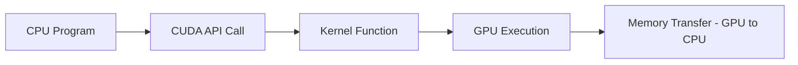

# CUDA - Notes

## Table of Contents (ToC)

  - [1. **Introduction**](#1-introduction)
  - [2. **Key Concepts**](#2-key-concepts)
  - [3. **Why It Matters / Relevance**](#3-why-it-matters--relevance)
  - [4. **Learning Map (Architecture Pipeline)**](#4-learning-map-architecture-pipeline)
  - [5. **Framework / Key Theories or Models**](#5-framework--key-theories-or-models)
  - [6. **How CUDA Works**](#6-how-cuda-works)
  - [7. **Methods, Types \& Variations**](#7-methods-types--variations)
  - [8. **Self-Practice / Hands-On Examples**](#8-self-practice--hands-on-examples)
  - [9. **Pitfalls \& Challenges**](#9-pitfalls--challenges)
  - [10. **Feedback \& Evaluation**](#10-feedback--evaluation)
  - [11. **Tools, Libraries \& Frameworks**](#11-tools-libraries--frameworks)
  - [12. **Hello World! (Practical Example)**](#12-hello-world-practical-example)
    - [Vector Addition in CUDA (C++)](#vector-addition-in-cuda-c)
  - [13. **Advanced Exploration**](#13-advanced-exploration)
  - [14. **Zero to Hero Lab Projects**](#14-zero-to-hero-lab-projects)
  - [15. **Continuous Learning Strategy**](#15-continuous-learning-strategy)
  - [16. **References**](#16-references)


---

## 1. **Introduction**
CUDA (Compute Unified Device Architecture) is a parallel computing platform and API model created by NVIDIA that allows developers to leverage GPU acceleration for general-purpose computing.

---

## 2. **Key Concepts**
- **GPU vs. CPU:** CPUs are designed for low-latency, complex tasks, while GPUs are optimized for high-throughput, parallelizable tasks.
- **Threads and Blocks:** CUDA divides work into **threads** that execute the same code, grouped into **blocks**, which further group into **grids**.
- **Kernels:** Functions written in CUDA C/C++ that run on the GPU and are executed by multiple threads in parallel.

**Misconception:** CUDA is often thought to be only for gaming or graphics. In reality, it's widely used in areas like scientific computing, machine learning, and AI.

---

## 3. **Why It Matters / Relevance**
- **Performance Boosts:** CUDA enables massive performance improvements for parallelizable tasks, speeding up computations in deep learning, simulations, and data processing.
- **Deep Learning:** CUDA is the foundation for many deep learning frameworks, like TensorFlow and PyTorch, enabling fast neural network training on GPUs.
- **Scientific Computing:** CUDA accelerates applications such as fluid dynamics, molecular dynamics, and complex simulations by leveraging parallel computing.

---

## 4. **Learning Map (Architecture Pipeline)**

1. **CPU Program:** A host program initializes the GPU computation.
2. **CUDA API Call:** Functions like `cudaMalloc()` and `cudaMemcpy()` allocate and transfer memory between the CPU and GPU.
3. **Kernel Function:** The kernel, which runs on the GPU, executes parallel tasks.
4. **Memory Transfer:** The result is transferred back from GPU to CPU.

---

## 5. **Framework / Key Theories or Models**
1. **SIMT (Single Instruction, Multiple Threads):** CUDA follows the SIMT architecture, where many threads execute the same instructions in parallel.
2. **Memory Hierarchy:** CUDA uses global, shared, and local memory, with each level having different speeds and access patterns.
3. **Amdahl’s Law:** This law explains the limits of parallelism, stating that only the parallel portion of a program can be accelerated by using more processors.

---

## 6. **How CUDA Works**
- **Step-by-step process:**
  1. **Memory Allocation:** The CPU allocates memory for the GPU using `cudaMalloc()`.
  2. **Kernel Launch:** The host (CPU) launches a kernel function, specifying the number of threads and blocks.
  3. **Parallel Execution:** The GPU executes the kernel across multiple threads.
  4. **Memory Transfer:** Results are copied back from the GPU to the CPU using `cudaMemcpy()`.

---

## 7. **Methods, Types & Variations**
- **CUDA C/C++:** The most commonly used language, offering direct control over GPU programming.
- **Thrust Library:** A high-level CUDA library similar to C++'s STL, offering parallel algorithms like `sort()`, `reduce()`, etc.
- **CuDNN:** A CUDA library specifically designed for accelerating deep learning computations.

**Contrasting Example:**
- **CUDA vs. OpenCL:** CUDA is NVIDIA-specific and often offers better performance and support, while OpenCL is cross-platform but may not offer the same optimization.

---

## 8. **Self-Practice / Hands-On Examples**
1. **Vector Addition:** Write a CUDA program to perform element-wise addition of two vectors.
2. **Matrix Multiplication:** Implement a CUDA-accelerated matrix multiplication kernel.
3. **Image Processing:** Use CUDA to apply filters (e.g., edge detection) to an image.

---

## 9. **Pitfalls & Challenges**
- **Memory Management:** Efficient memory usage (e.g., minimizing transfers between CPU and GPU) is crucial for maximizing performance.
- **Warp Divergence:** If threads within the same warp follow different execution paths, performance can suffer.
- **Debugging:** Debugging GPU code can be more challenging than CPU code due to its parallel nature.

---

## 10. **Feedback & Evaluation**
- **Feynman Test:** Explain to a beginner the difference between global and shared memory in CUDA.
- **Peer Review:** Have a colleague review your code to see if thread allocation and memory management are optimized.
- **Benchmarking:** Measure the performance of your CUDA program using a timing function to compare against CPU execution.

---

## 11. **Tools, Libraries & Frameworks**
- **Nsight Compute:** NVIDIA's profiler for performance analysis of CUDA applications.
- **CUDA Toolkit:** Includes compilers (nvcc), libraries, and debugging tools for CUDA development.
- **cuBLAS:** A GPU-accelerated version of BLAS (Basic Linear Algebra Subprograms).

**Comparison:**
- **Nsight Compute vs. Visual Profiler:** Nsight offers more advanced performance insights, while Visual Profiler is simpler for beginners.
- **cuBLAS vs. cuDNN:** cuBLAS focuses on linear algebra operations, while cuDNN accelerates deep learning operations.

---

## 12. **Hello World! (Practical Example)**

### Vector Addition in CUDA (C++)
```cpp
__global__ void vector_add(float *A, float *B, float *C, int N) {
    int idx = blockIdx.x * blockDim.x + threadIdx.x;
    if (idx < N) {
        C[idx] = A[idx] + B[idx];
    }
}

int main() {
    int N = 1024;
    size_t size = N * sizeof(float);
    
    float *A, *B, *C;
    cudaMallocManaged(&A, size);
    cudaMallocManaged(&B, size);
    cudaMallocManaged(&C, size);

    // Initialize A and B
    for (int i = 0; i < N; i++) {
        A[i] = i;
        B[i] = i * 2;
    }

    // Launch kernel with 256 threads per block and N/256 blocks
    vector_add<<<N / 256, 256>>>(A, B, C, N);

    cudaDeviceSynchronize();

    // Check results
    for (int i = 0; i < 10; i++) {
        printf("C[%d] = %f\n", i, C[i]);
    }

    cudaFree(A);
    cudaFree(B);
    cudaFree(C);
    return 0;
}
```
This program adds two vectors in parallel using CUDA.

---

## 13. **Advanced Exploration**
- **CUDA Streams:** Explore asynchronous operations and overlapping memory transfers with computations using CUDA streams.
- **Multi-GPU Programming:** Learn how to distribute tasks across multiple GPUs for even greater parallelism.
- **Tensor Cores:** Study how to use NVIDIA's specialized Tensor Cores for deep learning acceleration in frameworks like TensorFlow.

---

## 14. **Zero to Hero Lab Projects**
- **Basic:** Implement a parallel matrix multiplication with shared memory for better performance.
- **Intermediate:** Create a CUDA-based image processing library for filters and transformations.
- **Advanced:** Develop a deep learning training pipeline using CUDA and cuDNN for neural network acceleration.

---

## 15. **Continuous Learning Strategy**
- **Optimize Kernels:** Focus on optimizing memory access patterns, avoiding warp divergence, and maximizing resource usage.
- **Explore GPU Architecture:** Learn more about NVIDIA's GPU architecture (e.g., Volta, Ampere) to better understand CUDA performance characteristics.
- **Parallel Algorithm Design:** Study how to design algorithms for parallel execution, using techniques like divide-and-conquer or parallel reduction.

---

## 16. **References**
- **CUDA by Example:** A beginner-friendly introduction to programming with CUDA.
- **CUDA Programming Guide:** NVIDIA's official documentation on all CUDA features and best practices.
- **NVIDIA Developer Blog:** Stay up-to-date with new CUDA releases, tutorials, and performance optimization tips.

---
