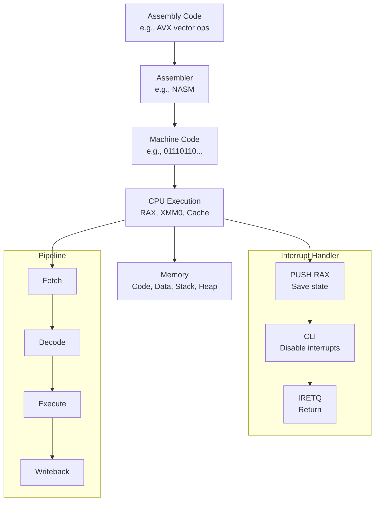

# Assembly Language Technical Notes

<!-- [A rectangular image illustrating an advanced assembly language workflow: a programmer writing optimized code with inline assembly in a high-level language (e.g., C), integrating with an OS kernel, compiled into machine code, and executed on a multi-core CPU with a detailed view of cache, registers (e.g., RAX, RBX), interrupts, and memory segmentation, including a pipeline diagram showing instruction execution stages.] -->

## Quick Reference
- **One-sentence definition**: Assembly language is a low-level programming language that provides precise control over hardware through architecture-specific instructions.
- **Key use cases**: Kernel development, real-time systems, and performance-critical optimizations in production environments.
- **Prerequisites**: Proficiency in assembly (e.g., x86/64), understanding of CPU architecture (pipelines, caches), and experience with systems programming (e.g., C, OS concepts).

## Related Notes
- [Embedded Systems](../../../../systems/embedded-systems/)
- [Microprocessors & Microcontrollers](../../../../systems/embedded-systems/resources/lectures/ensea-french/)
- [Computer Architecture Books](https://github.com/afondiel/cs-books/computer-architecture)

## Table of Contents
- [Introduction](#introduction)
- [Core Concepts](#core-concepts)
    - [Fundamental Understanding](#fundamental-understanding)
    - [Visual Architecture](#visual-architecture)
- [Implementation Details](#implementation-details)
    - [Basic Implementation](#basic-implementation)
    - [Intermediate Patterns](#intermediate-patterns)
    - [Advanced Topics](#advanced-topics)
- [Real-World Applications](#real-world-applications)
    - [Industry Examples](#industry-examples)
    - [Hands-On Project](#hands-on-project)
- [Tools & Resources](#tools--resources)
    - [Essential Tools](#essential-tools)
    - [Learning Resources](#learning-resources)
- [References](#references)
- [Appendix](#appendix) 

## Introduction
- **What**: Assembly language enables direct manipulation of a processor’s instruction set, offering unmatched control over hardware behavior.  
- **Why**: It addresses the need for maximum performance, minimal latency, and hardware-level customization in mission-critical systems.  
- **Where**: Deployed in operating system kernels, high-performance computing, and embedded systems requiring precise timing.

## Core Concepts
### Fundamental Understanding
- **Basic Principles**:  
  - Instructions are executed in a pipelined, out-of-order fashion on modern CPUs, requiring optimization for hazards (e.g., data, control).  
  - Memory hierarchy (registers, cache, RAM) dictates performance; assembly allows fine-tuned access strategies.  
  - Interrupts and exceptions integrate assembly with system-level control flow.  
- **Key Components**:  
  - **Registers**: Extended x86-64 registers (e.g., RAX, R8-R15) for 64-bit operations.  
  - **Instruction Set**: SIMD (e.g., SSE, AVX) for parallel processing, alongside scalar operations.  
  - **Memory Management**: Segmentation, paging, and manual cache control via instructions like `CLFLUSH`.  
- **Common Misconceptions**:  
  - *“Assembly is always faster”*: Poorly written assembly can underperform compiler-optimized high-level code.  
  - *“64-bit is just bigger registers”*: It introduces new calling conventions and memory models.

### Visual Architecture

- **System Overview**: Code leverages advanced instructions, handles interrupts, and optimizes for CPU pipelines.  
- **Component Relationships**: Registers feed the pipeline, memory interacts via cache, and interrupts redirect execution.

## Implementation Details
### Basic Implementation [Recap]
**Language**: x86-64 Assembly (NASM syntax)  
```
// Recap: Add two numbers
section .data
    num1 dq 5
    num2 dq 3
section .text
    global _start
_start:
    mov rax, [num1]
    add rax, [num2]
    mov rax, 60
    syscall
```
- A baseline for context.

### Intermediate Patterns [Recap]
```
// Recap: Subroutine for multiplication (simplified)
multiply:
    mov rax, [rdi]
    mul rsi
    ret
```

### Advanced Topics [Advanced]
**Language**: x86-64 Assembly (NASM syntax)  
```
// Optimized vector addition using AVX for 4 floats
section .data
    align 32
    vec1 dq 1.0, 2.0, 3.0, 4.0  ; 4 packed floats
    vec2 dq 5.0, 6.0, 7.0, 8.0  ; 4 packed floats
    result dq 0, 0, 0, 0         ; Result storage

section .text
    global _start

_start:
    vmovaps ymm0, [vec1]     ; Load vec1 into YMM0 (256-bit register)
    vmovaps ymm1, [vec2]     ; Load vec2 into YMM1
    vaddps ymm2, ymm0, ymm1  ; Add vectors (parallel)
    vmovaps [result], ymm2   ; Store result

    ; Exit (Linux syscall)
    mov rax, 60
    xor rdi, rdi
    syscall
```
- **System Design**:  
  - Uses AVX for SIMD parallelism, processing 4 floats in one instruction.  
  - Aligns data to 32 bytes for optimal memory access with `align 32`.  
- **Optimization Techniques**:  
  - Leverages CPU vector units to reduce cycles vs. scalar loops.  
  - Minimizes pipeline stalls with aligned memory and non-blocking instructions.  
  - Avoids unnecessary register spills by keeping data in YMM registers.  
- **Production Considerations**:  
  - Checks CPUID for AVX support before execution (not shown, but critical).  
  - Handles alignment faults in real systems with fallback paths.  
  - Integrates with C via proper calling conventions (e.g., System V ABI).

## Real-World Applications
### Industry Examples
- **Use Case**: Matrix multiplication in high-performance computing (e.g., scientific simulations).  
- **Implementation Pattern**: SIMD instructions (AVX) with cache-aware data blocking.  
- **Success Metrics**: Throughput (FLOPS), reduced execution time.  

### Hands-On Project
- **Project Goals**: Optimize a dot product of two 8-element float vectors using AVX.  
- **Implementation Steps**:  
  1. Define aligned vectors in `.data`.  
  2. Use `VDPPS` (dot product instruction) for parallel computation.  
  3. Benchmark against a scalar version.  
- **Validation Methods**: Use `perf` to measure cycles and verify result accuracy.

## Tools & Resources
### Essential Tools
- **Development Environment**: IDA Pro or Ghidra for disassembly, VS Code.  
- **Key Frameworks**: NASM, YASM (for AVX support).  
- **Testing Tools**: `perf` (Linux), Intel VTune for profiling.  

### Learning Resources
- **Documentation**: Intel 64 and IA-32 Architectures Software Developer’s Manual.  
- **Tutorials**: Agner Fog’s optimization guides (agner.org).  
- **Community Resources**: OSDev.org, Stack Overflow (x86 tag).  

## References
- Intel SDM: https://software.intel.com  
- NASM Docs: https://www.nasm.us/doc/  
- “Computer Architecture: A Quantitative Approach” by Hennessy & Patterson  

## Appendix
- **Glossary**:  
  - *SIMD*: Single Instruction, Multiple Data (e.g., AVX).  
  - *Pipeline Hazard*: Stall due to data dependency or branch misprediction.  
- **Setup Guides**:  
  - Enable AVX: Check BIOS and kernel support (`cat /proc/cpuinfo`).  
- **Code Templates**: AVX vector operation from above.
