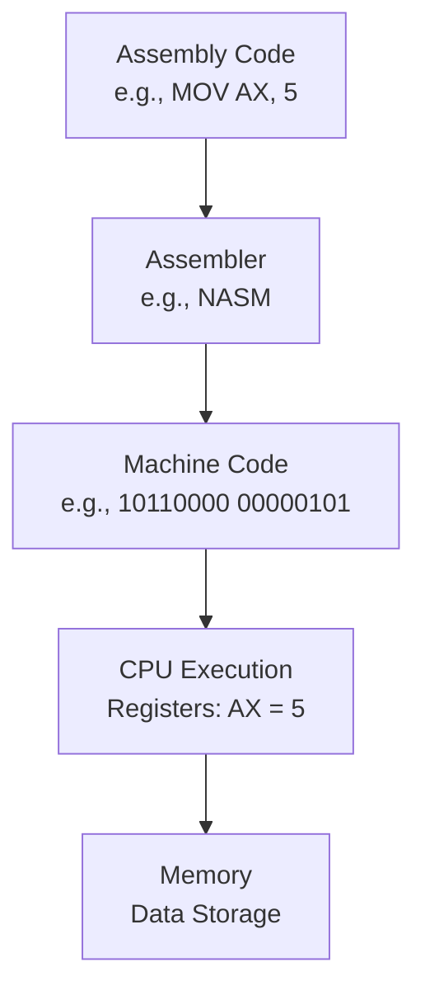

# Assembly Language Technical Notes
<!-- [A rectangular image showing a simplified assembly language workflow: a programmer writing assembly code (e.g., MOV, ADD instructions) on a text editor, the code being compiled by an assembler into machine code (binary), and the resulting output executed on a basic CPU architecture with registers and memory visually represented.] -->

## Quick Reference
- **One-sentence definition**: Assembly language is a low-level programming language that uses mnemonic instructions to directly interact with a computer's hardware.
- **Key use cases**: Writing performance-critical code, developing operating systems, and understanding computer architecture.
- **Prerequisites**: Basic understanding of computers (e.g., what a CPU does), willingness to learn hardware-level concepts, no prior programming experience required.

## Related Notes
- [Embedded Systems](../../../../systems/embedded-systems/)
- [Microprocessors & Microcontrollers](../../../../systems/embedded-systems/resources/lectures/ensea-french/)
- [Computer Architecture Books](https://github.com/afondiel/cs-books/computer-architecture)

## Table of Contents
1. [Introduction](#introduction)  
2. [Core Concepts](#core-concepts)  
    - [Fundamental Understanding](#fundamental-understanding)  
    - [Visual Architecture](#visual-architecture)  
3. [Implementation Details](#implementation-details)  
    - [Basic Implementation](#basic-implementation-beginner)  
4. [Real-World Applications](#real-world-applications)  
    - [Industry Examples](#industry-examples)  
    - [Hands-On Project](#hands-on-project)  
5. [Tools & Resources](#tools--resources)  
    - [Essential Tools](#essential-tools)  
    - [Learning Resources](#learning-resources)  
6. [References](#references)  
7. [Appendix](#appendix)  

## Introduction
- **What**: Assembly language is a human-readable representation of machine code, using short mnemonic commands (like `MOV` or `ADD`) to control a computer's processor directly.  
- **Why**: It allows programmers to write highly efficient code tailored to specific hardware, solving problems where speed and resource control are critical.  
- **Where**: Used in embedded systems (e.g., microcontrollers), operating system kernels, and reverse engineering software.

## Core Concepts
### Fundamental Understanding
- **Basic Principles**:  
  - Assembly is tied to a specific CPU architecture (e.g., x86, ARM), meaning instructions differ between processors.  
  - It operates on registers (small, fast storage in the CPU) and memory (larger, slower storage).  
  - Each line of code typically translates to one machine instruction.  
- **Key Components**:  
  - **Registers**: Temporary storage locations in the CPU (e.g., AX, BX in x86).  
  - **Instructions**: Commands like `MOV` (move data), `ADD` (add numbers), or `JMP` (jump to another instruction).  
  - **Assembler**: A tool that converts assembly code into machine code (e.g., NASM, MASM).  
- **Common Misconceptions**:  
  - *“It’s too hard for beginners”*: It’s manageable with step-by-step learning and practice.  
  - *“It’s obsolete”*: Assembly remains critical for low-level programming and hardware interfacing.

### Visual Architecture

- **System Overview**: Code is written, assembled into binary, and executed by the CPU using registers and memory.  
- **Component Relationships**: Instructions manipulate data in registers or memory, controlled by the CPU’s instruction set.

## Implementation Details
### Basic Implementation [Beginner]
**Language**: x86 Assembly (using NASM syntax)  
```
// Simple program to add two numbers and store the result
section .data
    num1 db 5          ; Define byte with value 5
    num2 db 3          ; Define byte with value 3
    result db 0        ; Define byte to store result

section .text
    global _start      ; Entry point for the program

_start:
    mov al, [num1]     ; Move num1 into register AL
    add al, [num2]     ; Add num2 to AL
    mov [result], al   ; Store result back in memory

    ; Exit program (Linux syscall)
    mov eax, 1         ; Syscall number for exit
    mov ebx, 0         ; Return code 0
    int 0x80           ; Make syscall
```
- **Step-by-Step Setup**:  
  1. Install NASM (e.g., `sudo apt install nasm` on Linux).  
  2. Save code as `add.asm`.  
  3. Assemble: `nasm -f elf add.asm -o add.o`.  
  4. Link: `ld -m elf_i386 add.o -o add`.  
  5. Run: `./add`.  
- **Code Walkthrough**:  
  - `mov al, [num1]` loads 5 into the AL register.  
  - `add al, [num2]` adds 3 to AL, making it 8.  
  - `mov [result], al` saves 8 to memory.  
- **Common Pitfalls**:  
  - Forgetting square brackets `[]` when accessing memory.  
  - Using wrong register sizes (e.g., AL is 8-bit, AX is 16-bit).  

## Real-World Applications
### Industry Examples
- **Use Case**: Bootloaders (e.g., GRUB) use assembly to initialize hardware before an OS loads.  
- **Implementation Pattern**: Direct register manipulation for hardware control.  
- **Success Metrics**: Fast execution, minimal resource use.  

### Hands-On Project
- **Project Goals**: Write a program to display a number (e.g., 7) by adding two values.  
- **Implementation Steps**:  
  1. Define two numbers in `.data` (e.g., 4 and 3).  
  2. Use `MOV` and `ADD` to compute their sum.  
  3. Exit cleanly with a syscall.  
- **Validation Methods**: Check the `result` memory value using a debugger (e.g., `gdb`).  

## Tools & Resources
### Essential Tools
- **Development Environment**: Text editor (e.g., VS Code, Notepad++).  
- **Key Frameworks**: NASM (Netwide Assembler) for assembling code.  
- **Testing Tools**: GDB (GNU Debugger) for stepping through code.  

### Learning Resources
- **Documentation**: NASM official docs (https://www.nasm.us/doc/).  
- **Tutorials**: “Assembly Language for Beginners” on YouTube or tutorials from OpenSecurityTraining.  
- **Community Resources**: Stack Overflow’s assembly tag, Reddit’s r/asm.  

## References
- NASM Documentation: https://www.nasm.us/doc/  
- Intel x86 Instruction Set Reference: https://software.intel.com/content/www/us/en/develop/documentation  
- “Programming from the Ground Up” by Jonathan Bartlett  

## Appendix
- **Glossary**:  
  - *Register*: Small, fast CPU storage (e.g., AL, AX).  
  - *Mnemonic*: A short word representing a machine instruction (e.g., MOV).  
- **Setup Guides**:  
  - Install NASM on Windows: Download from nasm.us, add to PATH.  
- **Code Templates**: See the basic implementation above as a starting point.
