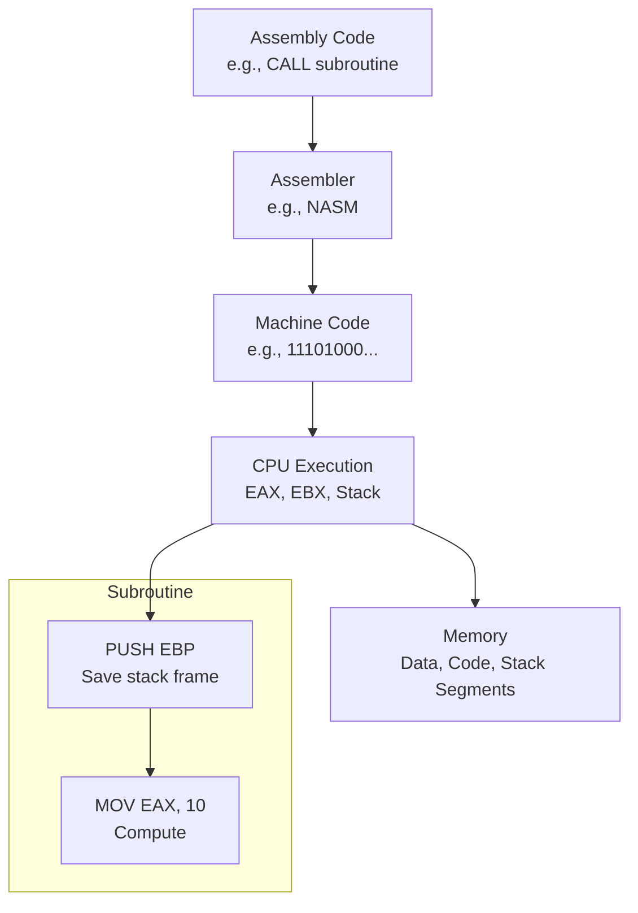

# Assembly Language Technical Notes
<!-- [A rectangular image depicting an intermediate assembly language workflow: a programmer optimizing code with loops and subroutines in a text editor, the assembler translating it into machine code, and a CPU executing it with visible register interactions (e.g., EAX, EBX) and a stack for function calls, alongside a memory layout showing data and code segments.] -->

## Quick Reference
- **One-sentence definition**: Assembly language is a low-level programming language that uses mnemonic instructions to directly control hardware with fine-tuned efficiency.
- **Key use cases**: Optimizing critical code sections, developing device drivers, and interfacing with hardware in real-time systems.
- **Prerequisites**: Familiarity with basic assembly (e.g., MOV, ADD), understanding of CPU registers, and experience with a high-level language (e.g., C).

## Related Notes
- [Embedded Systems](../../../../systems/embedded-systems/)
- [Microprocessors & Microcontrollers](../../../../systems/embedded-systems/resources/lectures/ensea-french/)
- [Computer Architecture Books](https://github.com/afondiel/cs-books/computer-architecture)

## Table of Contents
1. [Introduction](#introduction)  
2. [Core Concepts](#core-concepts)  
    - [Fundamental Understanding](#fundamental-understanding)  
    - [Visual Architecture](#visual-architecture)  
3. [Implementation Details](#implementation-details)  
    - [Basic Implementation](#basic-implementation-beginner-recap)  
    - [Intermediate Patterns](#intermediate-patterns-intermediate)  
4. [Real-World Applications](#real-world-applications)  
    - [Industry Examples](#industry-examples)  
    - [Hands-On Project](#hands-on-project)  
5. [Tools & Resources](#tools--resources)  
    - [Essential Tools](#essential-tools)  
    - [Learning Resources](#learning-resources)  
6. [References](#references)  
7. [Appendix](#appendix)  

## Introduction
- **What**: Assembly language provides a direct interface to a processor’s instruction set, enabling precise control over hardware operations.  
- **Why**: It solves performance bottlenecks in high-level languages by minimizing overhead and maximizing resource efficiency.  
- **Where**: Applied in operating system development, game engine optimization, and embedded firmware.

## Core Concepts
### Fundamental Understanding
- **Basic Principles**:  
  - Instructions execute sequentially unless altered by jumps or loops, requiring manual flow control.  
  - Memory access patterns (e.g., stack vs. heap) impact performance significantly.  
  - Optimization depends on understanding instruction timing and pipeline behavior.  
- **Key Components**:  
  - **Registers**: General-purpose (e.g., EAX, EBX) and special-purpose (e.g., ESP for stack pointer).  
  - **Stack**: Used for function calls and local variables, managed manually in assembly.  
  - **Addressing Modes**: Direct, indirect, and indexed ways to access memory (e.g., `[EBX + 4]`).  
- **Common Misconceptions**:  
  - *“More instructions = slower code”*: Fewer, well-chosen instructions can outperform bloated code.  
  - *“Assembly is only for experts”*: Intermediate programmers can leverage it with practice.

### Visual Architecture

- **System Overview**: Code uses subroutines and stack management, assembled into binary, executed with register and memory interplay.  
- **Component Relationships**: Subroutines interact via the stack, registers pass data, and memory stores persistent values.

## Implementation Details
### Basic Implementation [Beginner Recap]
**Language**: x86 Assembly (NASM syntax)  
```
// Quick recap: Add two numbers
section .data
    num1 db 5
    num2 db 3
section .text
    global _start
_start:
    mov al, [num1]
    add al, [num2]
    mov eax, 1
    int 0x80
```
- A simple starting point for context.

### Intermediate Patterns [Intermediate]
**Language**: x86 Assembly (NASM syntax)  
```
// Program with a subroutine to multiply two numbers
section .data
    num1 dd 6          ; 32-bit integer
    num2 dd 4          ; 32-bit integer
    result dd 0        ; Store result

section .text
    global _start

_start:
    push dword [num2]  ; Pass num2 to stack
    push dword [num1]  ; Pass num1 to stack
    call multiply      ; Call subroutine
    add esp, 8         ; Clean up stack (2 args * 4 bytes)
    mov [result], eax  ; Store result

    ; Exit
    mov eax, 1
    mov ebx, 0
    int 0x80

multiply:
    push ebp           ; Save old base pointer
    mov ebp, esp       ; Set new base pointer
    mov eax, [ebp + 8] ; Get first arg (num1)
    mov ebx, [ebp + 12]; Get second arg (num2)
    mul ebx            ; EAX = EAX * EBX
    pop ebp            ; Restore base pointer
    ret                ; Return, result in EAX
```
- **Design Patterns**:  
  - **Subroutines**: Use `CALL` and `RET` for reusable code blocks, managing the stack with `PUSH`/`POP`.  
  - **Stack Frame**: `EBP` preserves context across calls, enabling parameter passing.  
- **Best Practices**:  
  - Use 32-bit registers (e.g., EAX) for efficiency on modern CPUs.  
  - Clean up the stack after calls to avoid corruption.  
  - Comment code heavily for maintainability.  
- **Performance Considerations**:  
  - Minimize memory access; prefer register operations.  
  - Use `MUL` over loops for multiplication when possible.  
  - Align data (e.g., `dd` on 4-byte boundaries) for faster access.

## Real-World Applications
### Industry Examples
- **Use Case**: Interrupt handlers in operating systems (e.g., keyboard input).  
- **Implementation Pattern**: Save register state, process event, restore state using stack operations.  
- **Success Metrics**: Low latency, reliable execution under load.  

### Hands-On Project
- **Project Goals**: Create a program to compute the factorial of a number (e.g., 5! = 120).  
- **Implementation Steps**:  
  1. Define a number in `.data`.  
  2. Write a recursive subroutine using the stack to calculate factorial.  
  3. Store and verify the result.  
- **Validation Methods**: Use GDB to step through and check EAX for the correct result (e.g., 120 for 5).

## Tools & Resources
### Essential Tools
- **Development Environment**: VS Code with assembly syntax highlighting.  
- **Key Frameworks**: NASM or GAS (GNU Assembler).  
- **Testing Tools**: GDB, objdump (to inspect binaries).  

### Learning Resources
- **Documentation**: Intel x86 Developer Manual (Vol. 2: Instruction Set).  
- **Tutorials**: “x86 Assembly Guide” by University of Virginia CS.  
- **Community Resources**: r/asm, OSDev.org forums.  

## References
- Intel x86 Instruction Set Reference: https://software.intel.com  
- NASM Manual: https://www.nasm.us/doc/  
- “Assembly Language Step-by-Step” by Jeff Duntemann  

## Appendix
- **Glossary**:  
  - *Stack Frame*: Memory structure for subroutine state.  
  - *Addressing Mode*: Method to specify operands (e.g., `[EBX + 8]`).  
- **Setup Guides**:  
  - Install GDB: `sudo apt install gdb` (Linux).  
- **Code Templates**: Subroutine pattern from above.
