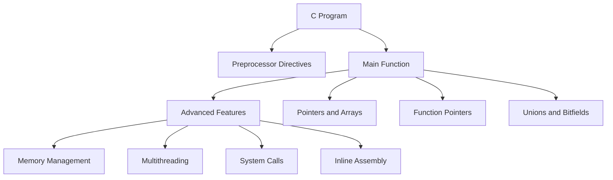

# C Technical Notes

## Quick Reference  
- **One-sentence definition**: C is a procedural programming language used for system programming, embedded systems, and applications requiring direct hardware access.  
- **Key use cases**: Operating systems, embedded systems, compilers, and performance-critical applications.  
- **Prerequisites**: Strong understanding of C syntax, pointers, memory management, and data structures.  

## Table of Contents  
1. Introduction  
2. Core Concepts  
   - Fundamental Understanding  
   - Visual Architecture  
3. Implementation Details  
   - Advanced Topics  
4. Real-World Applications  
   - Industry Examples  
   - Hands-On Project  
5. Tools & Resources  
6. References  
7. Appendix  

## Introduction  
### What: Core Definition and Purpose  
C is a general-purpose, procedural programming language developed in the early 1970s. It provides low-level access to memory and hardware, making it ideal for system programming and performance-critical applications.  

### Why: Problem It Solves/Value Proposition  
C allows developers to write efficient and portable code. Its simplicity and close-to-hardware capabilities make it a popular choice for building operating systems, compilers, and embedded systems.  

### Where: Application Domains  
C is widely used in:  
- Operating systems (e.g., Linux, Windows kernels)  
- Embedded systems (e.g., microcontrollers, IoT devices)  
- Compilers and interpreters  
- Game development (e.g., game engines)  

## Core Concepts  
### Fundamental Understanding  
#### Advanced Principles  
- **Memory Management**: Advanced techniques like custom allocators and memory pools.  
- **Multithreading**: Use POSIX threads (`pthread`) for concurrent programming.  
- **System Calls**: Interact with the operating system using system calls (e.g., `fork`, `exec`).  
- **Inline Assembly**: Embed assembly code within C for low-level optimizations.  

#### Key Components  
- **Pointers and Arrays**: Advanced usage, including pointer arithmetic and multi-dimensional arrays.  
- **Function Pointers**: Use for callbacks and dynamic function dispatch.  
- **Unions and Bitfields**: Optimize memory usage and manipulate data at the bit level.  

#### Common Misconceptions  
- **C is outdated**: C remains widely used in system programming and embedded systems.  
- **C is only for low-level programming**: C can also be used for high-level applications with proper abstractions.  

### Visual Architecture  


## Implementation Details  
### Advanced Topics [Advanced]  
```c  
#include <stdio.h>  
#include <stdlib.h>  
#include <pthread.h>  

// Shared variable  
int counter = 0;  
pthread_mutex_t lock;  

// Thread function  
void* increment(void* arg) {  
    for (int i = 0; i < 1000; ++i) {  
        pthread_mutex_lock(&lock);  // Lock the mutex  
        ++counter;  // Critical section  
        pthread_mutex_unlock(&lock);  // Unlock the mutex  
    }  
    return NULL;  
}  

int main() {  
    pthread_t threads[10];  
    pthread_mutex_init(&lock, NULL);  // Initialize the mutex  

    // Create 10 threads  
    for (int i = 0; i < 10; ++i) {  
        pthread_create(&threads[i], NULL, increment, NULL);  
    }  

    // Join all threads  
    for (int i = 0; i < 10; ++i) {  
        pthread_join(threads[i], NULL);  
    }  

    pthread_mutex_destroy(&lock);  // Destroy the mutex  
    printf("Final counter value: %d\n", counter);  

    return 0;  
}  
```  

#### System Design  
- **Concurrency Models**: Use POSIX threads (`pthread`) for parallel execution.  
- **Memory Optimization**: Implement custom allocators and memory pools for efficient memory usage.  
- **Error Handling**: Use return codes and `errno` for robust error handling.  

#### Optimization Techniques  
- **Inline Assembly**: Embed assembly code for performance-critical sections.  
- **Cache-Friendly Code**: Optimize data structures for CPU cache efficiency.  
- **Profiling**: Use tools like Valgrind and gprof to identify performance bottlenecks.  

#### Production Considerations  
- **Code Maintainability**: Follow coding standards and use static analysis tools.  
- **Testing**: Implement unit tests, integration tests, and stress tests.  
- **Deployment**: Use CI/CD pipelines for automated builds and deployments.  

## Real-World Applications  
### Industry Examples  
#### Use Cases  
- **Operating Systems**: C is used in the Linux kernel for its performance and low-level capabilities.  
- **Embedded Systems**: C is ideal for resource-constrained environments like IoT devices.  
- **Compilers**: C is used to build compilers for other programming languages.  

#### Implementation Patterns  
- **Operating Systems**: Use modular programming and function pointers for system calls.  
- **Embedded Systems**: Leverage static memory allocation and avoid dynamic memory.  
- **Compilers**: Use recursive functions and tree structures for parsing.  

### Hands-On Project  
#### Project Goals  
Build a multithreaded web server using C and POSIX threads.  

#### Implementation Steps  
1. Use `socket` to create a server that listens for incoming connections.  
2. Use `pthread` to handle multiple client connections concurrently.  
3. Implement basic HTTP request parsing and response handling.  
4. Use mutexes to protect shared resources.  

#### Validation Methods  
- Test the server with multiple concurrent clients.  
- Measure performance metrics like throughput and latency.  

## Tools & Resources  
### Essential Tools  
- **IDEs**: Code::Blocks, Dev-C++, Eclipse  
- **Compilers**: GCC, Clang, MSVC  
- **Debuggers**: GDB, LLDB  

### Learning Resources  
- **Documentation**: [GNU C Manual](https://www.gnu.org/software/gnu-c-manual/)  
- **Books**: "Advanced Programming in the UNIX Environment" by W. Richard Stevens  
- **Communities**: Stack Overflow, Reddit (r/C_Programming)  

## References  
- **Official Documentation**: [ISO C Standard](https://www.iso.org/standard/74528.html)  
- **Books**: "The C Programming Language" by Brian W. Kernighan and Dennis M. Ritchie  
- **Standards**: C89, C99, C11  

## Appendix  
### Glossary  
- **Mutex**: A synchronization primitive used to protect shared resources.  
- **System Call**: A mechanism for programs to interact with the operating system.  
- **Inline Assembly**: Assembly code embedded within C for low-level optimizations.  

### Setup Guides  
- [Installing GCC on Windows](https://code.visualstudio.com/docs/cpp/config-mingw)  
- [Installing Xcode on macOS](https://developer.apple.com/xcode/)  

### Code Templates  
- Advanced C program template:  
```c  
#include <stdio.h>  
#include <stdlib.h>  

int main() {  
    // Your code here  
    return 0;  
}  
```