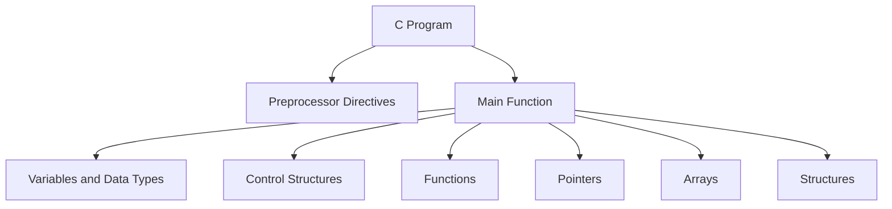

# C Technical Notes 
 
## Quick Reference  
- **One-sentence definition**: C is a procedural programming language used for system programming, embedded systems, and applications requiring direct hardware access.  
- **Key use cases**: Operating systems, embedded systems, compilers, and performance-critical applications.  
- **Prerequisites**: No prior programming experience required. Familiarity with basic computer operations is helpful.  

## Table of Contents  
1. [Introduction](#introduction)  
2. [Core Concepts](#core-concepts)  
    - [Fundamental Understanding](#fundamental-understanding)  
    - [Visual Architecture](#visual-architecture)  
3. [Implementation Details](#implementation-details)  
    - [Basic Implementation](#basic-implementation)  
4. [Real-World Applications](#real-world-applications)  
    - [Hands-On Project](#hands-on-project)  
5. [Tools & Resources](#tools--resources)  
6. [References](#references)  
7. [Appendix](#appendix)  

## Introduction  
### What: Core Definition and Purpose  
C is a general-purpose, procedural programming language developed in the early 1970s. It provides low-level access to memory and hardware, making it ideal for system programming and performance-critical applications.  

### Why: Problem It Solves/Value Proposition  
C allows developers to write efficient and portable code. Its simplicity and close-to-hardware capabilities make it a popular choice for building operating systems, compilers, and embedded systems.  

### Where: Application Domains  
C is widely used in:  
- Operating systems (e.g., Linux, Windows kernels)  
- Embedded systems (e.g., microcontrollers, IoT devices)  
- Compilers and interpreters  
- Game development (e.g., game engines)  

## Core Concepts  
### Fundamental Understanding  
#### Basic Principles  
- **Variables and Data Types**: Store and manipulate data (e.g., `int`, `float`, `char`).  
- **Control Structures**: Manage program flow using `if`, `else`, `for`, and `while`.  
- **Functions**: Reusable blocks of code that perform specific tasks.  
- **Pointers**: Variables that store memory addresses, enabling direct memory manipulation.  

#### Key Components  
- **Preprocessor Directives**: Commands processed before compilation (e.g., `#include`, `#define`).  
- **Arrays**: Collections of elements of the same data type.  
- **Structures**: User-defined data types that group related variables.  

#### Common Misconceptions  
- **C is outdated**: C remains widely used in system programming and embedded systems.  
- **C is too hard for beginners**: With proper guidance, beginners can learn C by starting with basic concepts and gradually progressing.  

### Visual Architecture  


## Implementation Details  
### Basic Implementation [Beginner]  
```c  
#include <stdio.h>  // Include the standard input-output library  

int main() {  
    // Step 1: Declare variables  
    int number1 = 10;  
    int number2 = 20;  

    // Step 2: Perform addition  
    int sum = number1 + number2;  

    // Step 3: Output the result  
    printf("The sum is: %d\n", sum);  

    return 0;  // Indicate successful program termination  
}  
```  

#### Step-by-Step Setup  
1. Install a C compiler (e.g., GCC, Clang) or an IDE (e.g., Code::Blocks, Dev-C++).  
2. Write the above code in a file with a `.c` extension (e.g., `sum.c`).  
3. Compile the program using a command like `gcc sum.c -o sum`.  
4. Run the program using `./sum` (on Linux/Mac) or `sum.exe` (on Windows).  

#### Code Walkthrough  
- `#include <stdio.h>`: Includes the standard input-output library for functions like `printf`.  
- `int main()`: The entry point of the program.  
- `printf`: Used to print output to the console.  
- `return 0`: Indicates the program executed successfully.  

#### Common Pitfalls  
- Forgetting to include necessary headers (e.g., `#include <stdio.h>`).  
- Missing semicolons at the end of statements.  
- Using uninitialized variables, leading to undefined behavior.  

## Real-World Applications  
### Hands-On Project  
#### Project Goals  
Create a simple calculator that can add, subtract, multiply, and divide two numbers.  

#### Implementation Steps  
1. Define variables to store two numbers and the result.  
2. Use `scanf` to take user input for the numbers and operation.  
3. Use `if-else` or `switch` statements to perform the selected operation.  
4. Display the result using `printf`.  

#### Validation Methods  
- Test the program with different inputs (e.g., positive numbers, negative numbers, division by zero).  
- Ensure the program handles invalid inputs gracefully.  

## Tools & Resources  
### Essential Tools  
- **IDEs**: Code::Blocks, Dev-C++, Eclipse  
- **Compilers**: GCC, Clang, MSVC  
- **Debuggers**: GDB, LLDB  

### Learning Resources  
- **Documentation**: [GNU C Manual](https://www.gnu.org/software/gnu-c-manual/)  
- **Tutorials**: [Learn-C.org](https://www.learn-c.org/)  
- **Communities**: Stack Overflow, Reddit (r/C_Programming)  

## References  
- **Official Documentation**: [ISO C Standard](https://www.iso.org/standard/74528.html)  
- **Books**: "The C Programming Language" by Brian W. Kernighan and Dennis M. Ritchie  
- **Standards**: C89, C99, C11  

## Appendix  
### Glossary  
- **Compiler**: A tool that converts C code into machine code.  
- **Pointer**: A variable that stores the memory address of another variable.  
- **Preprocessor**: A tool that processes directives before compilation.  

### Setup Guides  
- [Installing GCC on Windows](https://code.visualstudio.com/docs/cpp/config-mingw)  
- [Installing Xcode on macOS](https://developer.apple.com/xcode/)  

### Code Templates  
- Basic C program template:  
```c  
#include <stdio.h>  

int main() {  
    // Your code here  
    return 0;  
}  
```
