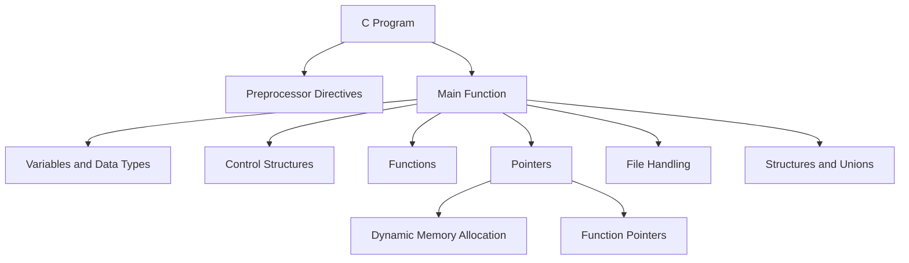

# C Technical Notes

## Quick Reference  
- **One-sentence definition**: C is a procedural programming language used for system programming, embedded systems, and applications requiring direct hardware access.  
- **Key use cases**: Operating systems, embedded systems, compilers, and performance-critical applications.  
- **Prerequisites**: Basic knowledge of C syntax, variables, control structures, functions, and pointers.  

## Table of Contents  
1. Introduction  
2. Core Concepts  
   - Fundamental Understanding  
   - Visual Architecture  
3. Implementation Details  
   - Intermediate Patterns  
4. Real-World Applications  
   - Industry Examples  
   - Hands-On Project  
5. Tools & Resources  
6. References  
7. Appendix  

## Introduction  
### What: Core Definition and Purpose  
C is a general-purpose, procedural programming language developed in the early 1970s. It provides low-level access to memory and hardware, making it ideal for system programming and performance-critical applications.  

### Why: Problem It Solves/Value Proposition  
C allows developers to write efficient and portable code. Its simplicity and close-to-hardware capabilities make it a popular choice for building operating systems, compilers, and embedded systems.  

### Where: Application Domains  
C is widely used in:  
- Operating systems (e.g., Linux, Windows kernels)  
- Embedded systems (e.g., microcontrollers, IoT devices)  
- Compilers and interpreters  
- Game development (e.g., game engines)  

## Core Concepts  
### Fundamental Understanding  
#### Intermediate Principles  
- **Dynamic Memory Allocation**: Manage memory at runtime using `malloc`, `calloc`, `realloc`, and `free`.  
- **File Handling**: Read from and write to files using `fopen`, `fclose`, `fread`, and `fwrite`.  
- **Function Pointers**: Use pointers to store and call functions dynamically.  
- **Structures and Unions**: Group related variables and share memory between variables of different types.  

#### Key Components  
- **Pointers and Arrays**: Understand the relationship between pointers and arrays for efficient data manipulation.  
- **Preprocessor Directives**: Use `#define`, `#ifdef`, and `#include` for code modularity and conditional compilation.  
- **Error Handling**: Use return codes and `errno` for robust error handling.  

#### Common Misconceptions  
- **C is only for low-level programming**: C can also be used for high-level applications with proper abstractions.  
- **Pointers are too complex**: With practice, pointers become a powerful tool for efficient programming.  

### Visual Architecture  


## Implementation Details  
### Intermediate Patterns [Intermediate]  
```c  
#include <stdio.h>  
#include <stdlib.h>  // For dynamic memory allocation  

// Function to add two numbers  
int add(int a, int b) {  
    return a + b;  
}  

// Function to multiply two numbers  
int multiply(int a, int b) {  
    return a * b;  
}  

int main() {  
    // Declare a function pointer  
    int (*operation)(int, int);  

    // Use the function pointer to call add  
    operation = add;  
    printf("Addition: %d\n", operation(10, 20));  

    // Use the function pointer to call multiply  
    operation = multiply;  
    printf("Multiplication: %d\n", operation(10, 20));  

    // Dynamic memory allocation example  
    int* arr = (int*)malloc(5 * sizeof(int));  
    if (arr == NULL) {  
        fprintf(stderr, "Memory allocation failed\n");  
        return 1;  
    }  

    // Assign values to the array  
    for (int i = 0; i < 5; ++i) {  
        arr[i] = i * 2;  
    }  

    // Print the array  
    for (int i = 0; i < 5; ++i) {  
        printf("%d ", arr[i]);  
    }  
    printf("\n");  

    // Free the allocated memory  
    free(arr);  

    return 0;  
}  
```  

#### Design Patterns  
- **Modular Programming**: Break code into reusable functions and modules.  
- **Callback Functions**: Use function pointers to implement callbacks.  
- **Memory Pools**: Manage memory efficiently for performance-critical applications.  

#### Best Practices  
- Always check the return value of `malloc` and `free` allocated memory.  
- Use `const` to prevent unintended modifications.  
- Prefer `sizeof` over hardcoding sizes for portability.  

#### Performance Considerations  
- Minimize dynamic memory allocation in performance-critical sections.  
- Use stack memory for small, short-lived variables.  
- Profile code to identify and address bottlenecks.  

## Real-World Applications  
### Industry Examples  
#### Use Cases  
- **Operating Systems**: C is used in the Linux kernel for its performance and low-level capabilities.  
- **Embedded Systems**: C is ideal for resource-constrained environments like IoT devices.  
- **Compilers**: C is used to build compilers for other programming languages.  

#### Implementation Patterns  
- **Operating Systems**: Use modular programming and function pointers for system calls.  
- **Embedded Systems**: Leverage static memory allocation and avoid dynamic memory.  
- **Compilers**: Use recursive functions and tree structures for parsing.  

### Hands-On Project  
#### Project Goals  
Build a simple contact management system using structures and file handling.  

#### Implementation Steps  
1. Define a `Contact` structure to store name, phone number, and email.  
2. Use `fopen` and `fwrite` to save contacts to a file.  
3. Use `fread` to load contacts from the file.  
4. Implement functions to add, delete, and search for contacts.  

#### Validation Methods  
- Test the system with various contact entries and edge cases (e.g., empty file).  
- Measure performance for large datasets.  

## Tools & Resources  
### Essential Tools  
- **IDEs**: Code::Blocks, Dev-C++, Eclipse  
- **Compilers**: GCC, Clang, MSVC  
- **Debuggers**: GDB, LLDB  

### Learning Resources  
- **Documentation**: [GNU C Manual](https://www.gnu.org/software/gnu-c-manual/)  
- **Books**: "C Programming: A Modern Approach" by K. N. King  
- **Communities**: Stack Overflow, Reddit (r/C_Programming)  

## References  
- **Official Documentation**: [ISO C Standard](https://www.iso.org/standard/74528.html)  
- **Books**: "The C Programming Language" by Brian W. Kernighan and Dennis M. Ritchie  
- **Standards**: C89, C99, C11  

## Appendix  
### Glossary  
- **Dynamic Memory Allocation**: Allocating memory at runtime using `malloc`, `calloc`, and `realloc`.  
- **Function Pointer**: A pointer that stores the address of a function.  
- **Structure**: A user-defined data type that groups related variables.  

### Setup Guides  
- [Installing GCC on Windows](https://code.visualstudio.com/docs/cpp/config-mingw)  
- [Installing Xcode on macOS](https://developer.apple.com/xcode/)  

### Code Templates  
- Intermediate C program template:  
```c  
#include <stdio.h>  
#include <stdlib.h>  

int main() {  
    // Your code here  
    return 0;  
}  
```