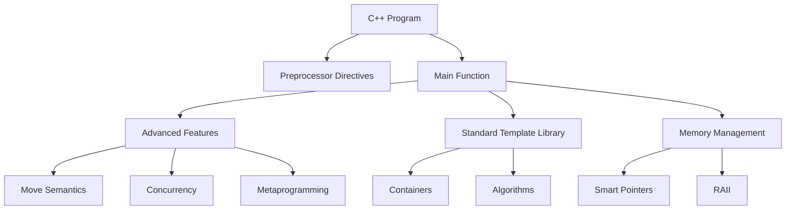

# C++ Technical Notes  
<!-- C++ is a high-performance, general-purpose programming language that supports multiple paradigms, including object-oriented, procedural, and generic programming. This guide is designed for advanced learners who are already proficient in C++ and want to master advanced core concepts, system design, and optimization techniques for production-level applications.   -->

## Quick Reference  
- **One-sentence definition**: C++ is a powerful programming language that combines low-level memory manipulation with high-level abstractions, enabling the development of efficient and scalable systems.  
- **Key use cases**: Game engines, operating systems, high-frequency trading, embedded systems, and performance-critical applications.  
- **Prerequisites**: Strong understanding of C++ syntax, OOP principles, templates, STL, and memory management.  


## Table of Contents  
1. [Introduction](#introduction)  
2. [Core Concepts](#core-concepts)  
    - [Fundamental Understanding](#fundamental-understanding)  
    - [Visual Architecture](#visual-architecture)  
3. [Implementation Details](#implementation-details)  
    - [Advanced Topics](#advanced-topics)  
4. [Real-World Applications](#real-world-applications)  
    - [Industry Examples](#industry-examples)  
    - [Hands-On Project](#hands-on-project)  
5. [Tools & Resources](#tools--resources)  
6. [References](#references)  
7. [Appendix](#appendix)  


## Introduction  
### What: Core Definition and Purpose  
C++ is an extension of the C programming language, enriched with advanced features like templates, move semantics, and concurrency support. It is designed for building high-performance, resource-efficient systems.  

### Why: Problem It Solves/Value Proposition  
C++ provides unparalleled control over system resources, enabling developers to optimize performance and memory usage. Its flexibility and scalability make it ideal for large-scale, performance-critical applications.  

### Where: Application Domains  
C++ is widely used in:  
- Game development (e.g., Unreal Engine, Unity)  
- Operating systems (e.g., Windows, Linux kernels)  
- High-frequency trading systems  
- Embedded systems (e.g., IoT devices, robotics)  

## Core Concepts  
### Fundamental Understanding  
#### Advanced Principles  
- **Move Semantics**: Optimize resource management by transferring ownership of resources instead of copying them.  
- **Concurrency**: Support for multithreading and parallel execution using threads, mutexes, and atomic operations.  
- **Metaprogramming**: Techniques like templates and `constexpr` for compile-time computations.  
- **RAII (Resource Acquisition Is Initialization)**: A programming idiom for managing resources through object lifetimes.  

#### Key Components  
- **Smart Pointers**: `std::unique_ptr`, `std::shared_ptr`, and `std::weak_ptr` for automatic memory management.  
- **Lambda Expressions**: Inline functions for concise and functional-style programming.  
- **Type Traits**: Utilities for type introspection and manipulation at compile time.  

#### Common Misconceptions  
- **C++ is only for low-level programming**: Modern C++ supports high-level abstractions like STL and functional programming.  
- **Manual memory management is always required**: Smart pointers and RAII eliminate the need for manual memory management in most cases.  

### Visual Architecture  


## Implementation Details  
### Advanced Topics [Advanced]  
```cpp  
#include <iostream>  
#include <thread>  
#include <vector>  
#include <atomic>  

std::atomic<int> counter(0);  // Atomic counter for thread-safe increments  

void incrementCounter(int id) {  
    for (int i = 0; i < 1000; ++i) {  
        ++counter;  // Atomic operation  
    }  
    std::cout << "Thread " << id << " finished." << std::endl;  
}  

int main() {  
    std::vector<std::thread> threads;  

    // Create 10 threads  
    for (int i = 0; i < 10; ++i) {  
        threads.emplace_back(incrementCounter, i);  
    }  

    // Join all threads  
    for (auto& t : threads) {  
        t.join();  
    }  

    std::cout << "Final counter value: " << counter << std::endl;  
    return 0;  
}  
```  

#### System Design  
- **Concurrency Models**: Use threads, async tasks, and thread pools for parallel execution.  
- **Memory Optimization**: Leverage move semantics and custom allocators for efficient memory usage.  
- **Error Handling**: Use exceptions and error codes judiciously for robust error handling.  

#### Optimization Techniques  
- **Inline Functions**: Reduce function call overhead for small, frequently called functions.  
- **Cache-Friendly Code**: Optimize data structures for CPU cache efficiency.  
- **Profiling**: Use tools like Valgrind and gprof to identify performance bottlenecks.  

#### Production Considerations  
- **Code Maintainability**: Follow coding standards and use static analysis tools.  
- **Testing**: Implement unit tests, integration tests, and stress tests.  
- **Deployment**: Use CI/CD pipelines for automated builds and deployments.  

## Real-World Applications  
### Industry Examples  
#### Use Cases  
- **Game Development**: C++ is used in game engines like Unreal Engine for its performance and flexibility.  
- **High-Frequency Trading**: C++ enables low-latency execution of trading algorithms.  
- **Embedded Systems**: C++ is ideal for resource-constrained environments like IoT devices.  

#### Implementation Patterns  
- **Game Development**: Use entity-component-system (ECS) architecture for scalable game design.  
- **High-Frequency Trading**: Optimize algorithms for speed and use lock-free data structures.  
- **Embedded Systems**: Leverage RAII and avoid dynamic memory allocation.  

### Hands-On Project  
#### Project Goals  
Build a multithreaded task scheduler using C++ concurrency features.  

#### Implementation Steps  
1. Define a `Task` class to represent individual tasks.  
2. Use `std::thread` and `std::mutex` to manage task execution.  
3. Implement a thread pool for efficient task scheduling.  
4. Add support for task prioritization and cancellation.  

#### Validation Methods  
- Test the scheduler with varying workloads and task types.  
- Measure performance metrics like throughput and latency.  

## Tools & Resources  
### Essential Tools  
- **IDEs**: Visual Studio, CLion, Qt Creator  
- **Compilers**: GCC, Clang, MSVC  
- **Debuggers**: GDB, LLDB  

### Learning Resources  
- **Documentation**: [cppreference.com](https://en.cppreference.com/)  
- **Books**: "Effective Modern C++" by Scott Meyers, "C++ Concurrency in Action" by Anthony Williams  
- **Communities**: Stack Overflow, Reddit (r/cpp), CppCon  

## References  
- **Official Documentation**: [ISO C++](https://isocpp.org/)  
- **Technical Papers**: C++ Core Guidelines  
- **Industry Standards**: C++11, C++14, C++17, C++20  

## Appendix  
### Glossary  
- **RAII**: Resource Acquisition Is Initialization, a programming idiom for resource management.  
- **Move Semantics**: A feature that enables efficient transfer of resources.  
- **Concurrency**: The ability of a program to execute multiple tasks simultaneously.  

### Setup Guides  
- [Setting up CLion for C++ development](https://www.jetbrains.com/clion/)  
- [Configuring GCC on Linux](https://gcc.gnu.org/)  

### Code Templates  
- Advanced C++ program template:  
```cpp  
#include <iostream>  
#include <thread>  
#include <atomic>  

std::atomic<int> counter(0);  

void worker(int id) {  
    for (int i = 0; i < 1000; ++i) {  
        ++counter;  
    }  
    std::cout << "Worker " << id << " finished." << std::endl;  
}  

int main() {  
    std::vector<std::thread> threads;  
    for (int i = 0; i < 10; ++i) {  
        threads.emplace_back(worker, i);  
    }  
    for (auto& t : threads) {  
        t.join();  
    }  
    std::cout << "Final counter value: " << counter << std::endl;  
    return 0;  
}  
```