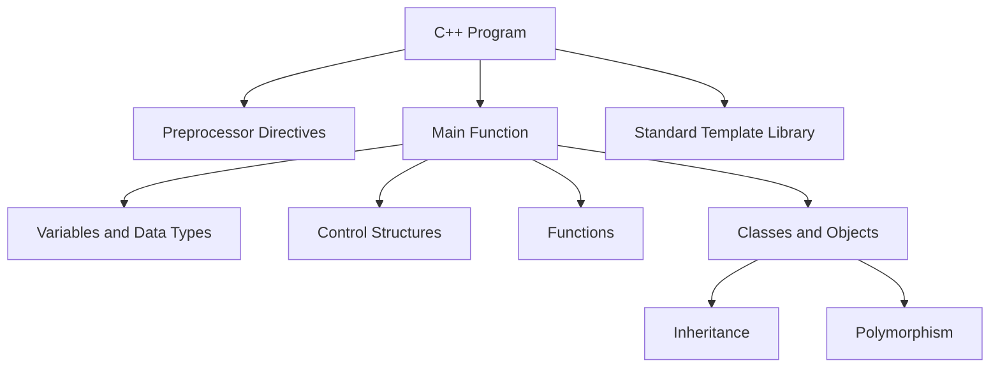

# C++ Technical Notes  
<!-- C++ is a powerful, high-performance programming language widely used for system/software development, game development, and applications requiring fine-grained control over hardware resources. This guide provides a beginner-friendly introduction to C++ core concepts, focusing on fundamental understanding, basic implementation, and essential tools to get started.   -->

## Quick Reference  
- **One-sentence definition**: C++ is a general-purpose programming language that supports object-oriented, procedural, and generic programming paradigms.  
- **Key use cases**: Game development, system programming, embedded systems, high-performance applications, and software tools.  
- **Prerequisites**: Basic understanding of programming concepts (e.g., variables, loops, functions). No prior C++ knowledge required.  

## Table of Contents  
1. [Introduction](#introduction)  
2. [Core Concepts](#core-concepts)  
    - [Fundamental Understanding](#fundamental-understanding)  
    - [Visual Architecture](#visual-architecture)  
3. [Implementation Details](#implementation-details)  
    - [Basic Implementation](#basic-implementation)  
4. [Real-World Applications](#real-world-applications)  
    - [Hands-On Project](#hands-on-project)  
5. [Tools & Resources](#tools--resources)  
6. [References](#references)  
7. [Appendix](#appendix)  

## Introduction  
### What: Core Definition and Purpose  
C++ is an extension of the C programming language with added features like classes, objects, and templates. It is designed for performance and flexibility, making it suitable for applications where efficiency is critical.  

### Why: Problem It Solves/Value Proposition  
C++ allows developers to write efficient and scalable code while providing low-level memory manipulation capabilities. It bridges the gap between high-level abstractions and hardware-level control.  

### Where: Application Domains  
C++ is used in:  
- Game engines (e.g., Unreal Engine)  
- Operating systems (e.g., Windows, Linux kernels)  
- Embedded systems (e.g., IoT devices)  
- High-frequency trading systems  

## Core Concepts  
### Fundamental Understanding  
#### Basic Principles  
- **Variables and Data Types**: Store and manipulate data (e.g., `int`, `float`, `char`).  
- **Control Structures**: Manage program flow using `if`, `else`, `for`, and `while`.  
- **Functions**: Reusable blocks of code that perform specific tasks.  
- **Classes and Objects**: Blueprints for creating objects with properties and methods.  

#### Key Components  
- **Standard Template Library (STL)**: A collection of template classes and functions for common tasks (e.g., vectors, strings).  
- **Pointers and References**: Tools for memory management and efficient data handling.  
- **Header Files**: Used to declare functions and classes for reuse across multiple files.  

#### Common Misconceptions  
- **C++ is just C with classes**: While C++ builds on C, it introduces many advanced features like polymorphism, templates, and exception handling.  
- **C++ is too hard for beginners**: With proper guidance, beginners can learn C++ by starting with basic concepts and gradually progressing.  

### Visual Architecture  


## Implementation Details  
### Basic Implementation [Beginner]  
```cpp  
#include <iostream>  // Include the input-output stream library  

int main() {  
    // Step 1: Declare variables  
    int number1 = 10;  
    int number2 = 20;  

    // Step 2: Perform addition  
    int sum = number1 + number2;  

    // Step 3: Output the result  
    std::cout << "The sum is: " << sum << std::endl;  

    return 0;  // Indicate successful program termination  
}  
```  

#### Step-by-Step Setup  
1. Install a C++ compiler (e.g., GCC, Clang) or an IDE (e.g., Code::Blocks, Visual Studio).  
2. Write the above code in a file with a `.cpp` extension (e.g., `sum.cpp`).  
3. Compile the program using a command like `g++ sum.cpp -o sum`.  
4. Run the program using `./sum` (on Linux/Mac) or `sum.exe` (on Windows).  

#### Code Walkthrough  
- `#include <iostream>`: Includes the library for input/output operations.  
- `int main()`: The entry point of the program.  
- `std::cout`: Used to print output to the console.  
- `return 0`: Indicates the program executed successfully.  

#### Common Pitfalls  
- Forgetting to include necessary headers (e.g., `#include <iostream>`).  
- Missing semicolons at the end of statements.  
- Using uninitialized variables, leading to undefined behavior.  

## Real-World Applications  
### Hands-On Project  
#### Project Goals  
Create a simple calculator that can add, subtract, multiply, and divide two numbers.  

#### Implementation Steps  
1. Define variables to store two numbers and the result.  
2. Use `std::cin` to take user input for the numbers and operation.  
3. Use `if-else` or `switch` statements to perform the selected operation.  
4. Display the result using `std::cout`.  

#### Validation Methods  
- Test the program with different inputs (e.g., positive numbers, negative numbers, division by zero).  
- Ensure the program handles invalid inputs gracefully.  

## Tools & Resources  
### Essential Tools  
- **IDEs**: Visual Studio, Code::Blocks, CLion  
- **Compilers**: GCC, Clang, MSVC  
- **Debuggers**: GDB, LLDB  

### Learning Resources  
- **Documentation**: [cppreference.com](https://en.cppreference.com/)  
- **Tutorials**: [LearnCpp.com](https://www.learncpp.com/)  
- **Community**: Stack Overflow, Reddit (r/cpp)  

## References  
- **Official Documentation**: [ISO C++](https://isocpp.org/)  
- **Books**: "C++ Primer" by Stanley B. Lippman, "Effective C++" by Scott Meyers  
- **Standards**: C++11, C++14, C++17, C++20  

## Appendix  
### Glossary  
- **Compiler**: A tool that converts C++ code into machine code.  
- **Object-Oriented Programming (OOP)**: A programming paradigm based on objects and classes.  
- **STL**: A library providing common data structures and algorithms.  

### Setup Guides  
- [Installing GCC on Windows](https://code.visualstudio.com/docs/cpp/config-mingw)  
- [Installing Xcode on macOS](https://developer.apple.com/xcode/)  

### Code Templates  
- Basic C++ program template:  
```cpp  
#include <iostream>  
int main() {  
    // Your code here  
    return 0;  
}  
```