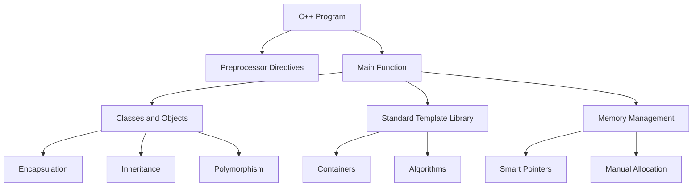

# C++ Technical Notes  
<!-- C++ is a versatile, high-performance programming language that supports multiple paradigms, including object-oriented, procedural, and generic programming. This guide is tailored for intermediate learners who are familiar with the basics of C++ and want to deepen their understanding of core concepts, design patterns, and best practices.   -->

## Quick Reference  
- **One-sentence definition**: C++ is a general-purpose programming language that combines low-level memory manipulation with high-level abstractions.  
- **Key use cases**: Game development, system programming, embedded systems, and performance-critical applications.  
- **Prerequisites**: Basic knowledge of C++ syntax, variables, control structures, functions, and classes.  

## Table of Contents  
1. [Introduction](#introduction)  
2. [Core Concepts](#core-concepts)  
    - [Fundamental Understanding](#fundamental-understanding)  
    - [Visual Architecture](#visual-architecture)  
3. [Implementation Details](#implementation-details)  
    - [Intermediate Patterns](#intermediate-patterns)  
4. [Real-World Applications](#real-world-applications)  
    - [Industry Examples](#industry-examples)  
    - [Hands-On Project](#hands-on-project)  
5. [Tools & Resources](#tools--resources)  
6. [References](#references)  
7. [Appendix](#appendix)  

## Introduction  
### What: Core Definition and Purpose  
C++ is an extension of the C programming language, enriched with features like classes, inheritance, polymorphism, and templates. It is designed for performance, flexibility, and scalability, making it ideal for complex systems and applications.  

### Why: Problem It Solves/Value Proposition  
C++ enables developers to write efficient, maintainable, and reusable code. It provides fine-grained control over system resources while supporting high-level abstractions, making it suitable for both low-level and high-level programming tasks.  

### Where: Application Domains  
C++ is widely used in:  
- Game development (e.g., Unreal Engine, Unity)  
- Operating systems (e.g., Windows, Linux kernels)  
- Embedded systems (e.g., IoT devices, robotics)  
- Financial systems (e.g., high-frequency trading)  

## Core Concepts  
### Fundamental Understanding  
#### Basic Principles  
- **Object-Oriented Programming (OOP)**: Encapsulation, inheritance, and polymorphism.  
- **Templates**: Enable generic programming by allowing functions and classes to operate with any data type.  
- **Memory Management**: Manual memory allocation/deallocation using `new` and `delete`.  
- **Standard Template Library (STL)**: Provides containers (e.g., `vector`, `map`) and algorithms (e.g., `sort`, `find`).  

#### Key Components  
- **Classes and Objects**: Define blueprints for creating objects with properties and methods.  
- **Pointers and References**: Tools for efficient memory management and data manipulation.  
- **Exception Handling**: Mechanisms to handle runtime errors gracefully (`try`, `catch`, `throw`).  

#### Common Misconceptions  
- **C++ is outdated**: C++ is actively evolving, with modern standards like C++17 and C++20 introducing new features.  
- **Manual memory management is always required**: Smart pointers (e.g., `std::unique_ptr`, `std::shared_ptr`) automate memory management in modern C++.  

### Visual Architecture  


## Implementation Details  
### Intermediate Patterns [Intermediate]  
```cpp  
#include <iostream>  
#include <memory>  // For smart pointers  

class Animal {  
public:  
    virtual void speak() const = 0;  // Pure virtual function  
};  

class Dog : public Animal {  
public:  
    void speak() const override {  
        std::cout << "Woof!" << std::endl;  
    }  
};  

class Cat : public Animal {  
public:  
    void speak() const override {  
        std::cout << "Meow!" << std::endl;  
    }  
};  

int main() {  
    // Using smart pointers for automatic memory management  
    std::unique_ptr<Animal> dog = std::make_unique<Dog>();  
    std::unique_ptr<Animal> cat = std::make_unique<Cat>();  

    dog->speak();  // Output: Woof!  
    cat->speak();  // Output: Meow!  

    return 0;  
}  
```  

#### Design Patterns  
- **Factory Pattern**: Creates objects without specifying the exact class.  
- **Singleton Pattern**: Ensures a class has only one instance.  
- **Observer Pattern**: Allows objects to notify dependents of state changes.  

#### Best Practices  
- Use smart pointers (`std::unique_ptr`, `std::shared_ptr`) to avoid memory leaks.  
- Prefer `const` correctness to prevent unintended modifications.  
- Leverage RAII (Resource Acquisition Is Initialization) for resource management.  

#### Performance Considerations  
- Minimize dynamic memory allocation in performance-critical sections.  
- Use move semantics (`std::move`) to optimize resource transfers.  
- Profile code to identify and address bottlenecks.  

## Real-World Applications  
### Industry Examples  
#### Use Cases  
- **Game Development**: C++ is used in game engines like Unreal Engine for its performance and flexibility.  
- **Embedded Systems**: C++ is ideal for resource-constrained environments like IoT devices.  
- **Financial Systems**: High-frequency trading systems rely on C++ for low-latency execution.  

#### Implementation Patterns  
- **Game Development**: Use polymorphism for game entities and templates for reusable components.  
- **Embedded Systems**: Leverage RAII for resource management and avoid dynamic memory allocation.  
- **Financial Systems**: Optimize algorithms for speed and use multithreading for parallel processing.  

### Hands-On Project  
#### Project Goals  
Build a simple inventory management system using OOP principles and STL containers.  

#### Implementation Steps  
1. Define classes for `Product` and `Inventory`.  
2. Use `std::vector` to store products in the inventory.  
3. Implement methods to add, remove, and search for products.  
4. Use file I/O to persist inventory data.  

#### Validation Methods  
- Test the system with various product types and edge cases (e.g., empty inventory).  
- Measure performance for large datasets.  

## Tools & Resources  
### Essential Tools  
- **IDEs**: Visual Studio, CLion, Code::Blocks  
- **Compilers**: GCC, Clang, MSVC  
- **Debuggers**: GDB, LLDB  

### Learning Resources  
- **Documentation**: [cppreference.com](https://en.cppreference.com/)  
- **Books**: "Effective Modern C++" by Scott Meyers, "The C++ Standard Library" by Nicolai Josuttis  
- **Communities**: Stack Overflow, Reddit (r/cpp), CppCon  

## References  
- **Official Documentation**: [ISO C++](https://isocpp.org/)  
- **Technical Papers**: C++ Core Guidelines  
- **Industry Standards**: C++11, C++14, C++17, C++20  

## Appendix  
### Glossary  
- **RAII**: Resource Acquisition Is Initialization, a programming idiom for resource management.  
- **STL**: Standard Template Library, a collection of template classes and functions.  
- **Polymorphism**: The ability of objects to take on multiple forms (e.g., function overriding).  

### Setup Guides  
- [Setting up CLion for C++ development](https://www.jetbrains.com/clion/)  
- [Configuring GCC on Linux](https://gcc.gnu.org/)  

### Code Templates  
- Intermediate C++ program template:  
```cpp  
#include <iostream>  
#include <memory>  

class MyClass {  
public:  
    void doSomething() {  
        std::cout << "Doing something!" << std::endl;  
    }  
};  

int main() {  
    std::unique_ptr<MyClass> obj = std::make_unique<MyClass>();  
    obj->doSomething();  
    return 0;  
}  
```
