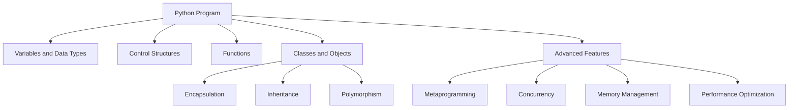

# Python Technical Notes  
<!-- Python is a high-level, interpreted programming language known for its simplicity, readability, and versatility. This guide is designed for advanced learners who are already proficient in Python and want to master advanced core concepts, system design, and optimization techniques for production-level applications.   -->

## Quick Reference  
- **One-sentence definition**: Python is a general-purpose programming language used for web development, data analysis, artificial intelligence, and more.  
- **Key use cases**: Web development, data science, automation, scripting, and machine learning.  
- **Prerequisites**: Strong understanding of Python syntax, OOP principles, data structures, and intermediate concepts like decorators and generators.  

## Table of Contents  
1. Introduction  
2. Core Concepts  
   - Fundamental Understanding  
   - Visual Architecture  
3. Implementation Details  
   - Advanced Topics  
4. Real-World Applications  
   - Industry Examples  
   - Hands-On Project  
5. Tools & Resources  
6. References  
7. Appendix  

## Introduction  
### What: Core Definition and Purpose  
Python is an interpreted, high-level programming language designed for readability and simplicity. It supports multiple programming paradigms, including procedural, object-oriented, and functional programming.  

### Why: Problem It Solves/Value Proposition  
Python simplifies complex programming tasks with its clean syntax and extensive libraries. It is widely used for rapid prototyping, data analysis, and automation.  

### Where: Application Domains  
Python is used in:  
- Web development (e.g., Django, Flask)  
- Data science and machine learning (e.g., Pandas, TensorFlow)  
- Automation and scripting  
- Game development (e.g., Pygame)  


## Core Concepts  
### Fundamental Understanding  
#### Advanced Principles  
- **Metaprogramming**: Techniques like decorators, metaclasses, and dynamic attribute creation.  
- **Concurrency**: Use of threads, processes, and asynchronous programming with `asyncio`.  
- **Memory Management**: Understanding of garbage collection and memory optimization techniques.  
- **Performance Optimization**: Profiling, C extensions, and using libraries like NumPy and Cython.  

#### Key Components  
- **Metaclasses**: Classes that define the behavior of other classes.  
- **Descriptors**: Objects that define how attributes are accessed and modified.  
- **Context Managers**: Objects that manage resources using the `with` statement.  

#### Common Misconceptions  
- **Python is slow**: While Python is slower than compiled languages, its performance can be optimized using techniques like C extensions and just-in-time compilation.  
- **Python is only for scripting**: Python is used in large-scale applications, including web services and machine learning pipelines.  

### Visual Architecture  


## Implementation Details  
### Advanced Topics [Advanced]  
```python  
# Metaclass example  
class Meta(type):  
    def __new__(cls, name, bases, dct):  
        print(f"Creating class {name}")  
        return super().__new__(cls, name, bases, dct)  

class MyClass(metaclass=Meta):  
    pass  

# Asynchronous programming example  
import asyncio  

async def fetch_data():  
    print("Fetching data...")  
    await asyncio.sleep(2)  
    print("Data fetched")  

async def main():  
    await asyncio.gather(fetch_data(), fetch_data())  

asyncio.run(main())  

# Context manager example  
class ManagedFile:  
    def __init__(self, filename):  
        self.filename = filename  

    def __enter__(self):  
        self.file = open(self.filename, 'r')  
        return self.file  

    def __exit__(self, exc_type, exc_val, exc_tb):  
        if self.file:  
            self.file.close()  

with ManagedFile('example.txt') as file:  
    content = file.read()  
    print(content)  
```  

#### System Design  
- **Concurrency Models**: Use of threads, processes, and asynchronous programming for parallel execution.  
- **Memory Optimization**: Techniques like object pooling and efficient data structures.  
- **Error Handling**: Robust error handling using exceptions and logging.  

#### Optimization Techniques  
- **Profiling**: Use tools like `cProfile` and `line_profiler` to identify bottlenecks.  
- **C Extensions**: Write performance-critical code in C and integrate it with Python using `ctypes` or `Cython`.  
- **Just-In-Time Compilation**: Use libraries like `Numba` for JIT compilation of Python code.  

#### Production Considerations  
- **Code Maintainability**: Follow coding standards and use static analysis tools.  
- **Testing**: Implement unit tests, integration tests, and stress tests.  
- **Deployment**: Use CI/CD pipelines for automated builds and deployments.  

## Real-World Applications  
### Industry Examples  
#### Use Cases  
- **Web Development**: Python is used in frameworks like Django and Flask for building web applications.  
- **Data Science**: Python is the language of choice for data analysis and machine learning with libraries like Pandas and TensorFlow.  
- **Automation**: Python scripts automate repetitive tasks, such as file handling and web scraping.  

#### Implementation Patterns  
- **Web Development**: Use MVC (Model-View-Controller) architecture in Django.  
- **Data Science**: Leverage Jupyter Notebooks for interactive data analysis.  
- **Automation**: Use libraries like `os` and `shutil` for file system operations.  

### Hands-On Project  
#### Project Goals  
Build a high-performance web scraper using asynchronous programming and data storage.  

#### Implementation Steps  
1. Use `aiohttp` for asynchronous HTTP requests.  
2. Implement data parsing using `BeautifulSoup`.  
3. Store scraped data in a SQLite database.  
4. Use `asyncio` for concurrent execution of scraping tasks.  

#### Validation Methods  
- Test the scraper with various websites and edge cases (e.g., handling timeouts).  
- Measure performance metrics like throughput and latency.  

## Tools & Resources  
### Essential Tools  
- **IDEs**: PyCharm, VS Code, Jupyter Notebook  
- **Package Manager**: pip  
- **Debuggers**: Built-in Python debugger (pdb)  

### Learning Resources  
- **Documentation**: [Python Official Documentation](https://docs.python.org/3/)  
- **Books**: "Fluent Python" by Luciano Ramalho  
- **Communities**: Stack Overflow, Reddit (r/Python)  

## References  
- **Official Documentation**: [Python Official Documentation](https://docs.python.org/3/)  
- **Books**: "Python Cookbook" by David Beazley and Brian K. Jones  
- **Standards**: PEP 8 (Python Enhancement Proposal for style guidelines)  

## Appendix  
### Glossary  
- **Metaclass**: A class that defines the behavior of other classes.  
- **Descriptor**: An object that defines how attributes are accessed and modified.  
- **Context Manager**: An object that manages resources using the `with` statement.  

### Setup Guides  
- [Installing Python on Windows](https://www.python.org/downloads/windows/)  
- [Installing Python on macOS](https://www.python.org/downloads/macos/)  

### Code Templates  
- Advanced Python program template:  
```python  
def main():  
    # Your code here  
    pass  

if __name__ == "__main__":  
    main()  
```