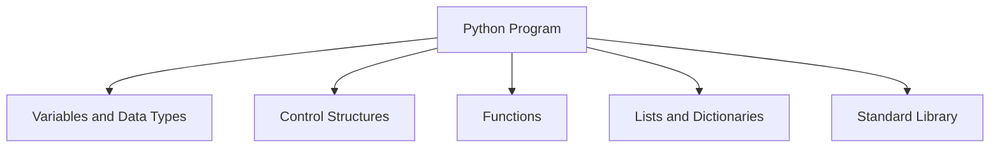

# Python Technical Notes  
<!-- Python is a high-level, interpreted programming language known for its simplicity, readability, and versatility. This guide is designed for beginners who are new to programming or transitioning from another language. It focuses on core concepts, basic syntax, and practical implementation to build a strong foundation in Python programming.   -->

## Quick Reference  
- **One-sentence definition**: Python is a general-purpose programming language used for web development, data analysis, artificial intelligence, and more.  
- **Key use cases**: Web development, data science, automation, scripting, and machine learning.  
- **Prerequisites**: No prior programming experience required. Familiarity with basic computer operations is helpful.  

## Table of Contents  
1. Introduction  
2. Core Concepts  
   - Fundamental Understanding  
   - Visual Architecture  
3. Implementation Details  
   - Basic Implementation  
4. Real-World Applications  
   - Hands-On Project  
5. Tools & Resources  
6. References  
7. Appendix  

## Introduction  
### What: Core Definition and Purpose  
Python is an interpreted, high-level programming language designed for readability and simplicity. It supports multiple programming paradigms, including procedural, object-oriented, and functional programming.  

### Why: Problem It Solves/Value Proposition  
Python simplifies complex programming tasks with its clean syntax and extensive libraries. It is widely used for rapid prototyping, data analysis, and automation.  

### Where: Application Domains  
Python is used in:  
- Web development (e.g., Django, Flask)  
- Data science and machine learning (e.g., Pandas, TensorFlow)  
- Automation and scripting  
- Game development (e.g., Pygame)  

## Core Concepts  
### Fundamental Understanding  
#### Basic Principles  
- **Variables and Data Types**: Store and manipulate data (e.g., `int`, `float`, `str`).  
- **Control Structures**: Manage program flow using `if`, `else`, `for`, and `while`.  
- **Functions**: Reusable blocks of code that perform specific tasks.  
- **Lists and Dictionaries**: Collections for storing and organizing data.  

#### Key Components  
- **Standard Library**: A rich collection of modules for common tasks (e.g., `os`, `math`).  
- **Indentation**: Python uses indentation to define code blocks, enhancing readability.  
- **Dynamic Typing**: Variables do not require explicit type declaration.  

#### Common Misconceptions  
- **Python is slow**: While Python is slower than compiled languages, its performance is often sufficient for many applications, and optimizations can be made.  
- **Python is only for beginners**: Python is used by professionals in various fields, including data science, web development, and machine learning.  

### Visual Architecture  


## Implementation Details  
### Basic Implementation [Beginner]  
```python  
# Step 1: Declare variables  
number1 = 10  
number2 = 20  

# Step 2: Perform addition  
sum = number1 + number2  

# Step 3: Output the result  
print("The sum is:", sum)  
```  

#### Step-by-Step Setup  
1. Install Python from [python.org](https://www.python.org/).  
2. Write the above code in a file with a `.py` extension (e.g., `sum.py`).  
3. Run the program using the command `python sum.py`.  

#### Code Walkthrough  
- `number1 = 10`: Declares a variable and assigns it a value.  
- `sum = number1 + number2`: Performs addition and stores the result.  
- `print("The sum is:", sum)`: Outputs the result to the console.  

#### Common Pitfalls  
- Forgetting to use proper indentation.  
- Using incorrect syntax (e.g., missing colons after control structures).  
- Misunderstanding variable scope.  

## Real-World Applications  
### Hands-On Project  
#### Project Goals  
Create a simple to-do list application that allows users to add, view, and delete tasks.  

#### Implementation Steps  
1. Use a list to store tasks.  
2. Implement functions to add, view, and delete tasks.  
3. Use a loop to continuously prompt the user for actions.  

#### Validation Methods  
- Test the application with various inputs (e.g., adding multiple tasks, deleting tasks).  
- Ensure the application handles invalid inputs gracefully.  

## Tools & Resources  
### Essential Tools  
- **IDEs**: PyCharm, VS Code, Jupyter Notebook  
- **Package Manager**: pip  
- **Debuggers**: Built-in Python debugger (pdb)  

### Learning Resources  
- **Documentation**: [Python Official Documentation](https://docs.python.org/3/)  
- **Tutorials**: [Real Python](https://realpython.com/), [W3Schools](https://www.w3schools.com/python/)  
- **Communities**: Stack Overflow, Reddit (r/Python)  

## References  
- **Official Documentation**: [Python Official Documentation](https://docs.python.org/3/)  
- **Books**: "Automate the Boring Stuff with Python" by Al Sweigart  
- **Standards**: PEP 8 (Python Enhancement Proposal for style guidelines)  

## Appendix  
### Glossary  
- **Interpreter**: A program that executes Python code line by line.  
- **Module**: A file containing Python code that can be imported and used in other programs.  
- **PEP**: Python Enhancement Proposal, a design document providing information to the Python community.  

### Setup Guides  
- [Installing Python on Windows](https://www.python.org/downloads/windows/)  
- [Installing Python on macOS](https://www.python.org/downloads/macos/)  

### Code Templates  
- Basic Python program template:  
```python  
def main():  
    # Your code here  
    pass  

if __name__ == "__main__":  
    main()  
```