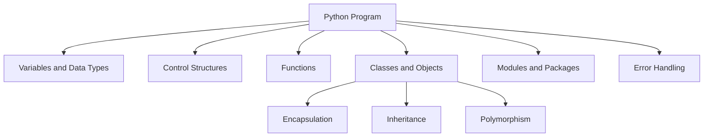

# Python Technical Notes  
<!-- Python is a high-level, interpreted programming language known for its simplicity, readability, and versatility. This guide is tailored for intermediate learners who are familiar with the basics of Python and want to deepen their understanding of core concepts, design patterns, and best practices.   -->

---

## Quick Reference  
- **One-sentence definition**: Python is a general-purpose programming language used for web development, data analysis, artificial intelligence, and more.  
- **Key use cases**: Web development, data science, automation, scripting, and machine learning.  
- **Prerequisites**: Basic knowledge of Python syntax, variables, control structures, functions, and data structures.  

## Table of Contents  
1. Introduction  
2. Core Concepts  
   - Fundamental Understanding  
   - Visual Architecture  
3. Implementation Details  
   - Intermediate Patterns  
4. Real-World Applications  
   - Industry Examples  
   - Hands-On Project  
5. Tools & Resources  
6. References  
7. Appendix  

## Introduction  
### What: Core Definition and Purpose  
Python is an interpreted, high-level programming language designed for readability and simplicity. It supports multiple programming paradigms, including procedural, object-oriented, and functional programming.  

### Why: Problem It Solves/Value Proposition  
Python simplifies complex programming tasks with its clean syntax and extensive libraries. It is widely used for rapid prototyping, data analysis, and automation.  

### Where: Application Domains  
Python is used in:  
- Web development (e.g., Django, Flask)  
- Data science and machine learning (e.g., Pandas, TensorFlow)  
- Automation and scripting  
- Game development (e.g., Pygame)  

## Core Concepts  
### Fundamental Understanding  
#### Intermediate Principles  
- **Object-Oriented Programming (OOP)**: Encapsulation, inheritance, and polymorphism.  
- **List Comprehensions**: Concise syntax for creating lists.  
- **Generators**: Functions that yield items one at a time, saving memory.  
- **Decorators**: Functions that modify the behavior of other functions.  

#### Key Components  
- **Classes and Objects**: Define blueprints for creating objects with properties and methods.  
- **Modules and Packages**: Organize code into reusable components.  
- **Error Handling**: Use `try`, `except`, and `finally` for robust error handling.  

#### Common Misconceptions  
- **Python is slow**: While Python is slower than compiled languages, its performance is often sufficient for many applications, and optimizations can be made.  
- **Python is only for beginners**: Python is used by professionals in various fields, including data science, web development, and machine learning.  

### Visual Architecture  


## Implementation Details  
### Intermediate Patterns [Intermediate]  
```python  
# Decorator example  
def my_decorator(func):  
    def wrapper():  
        print("Something is happening before the function is called.")  
        func()  
        print("Something is happening after the function is called.")  
    return wrapper  

@my_decorator  
def say_hello():  
    print("Hello!")  

say_hello()  

# Generator example  
def fibonacci(limit):  
    a, b = 0, 1  
    while a < limit:  
        yield a  
        a, b = b, a + b  

for num in fibonacci(10):  
    print(num)  
```  

#### Design Patterns  
- **Factory Pattern**: Creates objects without specifying the exact class.  
- **Singleton Pattern**: Ensures a class has only one instance.  
- **Observer Pattern**: Allows objects to notify dependents of state changes.  

#### Best Practices  
- Use list comprehensions for concise and readable code.  
- Leverage generators for memory-efficient iteration.  
- Follow PEP 8 guidelines for code style and readability.  

#### Performance Considerations  
- Use built-in functions and libraries for optimized performance.  
- Profile code using tools like `cProfile` to identify bottlenecks.  
- Avoid unnecessary loops and use vectorized operations with libraries like NumPy.  

## Real-World Applications  
### Industry Examples  
#### Use Cases  
- **Web Development**: Python is used in frameworks like Django and Flask for building web applications.  
- **Data Science**: Python is the language of choice for data analysis and machine learning with libraries like Pandas and TensorFlow.  
- **Automation**: Python scripts automate repetitive tasks, such as file handling and web scraping.  

#### Implementation Patterns  
- **Web Development**: Use MVC (Model-View-Controller) architecture in Django.  
- **Data Science**: Leverage Jupyter Notebooks for interactive data analysis.  
- **Automation**: Use libraries like `os` and `shutil` for file system operations.  

### Hands-On Project  
#### Project Goals  
Build a simple blog application using Flask.  

#### Implementation Steps  
1. Set up a Flask project and create routes for the home page and blog posts.  
2. Use SQLite to store blog posts and retrieve them dynamically.  
3. Implement forms for creating and editing blog posts.  
4. Style the application using Bootstrap.  

#### Validation Methods  
- Test the application with various inputs (e.g., creating, editing, and deleting posts).  
- Ensure the application handles invalid inputs gracefully.  

## Tools & Resources  
### Essential Tools  
- **IDEs**: PyCharm, VS Code, Jupyter Notebook  
- **Package Manager**: pip  
- **Debuggers**: Built-in Python debugger (pdb)  

### Learning Resources  
- **Documentation**: [Python Official Documentation](https://docs.python.org/3/)  
- **Books**: "Fluent Python" by Luciano Ramalho  
- **Communities**: Stack Overflow, Reddit (r/Python)  

## References  
- **Official Documentation**: [Python Official Documentation](https://docs.python.org/3/)  
- **Books**: "Python Cookbook" by David Beazley and Brian K. Jones  
- **Standards**: PEP 8 (Python Enhancement Proposal for style guidelines)  

## Appendix  
### Glossary  
- **Decorator**: A function that modifies the behavior of another function.  
- **Generator**: A function that yields items one at a time, saving memory.  
- **List Comprehension**: A concise way to create lists.  

### Setup Guides  
- [Installing Python on Windows](https://www.python.org/downloads/windows/)  
- [Installing Python on macOS](https://www.python.org/downloads/macos/)  

### Code Templates  
- Intermediate Python program template:  
```python  
def main():  
    # Your code here  
    pass  

if __name__ == "__main__":  
    main()  
```